# 绪章 本章内容看PPT即可，以下仅列出知识点

1. * 信号与信息的定义
   * 信号分类
     * 确定性信号、随机信号
     * 连续信号、离散信号
     * 周期信号、非周期信号
     * **能量信号、功率信号、非能量信号也非功率信号**
   * 信号分析、信号处理
   * 系统、模拟处理系统、数字处理系统

# 第一章	连续信号的分析

## 连续信号的时域描述和分析

1. 基本信号

   * 普通信号
     * 正弦信号
       $f(t) = K \sin(\omega t + \theta) = K \cos\left(\omega t + \theta - \frac{\pi}{2}\right), -\infty < t < \infty$
       * 性质：
         1. 
            
     * 指数信号/复指数信号
       $f(t) = K e^{st}, -\infty < t < \infty, s = \sigma + j\omega$
       * 对$\sigma$和$\omega$进行讨论，等于0，大于0，小于0。
         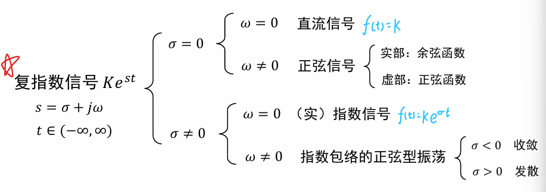
       * 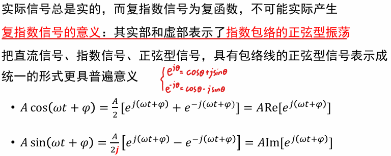
   * 奇异信号
     * 单位斜坡信号$r(t) = 
       \begin{cases} 
       t &  t \geq 0 \\
       0 & t < 0 
       \end{cases}$
       * 变换——三角形脉冲、“截平”的斜变信号
         
     * 单位阶跃信号$u(t) = 
       \begin{cases} 
       1 &  t > 0 \\
       0 &  t < 0 
       \end{cases}$
     * 单位冲激信号$\delta(t)$
       * 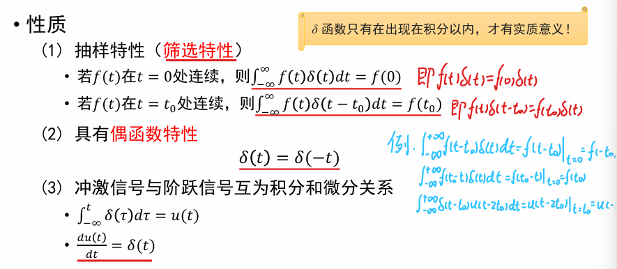
     * 单位冲激偶信号$\delta'(t)$
       * 正、负一对冲激信号
         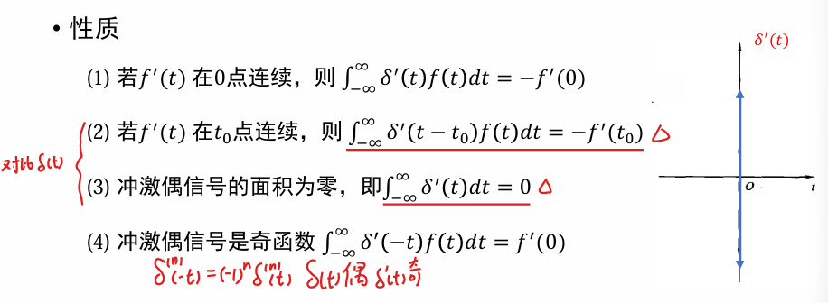

   

2. 连续信号的时域运算——基本运算

   * 尺度变换		af(t)
   * 翻转                at
   * 平移          $t-t_0$
   * 叠加和相乘
   * 微分和积分
     * 信号微分突出显示变化部分，信号积分可平滑突变部分
   * 卷积

3. 卷积

   * 定义
     $x(t) = x_1(t) * x_2(t) = \int_{-\infty}^{\infty} x_1(\tau) x_2(t - \tau) d\tau$

     * 注：现实中的信号通常是在$t \geq 0$时才有意义，此时亦需要$t - \tau \geq 0$ 故 $\tau \in [0, t]$，所以**自动控制方向的教材或文献通常把卷积公式写成$ x_1(t) * x_2(t) = \int_{0}^{t} x_1(\tau) x_2(t - \tau) d\tau$**

     * 使用定义计算卷积，称为定义法。课本PPT有详细的举例，使用图解来配合计算。

   * 运算性质

     * 交换律
     * 分配律
     * 结合律
     * 微分
     * 积分
     * 乘法微分
     * 与冲激信号、冲激偶信号的卷积
     * 与阶跃信号的卷积

     

     

     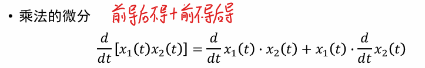

     

     

     利用上述性质可以简化卷积运算，如
     
     :fire:记住图解法的步骤，用来理解卷积！常用。
     

4. 连续信号的时域分解

   * 分解成冲激函数之和
     任意信号可以分解为一系列具有不同强度的冲激函数

   * 正交分解

     * 二维空间中的正交矢量

       $c_i=\frac{<x,y_i>}{<y_i,y_i>}$
       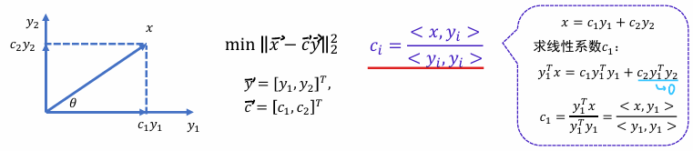

     * n维信号向量空间
       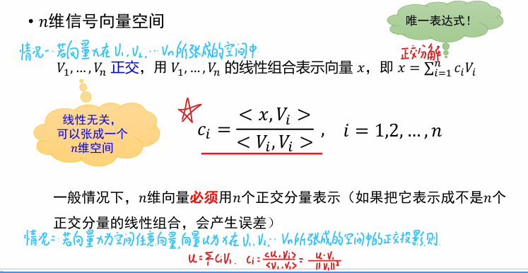
       注意，这里的向量在后续应用中==常当作函数处理==，即$\langle x(t), f_i(t) \rangle = \int_{t_1}^{t_2} x(t) f_i(t) dt  $。
       
     * 希尔伯特空间
       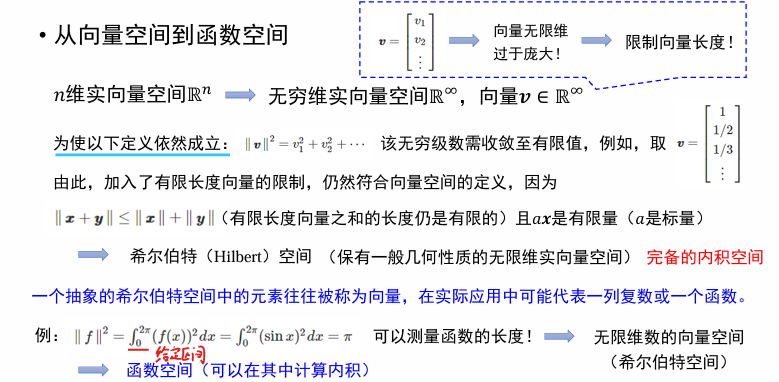
     
     * 正交函数集
     
       1. ==正交==定义
     
          考虑两个非零函数，若满足$\int_{t_1}^{t_2} f_1(t) f_2^*(t) \, dt = 0$
          则称$f_1(t)$$f_2(t)$==在区间$(t_1,t_2)$内==正交
     
          > 上标\*符号表示共轭，可覆盖复函数；若$f_2(t)$为实函数，则$f_2^*(t)=f_2(t)$
     
       2. 正交函数集
          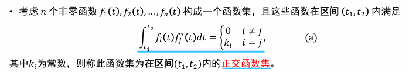
     
       3. 完备正交函数集
          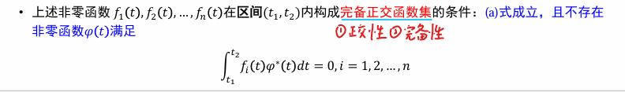
     
     * 常备的完备正交函数集
              1. 三角函数集，区间$(t_0,t_0+T)$，$T=\frac{2\pi}{\omega_0}$
                 $\left\{ 1, \cos \omega_0 t, \cos 2\omega_0 t, \ldots, \sin \omega_0 t, \sin 2\omega_0 t, \ldots \right\}$
                 2. 复指数函数集，区间$(t_0,t_0+T)$，$T=\frac{2\pi}{\omega_0}$
                     $\{e^{jn\omega_0t}\}\quad n=0,\pm1,\pm2,\dots$
     
     * 信号正交分解
     
       信号式子为$x(t) = \sum_{i=1}^{n} c_i f_i(t) + x_e(t), t \in (t_1, t_2), \quad f_i(t) \text{为实信号}$
       选取系数$c_i(i=1,2,\dots,n)$使这种线性组合表示最接近原信号$x(t)$，即使得均方误差$\overline{x_e^2(t)} = \frac{1}{t_2 - t_1} \int_{t_1}^{t_2} \left[ x(t) - \sum_{i=1}^{n} c_i f_i(t) \right]^2 dt$最小
       
     
       > 系数的求解思路有二。课本上是对均方误差表达式的系数$c_i$求偏导数。第二种是假定均方误差为0，直接从上述正交分解，内积的角度计算。也就是当信号$x(t)=\sum_{i=1}^{n} c_i f_i(t)$时，$\langle x(t), f_i(t) \rangle = \int_{t_1}^{t_2} x(t) f_i(t) dt = \sum_{i=1}^{n} c_i \int_{t_1}^{t_2} f_i(t) f_j(t) dt \Rightarrow c_i = \frac{\int_{t_1}^{t_2} x(t) f_i(t) dt}{\int_{t_1}^{t_2} [f_i(t)]^2 dt} = \frac{1}{k_i} \int_{t_1}^{t_2} x(t) f_i(t) dt$
     
     * 帕斯瓦尔方程
       * 如果$\overline{x_e^2(t)}=0$，则$x(t)$可以完全由n个正交函数精确描述，此时正交函数集完备。
       * 一般$\overline{x_e^2(t)}>0$，n越大，均方误差越小。当$n\to \infty$，有$\overline{x_e^2(t)}=0$，以及$\int_{t_1}^{t_2} x^2(t) \, dt = \sum_{i=1}^{\infty} c_i^2 k_i$。这就是帕斯瓦尔方程。它表示了信号分解的能量关系，信号的能量等于此信号在**完备正交函数集**中各分量的能量之和。
     
## 连续信号的频域分析

### 周期信号的傅里叶级数

1. 狄里赫利条件

   * 在一个周期内，如果有间断点存在，则间断点的数目应是有限个
   * 在一个周期内，极大值和极小值的数目应是有限个
   * 在一个周期内，信号是绝对可积的，即$\int^{t_0+T_1}_{t_0}|f(t)|dt$等于有限制

   狄里赫利条件是傅里叶级数存在的充分条件

   > 注：通常实际应用中的周期性信号都能满足狄里赫利条件，所以一般的周期信号都具有傅里叶级数。

2. 三角函数形式的傅里叶级数展开式
   
   * 三角函数的线性组合形式
     
   
     > 傅里叶系数的求解有正交分解法和积分法两种思路。正交分解法顾名思义，就是利用内积求解近似系数。积分法就是利用三角函数积分为0，也是正交的性质来化简式子。
   
     :fire::fire::fire:注意，$a_n$为n的偶函数，$b_n$为n的奇函数。
   
   * 三角函数形式
     $f(t)=c_0+\sum^{\infty}_{n=1}c_n\cos(nw_1t+\varphi_n)$
   
     * $c_0 = a_0 = \frac{1}{T_1} \int_{-\frac{T_1}{2}}^{\frac{T_1}{2}} f(t) \, dt$
     * $c_n=\sqrt{a_n^2+b_n^2}$
     * $\varphi_n = -\arctan\left(\frac{b_n}{a_n}\right), \quad a_n = c_n \cos \varphi_n, \quad b_n = -c_n \sin \varphi_n$
   
     > $c_n$为n的偶函数，$\varphi_n$是n的奇函数
     >
     > 为什么$\varphi_n = -\arctan\left(\frac{b_n}{a_n}\right)$，运算方便，由上述线性组合形式经过cocosinsin而来。
   
     周期信号的频谱
     
   
     * 幅度谱——相位谱
       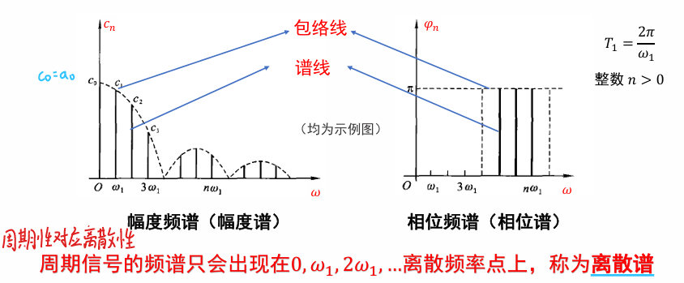
       
       > 类似的，包络线是真实的$\omega$函数，而谱线是离散的$nw_1$这样的点。
     
   * 复指数形式
     $f(t)=\sum_{n=-\infty}^{\infty} F(n\omega_1) e^{j n \omega_1 t}$
   
     * 数学运算性质及推导过程
       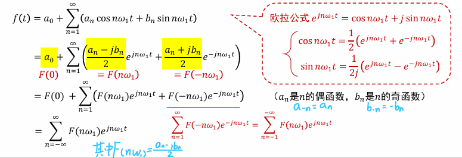
   
       $F(nw_1)=\frac{1}{2}c_ne^{j\varphi_n}=\frac{1}{2}(a_n-jb_n)=\frac{1}{T_1} \int_{-\frac{T_1}{2}}^{\frac{T_1}{2}} f(t) e^{-j n \omega_1 t} dt$
   
       $a_n=F_n+F_{-n}$
   
       $b_n=j(F_n-F_{-n})$
   
       $|F_n|=|F_{-n}|=\frac{1}{2}|c_n|$
   
     * 复数频谱——幅频、相频
       
       
       
       > 注意，负频率是数学运算的结果，根据欧拉公式，正负两个频率下相加才是原本的函数，因此，这里的赋值均为坐标单边谱的二分之一。
       
       当$F_n$为实数时，可以用正负来代表相位。$F_n=|F_n|e^{j\varphi_n}$
       
     
   * 函数对称性与傅里叶系数的关系
   
     * 偶函数
       
     * 奇函数
       
     * 奇谐函数
       
     * 总结
       
   
3. 周期方波信号的傅里叶近似
      $f(t) = 
      \begin{cases} 
      -\frac{E}{2} & -\frac{T_1}{2} \leq t < 0 \\
      \frac{E}{2} & 0 \leq t < \frac{T_1}{2}
      \end{cases}$
   
      傅里叶近似为
   
      $f(t) = \frac{2E}{\pi} \left( \sin \omega_1 t + \frac{1}{3} \sin 3\omega_1 t + \frac{1}{5} \sin 5\omega_1 t + \cdots \right)$
      计算均方误差可知，傅里叶级数越多，近似误差越小。
      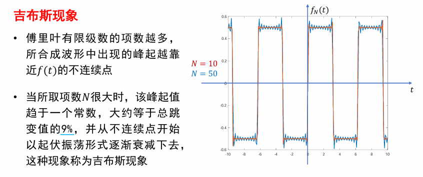
   
4. 典型周期信号的傅里叶级数
   
      * 周期矩形脉冲信号$f(t) = E \left[ u\left(t + \frac{\tau}{2}\right) - u\left(t - \frac{\tau}{2}\right) \right], \quad t \in \left[-\frac{T_1}{2}, \frac{T_1}{2}\right], \tau \in (0, T_1)$
        
        **三角形式**：
        $b_n=0,a_0 = \frac{E\tau}{T_1}, a_n = \frac{2E}{n\pi} \sin\left(\frac{n\pi\tau}{T_1}\right) = \frac{2E\tau}{T_1} Sa\left(\frac{n\pi\tau}{T_1}\right)$
        
        
        $f(t) = \frac{E\tau}{T_1} + \frac{2E\tau}{T_1} \sum_{n=1}^{\infty} Sa\left(\frac{n\pi\tau}{T_1}\right) \cos n\omega_1 t = \frac{E\tau}{T_1} + \frac{E\tau \omega_1}{\pi} \sum_{n=1}^{\infty} Sa\left(\frac{n\omega_1 \tau}{2}\right) \cos n\omega_1 t$
       > $Sa(x)=\frac{sinx}{x}$为取样函数。
       >
       > 取样函数方便我们观察赋值和坐标的变换。
      
      ​	**指数形式：**
      ​	$f(t) = \sum_{n=-\infty}^{\infty} F_n e^{j n \omega_1 t}$
      
      ​	$F_n = \frac{a_n}{2} = \frac{E\tau}{T_1} Sa\left(\frac{n \omega_1 \tau}{2}\right)$（注意，$F_n$为实数，因为$b_n$为0）
      ​	$f(t) = \frac{E\tau}{T_1} \sum_{n=-\infty}^{\infty} Sa\left(\frac{n\omega_1 \tau}{2}\right) e^{j n \omega_1 t}$	
      
      * * 周期矩形脉冲信号频谱特点$F_n=\frac{E\tau}{T_1} Sa\left(\frac{n \omega_1 \tau}{2}\right)$
          
      
        * 
          
      
          > 注意带宽的理解。矩形脉冲信号的傅里叶级数展开形式，相当于把信号分解为一系列正弦信号，然后看这些正弦信号的模，相当于强度。强度大的几个相当于主导部分，因此是这个信号的关键部分，可以允许一定失真，把这些传过去就可以大部分还原。故称为信号本身的带宽，而不是滤波器的。
      
        * 接下来讲解了系数变化对于频谱的影响
      
          
          
      
      * 对称方波信号
      
        重点：信号上下平移，不改变$F_n$
        
        
      
      * 复指数信号
      
        
        
      
        > $e^{j\omega_1t}$只是一种频率的正弦信号，自然只有在当前频率$\omega_1$才有幅值。故复指数信号是正弦信号的一种表现形式。
      
      * 正弦信号（从$e^{j\omega_1t}$推导而来）
        

### 非周期信号的傅里叶变换

1. 非周期信号的频谱分析

   > 非周期信号可以看作周期无穷大的周期信号。
   >
   > 当T无穷大时，谱线连续，幅度变为无穷小量。

   * 从傅里叶级数到**傅里叶变换**

     * 定义$F(\omega)=T_1F(n\omega_1)$（避免无穷小量）
       

       > $T_1F(n\omega_1)=\frac{2\pi F(n\omega_1)}{\omega_1}$。下列PPT描述了为何可以用$F(\omega)$的值代表$F(n\omega)$。当T无穷大，角频率无穷小，原本的离散频谱的横坐标间距无限小，类似冲激函数。

       
       

       频谱密度函数（频谱函数）$F(\omega)=\int^{\infty}_{-\infty}f(t)e^{-j\omega t}dt$
       基于此，有$f(t)=\frac{1}{2\pi}\int^{\infty}_{-\infty}F(\omega)e^{j\omega t}d\omega$
       这就是==傅里叶变换==
       

     * 频谱密度函数奇偶性
       

     * 狄里赫利条件
       

   * 典型非周期信号的频谱
   
     1. 矩形脉冲信号（又称：窗函数、门函数）
   
        *  $f(t) = 
          \begin{cases} 
          E & \text{if } |t| < \frac{\tau}{2} \\
          0 & \text{if } |t| > \frac{\tau}{2}
          \end{cases}$
          
        * $F(\omega)= E \tau Sa\left(\frac{\omega \tau}{2}\right)$
   
     2. 单边指数信号
   
        * $f(t) = 
          \begin{cases} 
          e^{-at} & t > 0, a > 0 \\
          0 & t < 0
          \end{cases}$
        * $F(\omega)=\frac{1}{a+j\omega}$
          $|F(\omega)| = \frac{1}{\sqrt{a^2 + \omega^2}}, \quad \varphi(\omega) = -\arctan\left(\frac{\omega}{a}\right)$
   
     3. 双边指数信号
   
        * $f(t)=e^{-a|t|},a>0$
        * $F(\omega)=\frac{2a}{a^2+\omega^2},|F(\omega)|=\frac{2a}{a^2+\omega^2},\varphi(\omega)=0$
   
     4. 单位直流信号
   
        * $f(t)=1,-\infty<t<\infty$
        * ==不满足狄里赫利条件！==
        * 通过双边指数信号$e^{-a|t|}(a>0)$频谱求极限而来
        * $\mathcal{F}[e^{-a|t|}] = \frac{2a}{a^2 + \omega^2}, \quad F(\omega) = \lim_{a \to 0^+} \frac{2a}{a^2 + \omega^2} = 
          \begin{cases} 
          0 & \omega \neq 0 \\
          \infty & \omega = 0 
          \end{cases} \quad \text{(冲激函数)}$
   
     5. 双边奇数信号
   
        * $f(t) = 
          \begin{cases} 
          -e^{at} & t < 0, a > 0 \\
          e^{-at} & t > 0, a > 0
          \end{cases}$
        * $F(\omega) = -\frac{j 2\omega}{a^2 + \omega^2}$
        * $|F(\omega)| = \frac{2|\omega|}{a^2 + \omega^2}, \quad \varphi(\omega) = 
          \begin{cases} 
          \frac{\pi}{2} & \omega < 0 \\
          -\frac{\pi}{2} & \omega > 0
          \end{cases}$
   
     6. 符号函数信号
   
        * $\text{sgn}(t) = 
          \begin{cases} 
          -1 & t < 0 \\
          0 & t = 0 \\
          1 & t > 0
          \end{cases}$
        * ==不满足狄里赫利条件！==
        * 由双边奇指数信号求极限而来
        * $F(\omega) = \lim_{a \to 0} -\frac{j 2\omega}{a^2 + \omega^2} = \frac{2}{j\omega}$
   
     7. 单位冲激信号
   
        * $F[\delta(t)]=1$
        * $F[1]=2\pi \delta(\omega)$
   
     8. 单位阶跃信号
   
        * ==不满足狄里赫利条件==
        * $u(t)=\frac{1}{2}+\frac12sgn(t)$
      * $F(\omega)=\pi \delta(\omega)+\frac{1}{j\omega}$
        * 一般都对$\pi \delta(\omega)$利用冲激信号的性质进行处理
   
   * 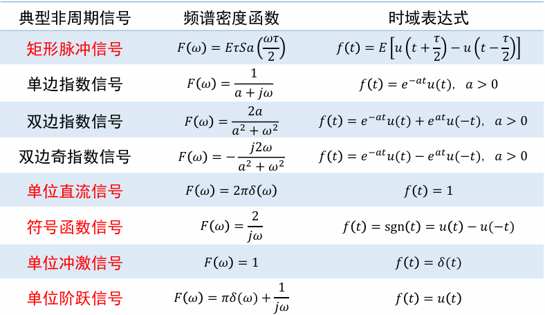

### 傅里叶变换的性质

1. * 线性
     

   * 奇偶虚实性
     
     

     * 当$f(t)$为实函数时，$f(t)=f^*(t)$，有$F(\omega)=F^*(-\omega)$
     * 当$f(t)$为实函数时，$|F(\omega)|$为$\omega$的偶函数，$\varphi(\omega)$为$\omega$的奇函数
     * 当$f(t)$为实偶函数时，$F(\omega)$是$\omega$的实偶函数
     * 当$f(t)$为实奇函数时，$F(\omega)$是$\omega$的虚奇函数

   * 对偶性

     * $f(t) \xleftrightarrow{\mathcal{F}} F(\omega)$

       $F(t) \xleftrightarrow{\mathcal{F}} 2\pi f(-\omega)$

   * 尺度变换特性

     * 

     * 

       > 时域压缩以提高脉冲速率，但压缩时域会导致信道频带展宽，引进更多高频噪声。这是互相矛盾的点。

   * 时移特性

     * 

   * 频移特性

     * $f(t)e^{\pm j\omega_0 t} \xleftrightarrow{\mathcal{F}} F(\omega \mp \omega_0)$
     * 频谱搬移的实现原理：将原信号$f(t)$乘以载波信号$cos \omega_0 t$或$sin \omega_0 t$
       
   
   * 微分特性
   
     * $\frac{d^n f(t)}{dt^n}\xleftrightarrow{\mathcal{F}}(j\omega)^nF(\omega)$
     * 增强了高频成分，有助于突出信号的变化
   
   * 积分特性
   
     * 
   
   * 时域卷积定理
   
     * $f_1(t)*f_2(t)\xleftrightarrow{\mathcal{F}}\mathcal{F}_1(\omega)\mathcal{F_2}(\omega)$
   
   * 频域卷积定理
   
     * $f_1(t)f_2(t) \xleftrightarrow{\mathcal{F}} \frac{1}{2\pi} F_1(\omega) * F_2(\omega)$
     * 例题
       1. 使用窗函数取出周期函数的单周期部分
          
   
2. 计算例子

   * 利用阶跃信号计算矩形脉冲信号的傅里叶变换时，注意$\pi \delta(\omega)$会被抵消掉。
     
     例如这里，$\delta(\omega)$在0处才有意义，其值一般认为无穷大，但是0时其系数为0，无穷大*0=0！
     因此，在使用阶跃信号的傅里叶变幻时常要注意这个抵消方式。
   * 三角脉冲求导就是两个矩形脉冲信号，不管零点这个严格来说导数不存在的点。
     
   * 矩形脉冲信号——连续求导两次，求出傅里叶变换再利用微积分特性往上还原。
     
     不要尝试求这个矩形脉冲的卷积！一般能分解为比较好算的卷积式子的矩形脉冲长这样：
     
   * 擅于利用傅里叶变换的对偶性求某些式子的傅里叶变换，如$Sa(t)$，可以利用矩形脉冲的傅里叶变换反求其傅里叶变换。
     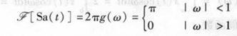
   * 

### 周期信号的傅里叶变换

> 一个周期内绝对可积的周期信号可以用傅里叶级数表示。周期信号的频谱是离散谱。
>
> 周期信号在无限区间内并不绝对可积，因此不满足狄里赫利条件。但可以通过引入冲激函数，得到周期信号的傅里叶变换

1. 典型周期信号的傅里叶变换

   * 复指数信号$e^{j\omega_0 t}$

     $\mathcal{F}\left[e^{j\omega_0 t}\right] = 2\pi \delta(\omega - \omega_0)$

     > 使用频移性质，从1--->$e^{j\omega_0 t}$
   
   * 正弦信号$sin \omega_0 t$
     $\mathcal{F}[\sin \omega_0 t] &= \frac{1}{2j}[2\pi \delta(\omega - \omega_0) - 2\pi \delta(\omega + \omega_0)] \\
     &= -j\pi \delta(\omega - \omega_0) + j\pi \delta(\omega + \omega_0) $
     
   * 余弦信号$cos \omega_0 t$
     $\mathcal{F}[\cos \omega_0 t] &= \frac{1}{2}[2\pi \delta(\omega - \omega_0) + 2\pi \delta(\omega + \omega_0)] \\
     &= \pi \delta(\omega - \omega_0) + \pi \delta(\omega + \omega_0)$
   
2. 一般周期信号的傅里叶变换

   * 周期信号的傅里叶变换
     
     将周期信号展开成无穷多项复指数函数的线性组合。

     对展开后的每一项分别进行傅式变换，得到其傅里叶变换。

     由其形态可知，周期信号的傅里叶变换由无穷多个冲激函数组成。

     * $F(n\omega_1)=F_n=\frac{1}{T_1}F_0(\omega)|_{\omega=n\omega_1}$
     * 冲激位于信号的谐频处，强度等于$f(t)$傅里叶级数系数$F_n$的$2\pi$倍

   * 周期信号的傅里叶级数
     

     :fire:**单脉冲信号的傅里叶变换**和**傅里叶级数系数**关系：
     	$F_n=\frac{1}{T_1}F_0(\omega)|_{\omega=n\omega_1}$
     单脉冲信号——级数系数——傅里叶变换

   * 二者对比
     

     > 一个是离散函数（$F_n$），一个是冲激函数序列（带箭头）（$F_{\omega}$）

   * 例子——周期矩形脉冲信号
     
     例子——周期单位冲激序列
     

### 连续信号的复频域分析

> 拉普拉斯变换是傅里叶变换的拓展。
>
> 傅里叶变换无法解决功率型非周期信号、指数增长型信号等。
>
> 对于不满足绝对可积的信号，我们乘以一个随时间衰减的因子$e^{-\sigma t}$，使其满足绝对可积条件。

1. **从傅里叶变换到拉普拉斯变换**
   
   
2. 拉普拉斯变换的收敛域
   
   * 存在傅里叶变换的信号一般也存在拉普拉斯变换（个别除外，如单位直流信号）
   * 存在拉普拉斯变换的信号，其傅里叶变换不一定存在。

# 第二章 离散信号的分析

## 信号的采样和恢复

1. 信号定义

   * 离散信号

     * 时间上是离散的，只是某些不连续的规定时刻给出信号的瞬时值

     * 产生方式：连续时间信号的采样、信号本身就是离散信号

   * 采样信号

     *  利用采样脉冲序列$p(t)$从连续信号$f(t)$中“抽取”一系列的离散样值
     * 通常用$f_s(t)$表示
   
2. 时域采样
   
   * 基本形式的推导
   
     > $f(t)$为连续信号，$p(t)$为采样脉冲，$f_s(t)$为采样信号
   
     * $f_S(t)=f(t)p(t)$，$F_s(\omega)=\frac{1}{2\pi}F(\omega)*P(\omega)$
   
     * $P(\omega)=\sum^{\infty}_{-\infty}2\pi P_n\delta(\omega-n\omega_s)$，$P_n = \frac{1}{T_s} \int_{-\frac{T_s}{2}}^{\frac{T_s}{2}} p(t) e^{-j n \omega_s t} dt$
   
       > $p(t)$为周期为$T_s$的采样脉冲函数，$P_n$为其傅里叶系数。
       >
       > 采样角频率$\omega_s=\frac{2\pi}{T_s}$
   
     * $F_s(\omega)=\sum^{\infty}_{n=-\infty}P_nF(\omega-n\omega_s)$
   
       > 在频域上以$\omega_s$为周期进行周期延拓。不等幅。
       >
       > $F(\omega)$和$\delta(\omega-n\omega_s)$合并成为$F(\omega-n\omega_s)$。
   
   * 矩形脉冲采样
     
   
     * $P_n=\frac{E\tau}{T_s} Sa\left(\frac{n\omega_s \tau}{2}\right)$
       $F_s(\omega) = \frac{E\tau}{T_s} \sum_{n=-\infty}^{\infty} Sa\left(\frac{n\omega_s \tau}{2}\right) F(\omega - n\omega_s)$
   
       > $F(\omega)$在以$\omega_s$为周期的延拓过程中，==幅度以$Sa\left(\frac{n\omega_s \tau}{2}\right)$作为包络函数的规律变化== 
   
   * **冲激采样（理想采样）** 
     采样信号：$p(t)=\delta_T(t)=\sum^{\infty}_{n=-\infty}\delta(t-nT_s)$
     $P_n=\frac{1}{T_s}$
     $F_s(\omega)=\sum_{n=-\infty}^{\infty} P_n F(\omega - n\omega_s) = \frac{1}{T_s} \sum_{n=-\infty}^{\infty} F(\omega - n\omega_s)$
   
     * 原连续信号的频谱$F(\omega)$以$\omega_s$为周期重复（等幅）
     * ==频谱的幅度乘上一个常数$\frac{1}{T_s}$==
   
     * 例子分析——周期矩形信号经冲激信号采样后，采样信号的频谱
       首先，求出周期矩形信号的傅里叶变换。再代入到采样信号的定义式。由最后采样信号的频谱可以看到，如果$w_s$不够大，延拓后的频谱可能会叠在一起，对未来的恢复产生阻碍。
   
   * 时域采样定理（香农定理）
   
     * 频谱函数只在有限区间具有有限值：频谱受限
     * 
   
3. 频域采样

   * 频域采样定理
     

4. 从时域采样信号$f_S(t)$恢复原信号$f(t)$

   > 从时域采样信号恢复就是指算出$f(t)$

   * 通过窗函数取主频带$F(\omega)=F_s(\omega)H(\omega)$

     

     $H(\omega) = 
     \begin{cases} 
     T_s & |\omega| \leq \omega_c \\
     0 & |\omega| > \omega_c 
     \end{cases}$

     注意，==窗函数的幅值选择的是$T_s$==。因为$F_s(\omega)=\frac{1}{T_s} \sum_{n=-\infty}^{\infty} F(\omega - n\omega_s)$，要抵消前面的$\frac{1}{T_s}$才是$F(\omega)$。详情看前面$F_s(\omega)$的推导。
     其时域表达式，通过傅里叶变换的对偶性，可以得到
     $h(t)=Sa(\frac{\omega_st}{2})$

     则由时域卷积定理，可以求出
     

   * 图解：
     

   * 采样频率选择

     * 为了保留原连续信号某一频率分量的全部信息，至少对该频率分量一个周期采样两次
     * 对于快变信号，要提高采样频率
     * 采样频率过高会增加计算机内存的占用量，也造成采样过程不稳定
     * 对于不是带限的信号，在采样前采用抗混叠滤波器，把不需要或者不重要的高频成分滤除

5. 从频域采样信号$F_p(\omega)$恢复原信号$F(\omega)$

   > 从频域采样信号恢复就是指算出$F(\omega)$

   

6. 总结
   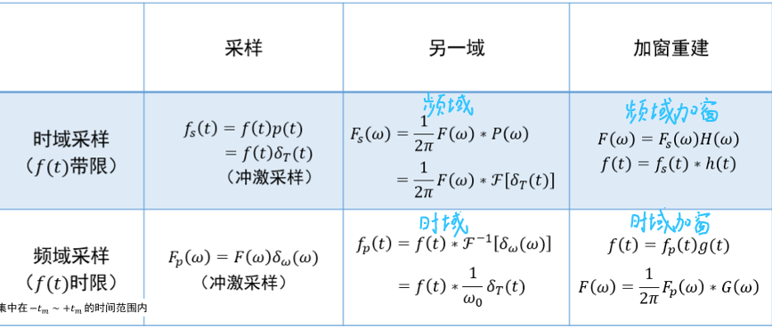

## 离散信号的时域描述和运算

1. **离散信号的秒速——序列**

   * 只要给出函数值的离散时刻是等间隔的，都可以用序列$x(n)$来表示
   * n是各函数值在序列中出现的**序号**，对应序号n的函数值通常称为在第n个点的**“样值”**
   * 通常用$x(n)$定义在整个定义域内的一组有序数列的集合${x(n)}$来表示一个离散信号，**$x(n)$仅对n的整数值才有定义**
   * 离散信号的能量定义为$W=\sum^{\infty}_{n=-\infty}|x(n)|^2$

2. 序列的表示方法

   * 有序数列的集合
   * 闭式表达式
   * 图形表示法
     

3. 离散信号表示

   * 单位脉冲序列（单位样值信号）
     

   * 单位阶跃序列
     

   * 矩形序列

     

   * **正弦型序列**

     * $x(n)=Asin(n\Omega_0+\phi)$，$\Omega_0$表示数字角频率，单位为弧度；$\phi$为正弦序列的初始相角。$\Omega_0=\omega_0T_s$

       推导过程：$x(n)=Asin(\omega_0t+\varphi_0)|_{t=nT_s}$

       ​							$=Asin(n\omega_0T_s+\varphi_0)=Asin(n\Omega_0+\varphi_0)$

     * 连续时间正弦信号与离散时间正弦序列的区别

       * 在时移与相移上的区别
         
       * 周期性的区别：离散时间正弦序列不一定是周期序列
         只有$\frac{2\pi}{\Omega_0}$为有理数时，方为周期序列。
         
       * 数字频率
         

   * 复指数序列
     

4. 离散信号的时域运算

   * 平移和翻转
     

   * 和、积
     

   * 累加
     

   * 差分运算
     

   * 序列的时间尺度（比例）变换

     
     
     
   * **卷积和**
   
     * 对于两序列$x(n),h(n)$，其卷积和定义为：
       $y(n)=\sum^{\infty}_{m=-\infty}x(m)h(n-m)=x(n)*h(n)$
       其中$x(n)$可用任意离散序列表示为$x(n)=\sum^{\infty}_{m=-\infty}x(m)\delta(n-m)$，即$x(n)=x(n)*\delta(n)$
   
     * 
   
     * **卷积和求解思路**
   
       1. 
          
          **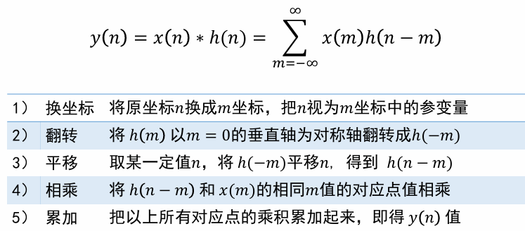**
   
       2. 图解法
   
          图中蓝字标注了数据的意思。从上到下模拟了平移过程。
          
   
     * **卷积和的性质**
       

## 离散信号的频域分析

### 离散傅里叶级数

1. 

2. 离散傅里叶级数变换对	**DFS**

   * **结论**
     
     
     
     
     > $n=<N>$表示求和索引从0到N-1
     
   * 推导
     由连续周期信号傅里叶级数推导而来。首先改变符号
     
     默认离散信号为周期序号，即$T_0=NT_s$（非周期信号无傅里叶级数）。进行代换，$t=nT_s$，$dt=T_s$
     

     
     

3. 连续和离散周期信号频谱的关系

   > * 离散周期序列$x(n)$与其DFS系数$X(k\Omega_0)$（反映了复振幅）是一一对应的
   > * 如果$x(n)$是从连续周期信号$x(t)$采样得来，即$x(n)=x(t)|_{t=nT_s}$，假设买个周期内采样N个点，$x(n)$的频谱$X(k\Omega_0)$与$x(t)$的频谱$X(k\omega_0)$的关系。
   > * 

   * 结论

     * 采样频率满足采样定理的条件下，$X(k\Omega_0)$可以看作$X(k\omega_0)$的周期重复，重复周期为$\omega_s$（模拟频率）、$2\pi$（数字频率）

       > 数字频率为$\Omega$，模拟频率为$\omega$；由于$\Omega=\omega T_s$，因此两种频域下信号周期不同。连续即模拟，离散即数字。

     * 采样频率若不满足采样定理，发生频谱混叠

     * 

   * 例子

     * 
     * 
       

4. 离散傅里叶级数（DFS）的主要性质

   * 线性性质
     
   * 周期卷积定理
     
   * 复共轭
     
   * 位移性质
     
   * 帕斯瓦尔定理
     

### 从离散傅里叶级数(DFS)到离散时间傅里叶变换（DTFT）

1. 从DFS到DTFT

   * 结论：离散时间傅里叶变换对$x(n)\xleftrightarrow{DTFT}X(\Omega) $
     

     * DTFT存在条件
       

   * 推导：

     * 对于长度有限的非周期信号$x(n)$，以N为周期，将$x(n)$延拓为周期信号$x_N(n)$
       

     * 求出$x_N(n)$的DFS变换对
       

     * 考虑周期N趋向于无穷大的情形
       

     * 仿照推导非周期信号的傅里叶变换的方法，引入频谱密度函数。
       

     * 对无穷小量进行等效处理
       

       > 具体思想参照非周期信号傅里叶变化部分。
     
   * **DTFT性质**
     
     
   * 解题方法
   
     * 常用**DTFT对**
       $x_1(n)=a^nu(n),|a|<1 \xleftrightarrow{DTFT}X_1(\Omega)=\frac{1}{1-ae^{-j\Omega}}$
       $x_2(n)=-a^nu(-n-1),|a|>1\xleftrightarrow{DTFT}X_1(\Omega)=\frac{1}{1-ae^{-j\Omega}}$
   
       后续常常结合**DTFT**的位移性质
   
       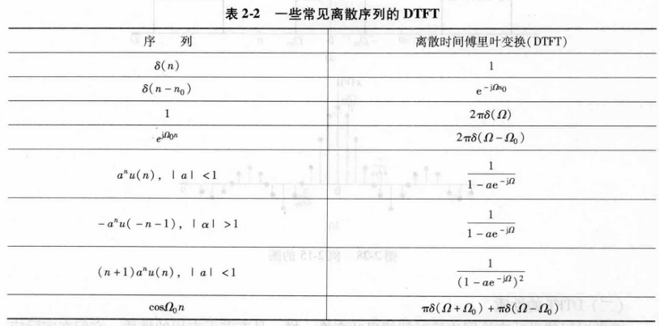
   
     * 利用**DTFT**性质求解差分方程
       
   
2. 信号与傅里叶变换的关系

   * 
   * 
   * 总结
     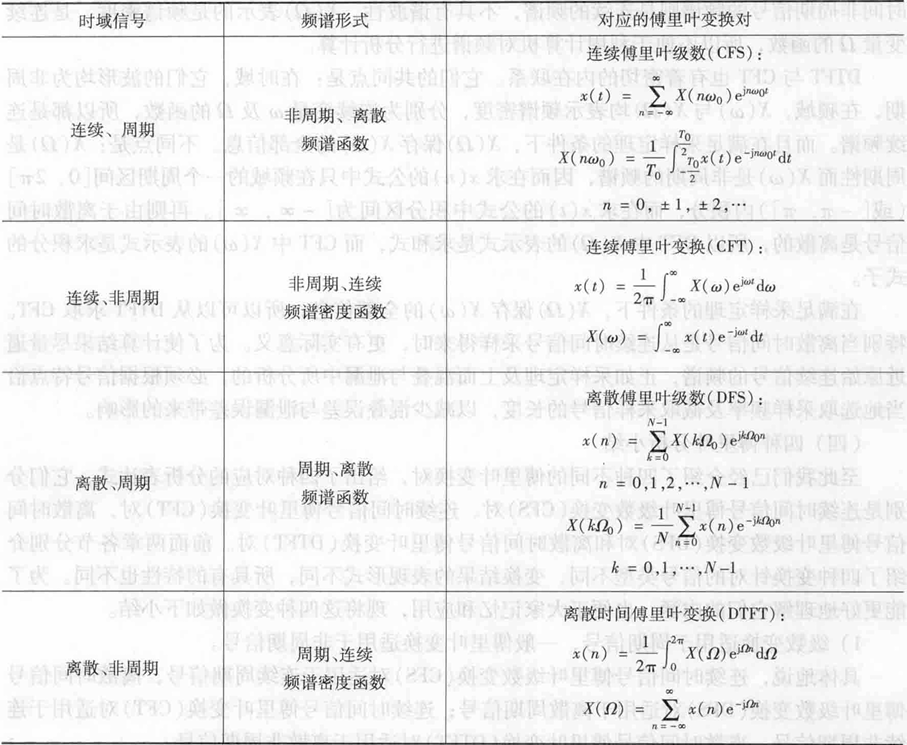

### DFT

1. 离散傅里叶变换对$x(n)\xleftrightarrow{DFT}X(k)$

   > 计算机对信号进行分析，要求信号的时域和频域都是离散序列，而非周期离散DTFT得到的频谱函数为连续，不符合要求，因此要进行一些处理，得到==一个时域和频域都离散的傅里叶变换对==

   * 结论
     

   * 推导：

     * 利用周期信号的DFS，取主值区间，定义新的运算而来。（我有点不太懂，略过了）
     * 也可以从**DTFT**到**DFT**，即对DTFT频域进行离散采样而来。
        
       同时，要保证$N \geq L$，通常$N=L$，时间上越多，频域上就得采的更密，不然有信息丢失。
   
   * **DFT**矩阵形式（重要）

     * 令$W_N=e^{-j\frac{2\pi}{N}}$
       
       
       $X(k) = \text{DFT}[x(n)] = \sum_{n=0}^{N-1} x(n) W_N^{nk}, \quad k = 0, 1, \ldots, N-1 $
       
       
       $x(n) = \text{IDFT}[X(k)] = \frac{1}{N} \sum_{k=0}^{N-1} X(k) W_N^{-nk}, \quad n = 0, 1, \ldots, N-1$
       
     * 写成矩阵形式
       
     
   * **DFT小结**
     
   
2. **离散傅里叶变换DFT的性质**

   * 线性性质
     
   * ==圆周移位性质==
     $x((n-m))_NR_N(n)$
     * **用取余数（取模值）运算表示周期延拓**
       若$n=n_1+mN$，$0 \leq n_1 \leq N-1$，m为整数
       $((n))_N=(n_1)$
       称为取余数，或称作n对N取模值
     * **理解圆周移位的概念**
       
       
     *  **圆周移位性质：时域和频域**
       
   * ==圆周卷积性质==
     * **时域圆周卷积**
       
     * 例题：求解圆周卷积的两种方法
       卷积性质逆推
       
       直接计算
       
     * **频域圆周卷积**
       
   * 圆周卷积和线性卷积对比
     
   * 奇偶虚实性
     
     
     
   
3. 常用**DFT**及一些常考点

   * $x(n)=x(n)=\cos(\frac{2\pi n}{N})R_N(n)$
     $X(k) = \text{DFT} \left[ \cos\left( \frac{2\pi n}{N} \right) R_N(n) \right] = \frac{N}{2} \left[ \delta(k-1) + \delta(k - N + 1) \right] \quad (0 \leq k \leq N-1)$

   * $h(n)=\sin(\frac{2\pi n}{N})R_N(n)$
     $H(k) = \text{DFT} \left[ \sin\left( \frac{2\pi n}{N} \right) R_N(n) \right] = \frac{N}{2j} \left[ \delta(k-1) - \delta(k - N + 1) \right] \quad (0 \leq k \leq N-1)$

     > 上述式子的证明关键有二。其一为将sin和cos写成$W_N$的形式，即利用欧拉变换；其二为利用$W_N$的正交性。

   * 对$\cos$和$\sin$做周期延拓时，若圆周卷积长度为sin和cos的周期，即sin和cos的形式类似$x(n)=\cos(\frac{2\pi n}{N})$。与其他函数不同的是，此时，**由于cos和sin本身的闭环，可以直接把取模值这一步去掉，**==即$\cos((\frac{2\pi n}{N}))_N=\cos(\frac{2\pi n}{N})$。==

### FFT

1. **FFT推导**

   > **FFT**从**DFT**变化而来，目标是简化DFT的运算量。

   * 源头：**DFT**
     
     * **计算量大：**由计算式子可以看到，计算一个$X(k)$值需要进行N次复数相乘，N-1次复数相加；则N个$X(k)$点，则需要$N^2$次复数相乘和$N(N-1)$次复数加法。

   * $W_N=e^{-j\frac{2\pi}{N}}$关键性质

     * ==数值==

     * 正交性
       

       > 所谓几何级数，就是等比数列无限项求和。$lN$表示n-m为N的整数倍。当满足此条件时，$W^{(n-m)k}_N=1$，则自然结果为1。若不满足，利用等比数列求和公式计算，会发现分子为0，结果为0。

     * 周期性
       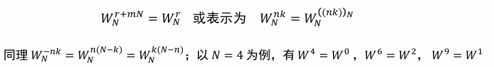

     * 对称性
       

     * 可约性
       
     
   * FFT的思想
     将长序列分解为多个短序列信号，然后分别求各个短序列的DFT，最后将他们组合，得到原序列的DFT
   
2. **FFT过程**
   
   * 将$N=2^M$点DFT分解为两组$\frac N2$点DFT
     
   
   * **基2FFT算法（Cooley-Tukey算法）**
   
     * 基础式子的推导
       对上述式子进一步处理，利用$W_N$的可约性，有：
       
       根据$W_N$的对称性，有
   
     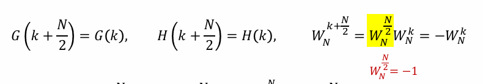
     
   
     * 应用上述式子，对DFT算法进行处理
   
       简述，即应用上述$X(k)=G(k)+W_N^kH(k)$式子，列出k从0到N-1的所有$X(k)$，按照偶数，奇数序号重新排列。再使用$W_N$的对称性进行处理，将该组式子抽象为蝶形运算。
       下列为N=4的例子：
       
       后续N=8，16等情况下，第一次分完后对偶数组和奇数组仍可以再进一步分割。
   
       
       
       
       
   
       
   
     * FFT算法的特点
   
       * 基本运算单元为一个蝶形
   
       * 每一蝶形是独立的
   
       * 每一级中有$\frac{N}{2}$个蝶形，需乘法$\frac{N}{2}$次，加减法N次
   
       * 与DFT计算量相比
         
   
         > M理解为DFT分解的阶数，如N=8时有3个阶的DFT
   
   * 例子
     
   
3. **FFT注意事项**

   * 
   * 这部分内容有点迷糊，看PPT，老师也没细讲
   
4. **FFT解题相关事宜**

   * 若给出基2FFT的矩阵形式，注意其结果的排布顺序，例如
     $\begin{bmatrix}
     X(0) \\
     X(2) \\
     X(1) \\
     X(3)
     \end{bmatrix}
     =
     \begin{bmatrix}
     1 & W^0 & 0 & 0 \\
     1 & -W^0 & 0 & 0 \\
     0 & 0 & 1 & W^1 \\
     0 & 0 & 1 & -W^1
     \end{bmatrix}
     \begin{bmatrix}
     1 & 0 & W^0 & 0 \\
     0 & 1 & 0 & W^0 \\
     1 & 0 & -W^0 & 0 \\
     0 & 1 & 0 & -W^0
     \end{bmatrix}
     \begin{bmatrix}
     x(0) \\
     x(1) \\
     x(2) \\
     x(3)
     \end{bmatrix}$
     注意频域列，是0，2，1，3！要看清。由于排列的不同，这个矩阵对应的蝶形运算图也有所不同，注意区分。

### Z变换

> 增长型离散信号的傅里叶变换不收敛，为了求傅里叶变换，需要乘衰减的实指数信号，即$x(n)r^{-n}$

1. **离散信号的Z变换和Z反变换**

   * Z变换
     $X(z)=\sum^{\infty}_{-\infty}x(n)z^{-n}$
     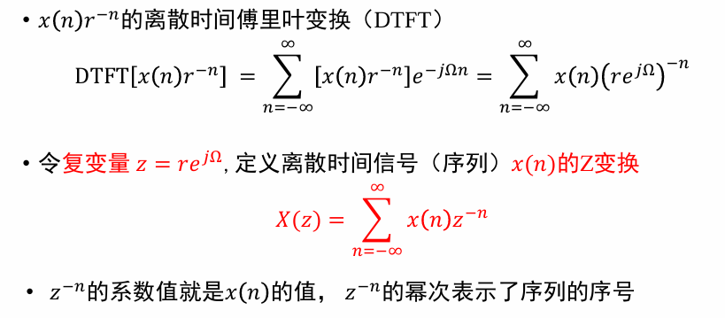

   * Z反变换
     

     > $z=re^{j\Omega}$，两边取微分得到dz和$d\Omega$的关系

   * Z变换的收敛域
     

   * Z变换的几何表示
     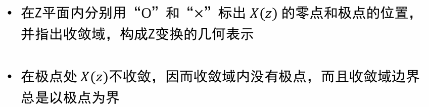

   * 单边Z变换
     

2. **Z变换与其他变换的关系**

   * **Z变换与拉普拉斯变换的关系**

     * 结论
       $z=e^{sT}$
       

     * 证明过程
       

       > 其实证明过程就是找这两个表达式相互等效的条件，即如何代换变量可以获得相同的表达式。

     * **从s平面到z平面的映射**
       关键：$z=e^{sT}$
       
       
       

   * **Z变换与DTFT、DFT的关系**

     * 结论
       * **Z变换和DTFT**
         
       * **Z变换与DFT**
         

# 第三章 信号处理基础

## 系统及其性质

1. 系统的描述
   * 定义
   * 描述
   * 系统与信号的关系
   * 系统的数学模型
   * 系统的研究方法
     
   * 系统的分类
2. 系统的性质
   * 记忆性
      对任意的输入信号，如果每一时刻系统的输出信号值仅仅取决于同时刻的输 入信号值，而与它过去的工作状态（历史）无关，称该系统具有无记忆性， 否则，该系统为有记忆的。
   * 因果性
     对于任意的输入信号，如果系统在任何时刻的输出值，只取决于该时刻 和该时刻以前的输入值，而与将来时刻的输入值无关，就称该系统具有因果性；否则，如果某个时刻的输出值还与将来时刻的输入值有关，则为非因果的。
   * 可逆性
     如果一个系统对不同的输入信号产生不同的输出信号，即系统的输入输出 信号呈一一对应的关系，则称该系统是可逆的，或称为可逆系统，否则就 是不可逆系统。
   * 稳定性
     
   * 时不变性
     
   * 线性
     
     

## 信号的线性系统处理

### 时域法分析

1. 线性时不变动态系统的表示方法

   * 对于连续系统
     

   * 对于离散系统
     

2. 系统响应

   * 零输入响应和零状态响应
     

   * 系统响应=零输入响应+零状态响应
     

     > 增量线性系统：Δy(t)=AΔx(t)

3. 线性时不变（LTI）系统的单位冲激/脉冲响应

   * 定义
     

   * 系统表达式
     

   * 连续时间LTI系统单位冲激响应$h(t)$的特点

     * 具有齐次微分方程解的基本形式
       

     * 其形式与n，m值得相对大小密切相关
       

     * 求解$h(t)$的经典方法和步骤（n>m）

       ```markdown
       * 列系统微分方程
       * 求微分方程的特征根
       * 得齐次解
       * 求各阶导数
       * 代入微分方程
       * 两边奇异函数得系统平衡，可求出系数A_i
       ```

       例题：
       

   * 离散时间LTI系统的单位样值响应

     > 

     * 表达式
       

     * 响应$h(n)$的特点
       

       例题

       
   
4. **线性时不变系统的时域分析**

   > 卷积积分——连续时间线性时不变系统
   >
   > 卷积和——离散时间线性时不变系统
   >
   > 基本思想（以连续时间情况为例）：任意连续时间信号可以分解为一系列冲激函数之和，如果已知LTI系统的单位冲激响应$h(t)$，利用线性和时不变性就能确定出系统对任意信号的响应

   * 卷积积分
     LTI系统对任意输入信号$x(t)$的响应是$x(t)$与系统单位冲激响应$h(t)$的卷积，即$y(t)=x(t)*h(t)$
     * 卷积积分图示
       
     * 推导过程
       
   * 卷积和
     $y(n)=x(n)*h(n)$
     * 
   * 冲激/脉冲响应和阶跃响应的关系
     

### 频域法分析

> 频率响应、无失真传输、理想低通滤波器

1. **线性系统的频率响应（连续系统）**

   * 对任意连续信号$x(t)$，$Y(\omega)=X(\omega)H(\omega)$

     * 推导
       

       > $x(t)$可看作无数个 $\frac{1}{2\pi}X(\omega)e^{j\omega t}d\omega$信号的和

     * 频率特性$H(\omega)$

       
       
     * 图示
       
     
   * 例题
     
   
2. **线性系统的频率响应（离散系统）**

   * 对任意离散信号$x(n)$，
     * 
       注意，这里是==DTFT==
     * 图示
       
     * 离散时间系统频率特性$H(\Omega)$
       

3. **无失真传输**

   * 定义
     信号波形不变，只能是幅度上对原信号按比例地放大或缩小，或者在时间上有一固定地延迟
     因此，
     

   * 无失真传输系统的频率特性函数
     $H(\omega)=\frac{Y(\omega)}{X(\omega)}=Ke^{-j\omega t_0}=|H(\omega)|e^{j\varphi_h(\omega)}$

     * 无失真传输系统的频域条件
       $|H(\omega)|=K$
       $\varphi_h(\omega)=-\omega t_0$

       > 谐波相移必须与其频率成正比

   * 无失真传输图示
     

   * 局限性，理想性
     

4. **理想低通滤波器**

   * 频率特性
     

   * **理想低通滤波器的冲激响应**
     

   * 时域的有线/无限和频域的有限/无限的关系
     
     

   * **理想低通的阶跃响应**
     
     
     

     > 正弦积分函数

     * 结果分析
       

   * **理想低通对矩形脉冲的阶跃响应**

     * 
     * 吉布斯现象
       
     * 典型例题
       
       
       
       

### 复频域分析

1. 

# 滤波器

## 滤波器分类及指标

* 模拟滤波器
  

  * 模拟滤波器要强调**物理可实现性**。
    

  * 技术指标

    * 中心频率

    * 通带波动

    * 相移

    * 群延迟

    * 衰减函数$\alpha$      通带衰减函数$\alpha_p$、阻带衰减函数$\alpha_s$

      

      通带截止频率$\omega_p$、阻带截止频率$\omega_s$、通带最大衰减$\alpha(\omega_p)$、阻带最小衰减$\alpha(\omega_s)$
      
      3dB选取的原因——等效于功率减半
      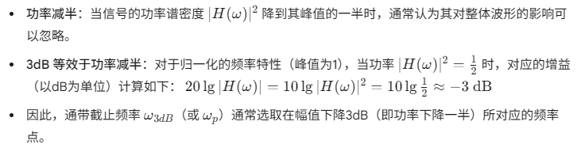

* 数字滤波器
  

## 模拟滤波器

1. 模拟滤波器概述
   
   

2. 设计系统函数$H(s)$

   * 模拟滤波器系统函数$H(s)$的要求

     * 稳定性——模拟滤波器应当是稳定的时不变系统。（只有LTI系统具有传递函数）
     * 是一个具有实系数的s有理函数，极点分布在s左半平面
     * 分子多项式阶次不大于分母多项式的阶次——符合实际系统的因果性
     * $h(t)$是t的实函数
       

   * 设计过程

     * 设计思路（假设）

       1. 零极点对称分布
          
          实现方法（用$-s^2$代替$\omega^2$）
          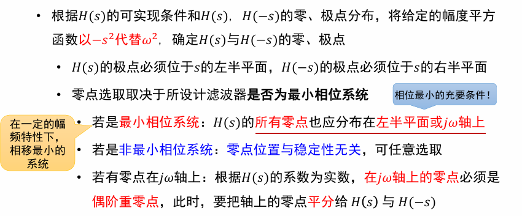
          例题
          

          

3. 巴特沃思低通滤波器

   * 幅频特性模平方（幅度二次方函数）
     

   * 幅频特性
     

     * **最大平坦性：**可以证明，若阶数为𝑛，在𝜔=0处，它的前(2𝑛−1)阶导数都 等于零。这表明，巴特沃思滤波器在 $\omega$ =0附近一段范围内是非常平直的， 它以原点的最大平坦性来逼近理想滤波器——“最平响应”

     * **频响曲线的单调下降特性：**幅值函数 无论在通带、阻带（或过渡带）都是 单调递减的；在𝜔=0处，具有最大值$H(\omega)$=1；当𝜔→∞，幅值趋于零,$H(\infty)$=0。
       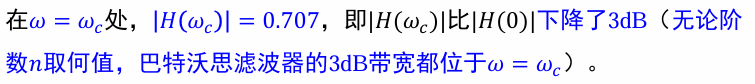

     * **滤波器幅频特性与阶数n的关系：**
       

   * 零极点分布
     
     
     > $s=j\omega$，则$\omega=\frac{s}{j}$。通过变换得到$H(s)H(-s)$
     
     
     
   * 设计传递函数
     
     
     
   
     * 滤波器阶次的确定
   
       * 衰减函数
         
       * 通过衰减函数推导滤波器阶数，通过通带衰减函数和阻带衰减函数的表达形式可以得到n
         
       * 例题——归一化之后要换回去
         
         

## 数字滤波器


1. 概述

   
   过程
   
   分类
   
   原理
   

   * 有限冲激响应的传递函数
     
   * 无限冲激响应的传递函数
     

2. 无限冲激响应（$IIR$）滤波器

   * 设计方法——间接设计法：借助模拟滤波器传递函数$H_a(s)$求出相应的数字滤波器传递函数$H(z)$

     * 给定技术指标要求，确定一个满足该指标的模拟滤波器$H_a(s)$
     * 寻找一种变换关系把s平面映射到z平面，使$H_a(s)$变换为所需的数字滤波器传递函数$H(z)$

     

     * 为了使数字滤波器保持模拟滤波器的特性，从复变量s到复变量z之间的映射满足两个基本条件
       

   * 具体实现方法——冲激响应不变法

     * 总纲
       
     * 数学过程
       
     * 映射满足前述两个基本条件
       
       
     * s平面和z平面的映射呈多值映射关系
       
     * 
     * $IIR$滤波器的特点
       
   
   * 具体实现方法二——双线性变换法
   
     > 冲激响应不变法存在频谱混叠的缺点，只适用于低通或者限带的高通、带通的情况；要找出一种频率特性有一一对应关系的变换
   
     * 映射原理
       
       
     * 双线性变换的特性
       
     * 
     * 
   
   
   
   
