## 小知识

1. 关于交流，直流，交直流的变量命名方法，依次为$u_{be}$、$U_{BE}$、$U_{be}$。

## 基本放大电路

### 2.1、2.2

1. 分析基本放大电路的方法：==先直流后交流==。
   ==直流电路的分析方法==的基本套路如下：推导过程较为简单，不在此赘述，主要是，$U_{CEQ}$不是1.4V！工作在放大区时，发射极正偏，集电极反偏，并不均为0.7V，要根据实际电路来推算。从上到下顺序为1，2，3，4，那么推到顺序就是1，2，4，3.
   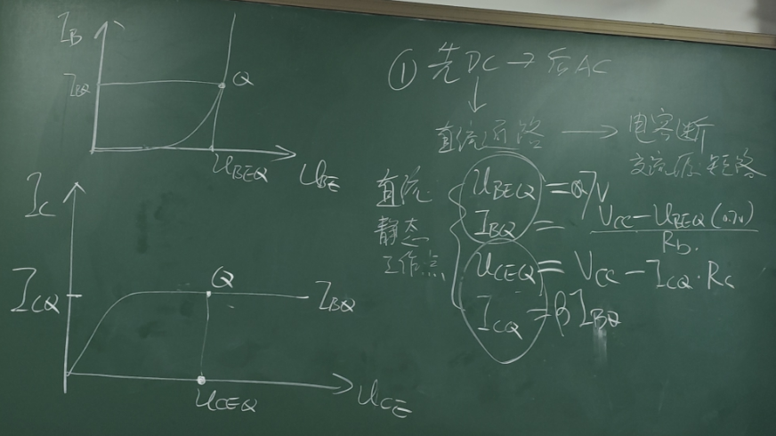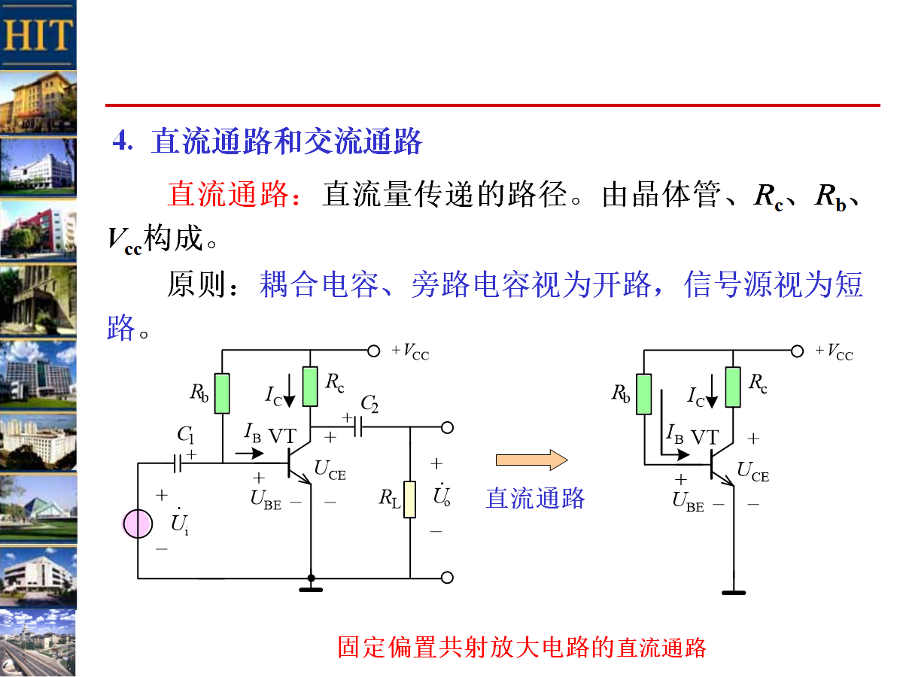

​	==交流电路==分析方法：Vcc置零，然后Vcc那端就接地了，化简一下即可。由下图也能看出此电路的输入电阻和输出电阻的组成。**放大倍数、输入电阻、输出电阻通常都是在正弦信号下的交流参数**。因此，在讨论这些参数时，无需讨论直流。
​	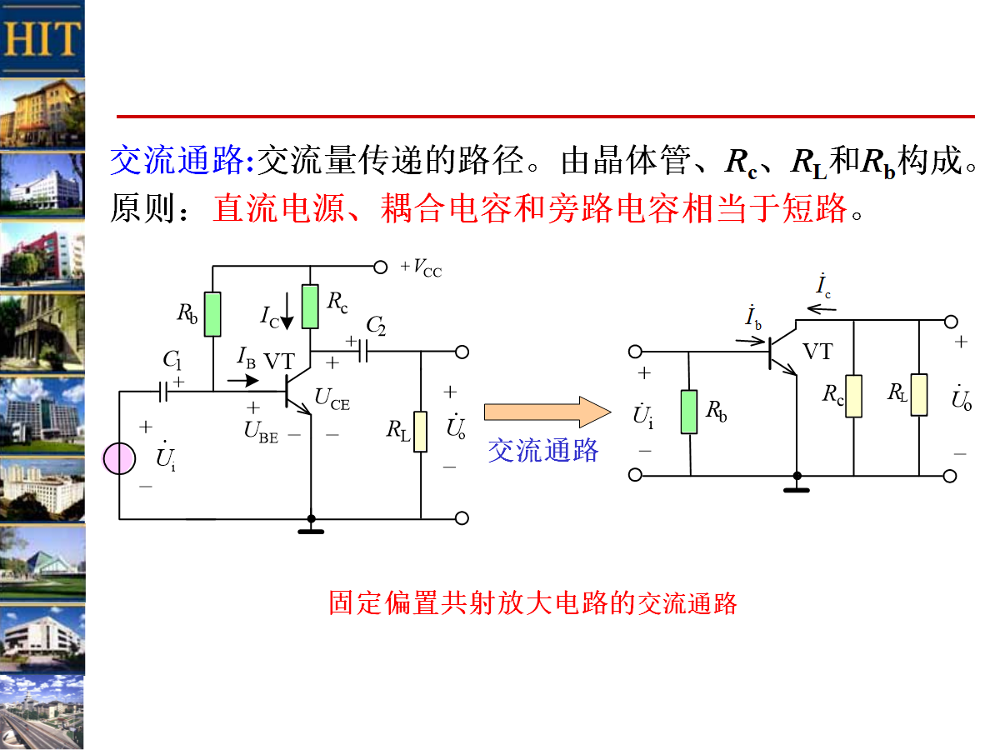
2. **固定偏置共射组态基本放大电路的组成**：

   要实现放大功能，那么就要让==三极管工作在放大状态==，如果仅仅是由交流电源来提供电压的话，无法让发射极的PN结正向偏置，即$U_{BE}>U_{on}$，因此，我们要==给这个三极管一个足够大的直流的$U_{BE}$==，最简单的办法是在交流源处多加一个直流电源，但那样并不经济，因此，我们使用耦合电容$C_{1}$和偏置电阻$R_{b}$，电容阻直流，那么直流电源产生的直流电流就会直接沿着图$I_B$的方向作用，使得Vcc同时提供了该PN结的正向导通电压。此时，基极的电流就由直流和交流构成，通过三极管放大到集电极处，但我们需要的是交流，而非交直流，因此，这里再使用一个电容$C_2$，==将交流信号取出来==，即可实现了对于交流信号的放大。可以看到，这里的两个电容将直流和交流两个电路连接在了一起，通过电容的阻直通交的性质，此即为==耦合电容==。**耦合即为连接**
   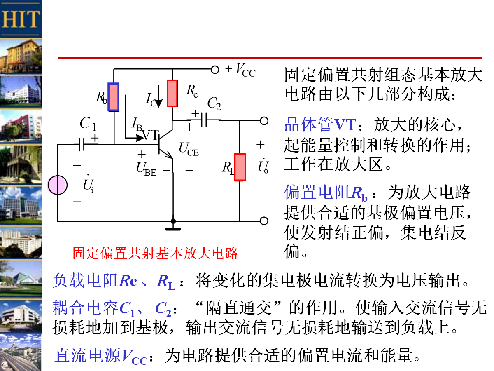

3. 放大电路的组成原则：关键点==选择合适的静态工作点$Q$==，否则动态变化时，有可能工作点会跑到三极管的截止区饱和区，导致出现异常。
   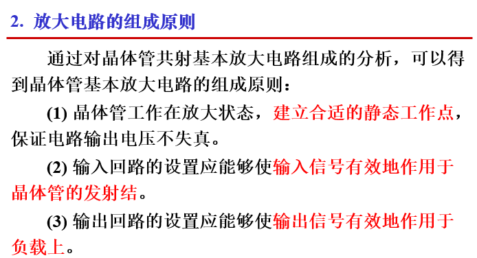

4. 关于2.1的内容主要看PPT即可，这里补充一些知识点。
   通频带的下限截止频率的决定因素是电路中的耦合电容，上限截止频率是三极管结电容。
   一般我们关注的是电压放大倍数即可，即$\dot{A_{uu}}$。

   ==输入电阻越大==，放大电路从信号源索取的电流越小，放大电路所得到的输入电压越接近于源电压，换言之，信号源的内阻压降越小，信号电压损失越小。
   ==输出电阻越小==，负载电阻变化时，输出电压变化越小，放大电路代负载的能力越强。

   非线性失真系数$D$，输出波形中的谐波成分总量与基波成分之比。

   最大不失真输出电压：再打就出现非线性失真。

   放大的前提是不失真！

### 2.3**基本放大电路的分析方法**

1. 电路的分析分为静态分析和动态分析，静态分析的方法有：直接计算法、图解法；动态分析的方法有：微变等效法、图解法。
   需要注意的是，图解法是更精确的解法，因为我们在计算时，实际上假定了发射极PN结的正向压降为0.7V，但实际上不一定是0.7，因此计算建立在一个模糊的前提上，得到的结果也必然是不够精确的。由于三极管的输出输入特性曲线均为曲线，非线性，不可解，因此图解法一般是用来做实验的，考试中不会考。图解法在输入和输出两端的求解作图如下所示：
   

2. **分压偏置共射放大电路的图解法分析**

   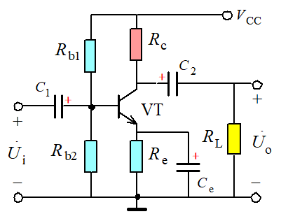

   **输入回路方程：$i_B\sim u_{BE}$		输出回路方程：$i_C \sim u_{CE}$**
   **先静态**：画出直流通路如下，由于基极电流的存在，实际上并不好求解输入回路方程，我们利用戴维南定理，做等效变换，就可以将其化为一个网孔，就很方便可以==求出输入回路方程==。然后就可以求依次求解，得到==输入直流负载线==，==直流负载线==。求解过程不再赘述。
   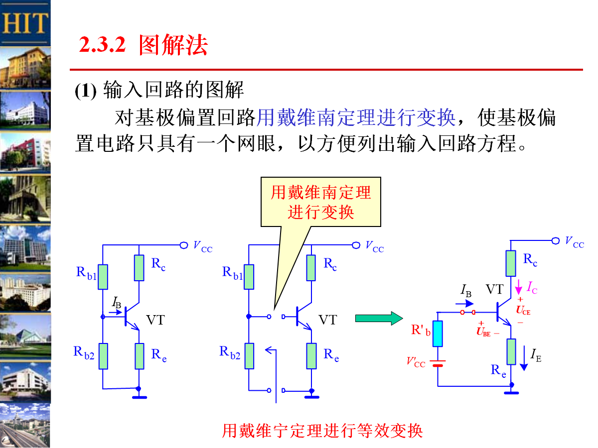
   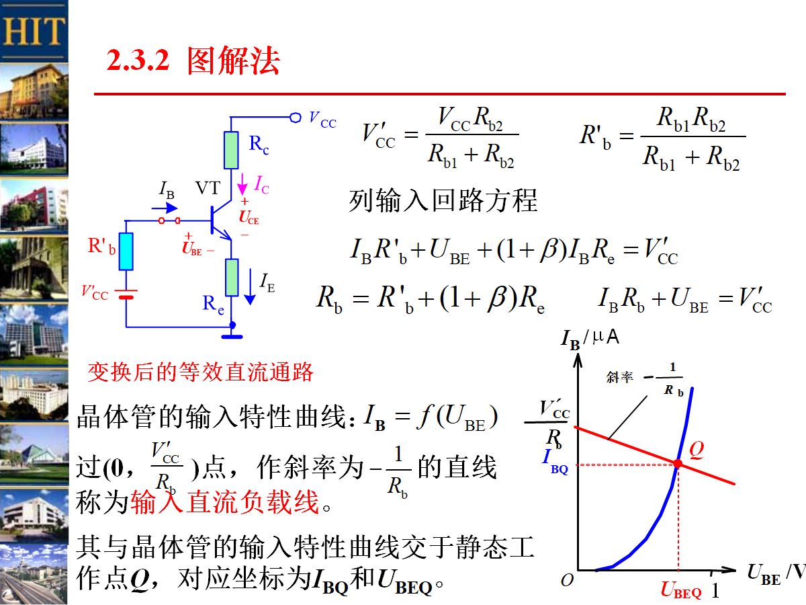
   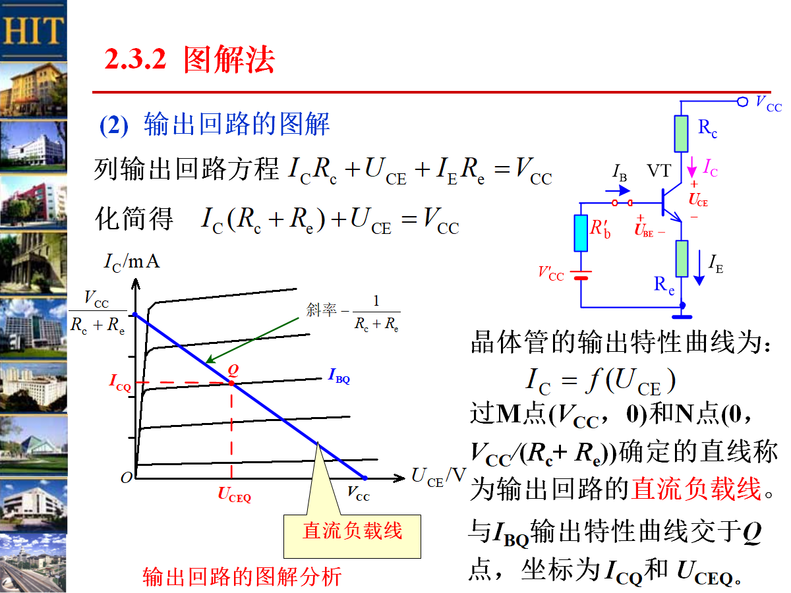

   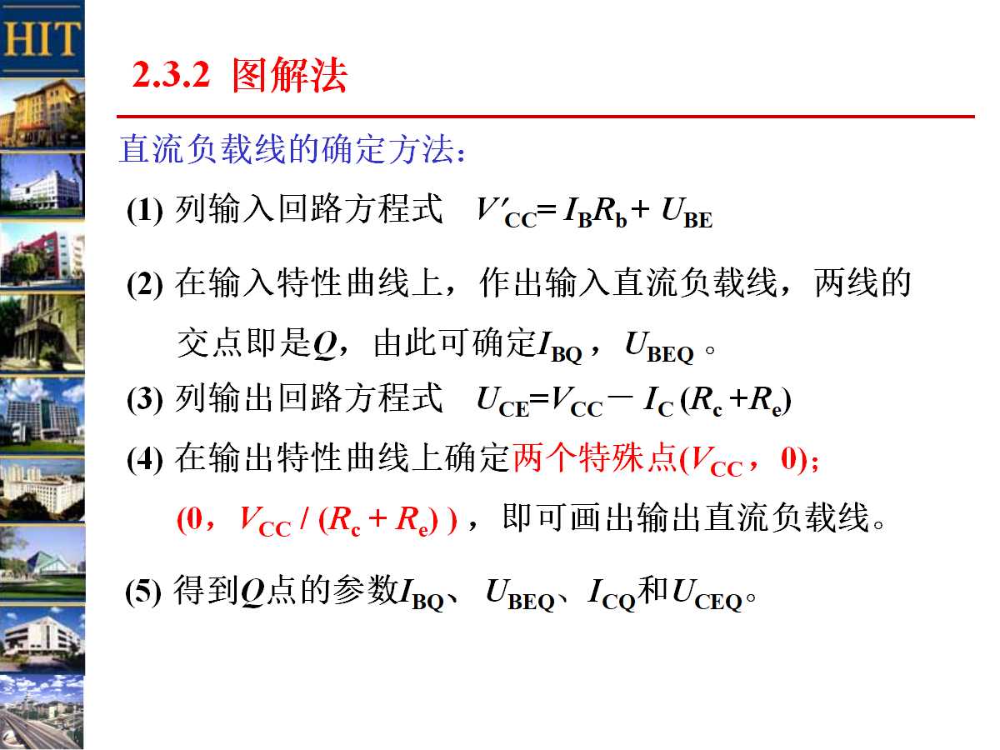
   **后动态**：先画出交流通路，可以看出输出电阻和输入电阻。画==交流负载线==就是在静态工作点Q的基础上加一个斜率（动态是建立在静态的基础上的），该斜率由输出电阻可以得到。交流负载线在输出特性曲线上要比直流负载线陡，是动态信号的运动轨迹。
   
   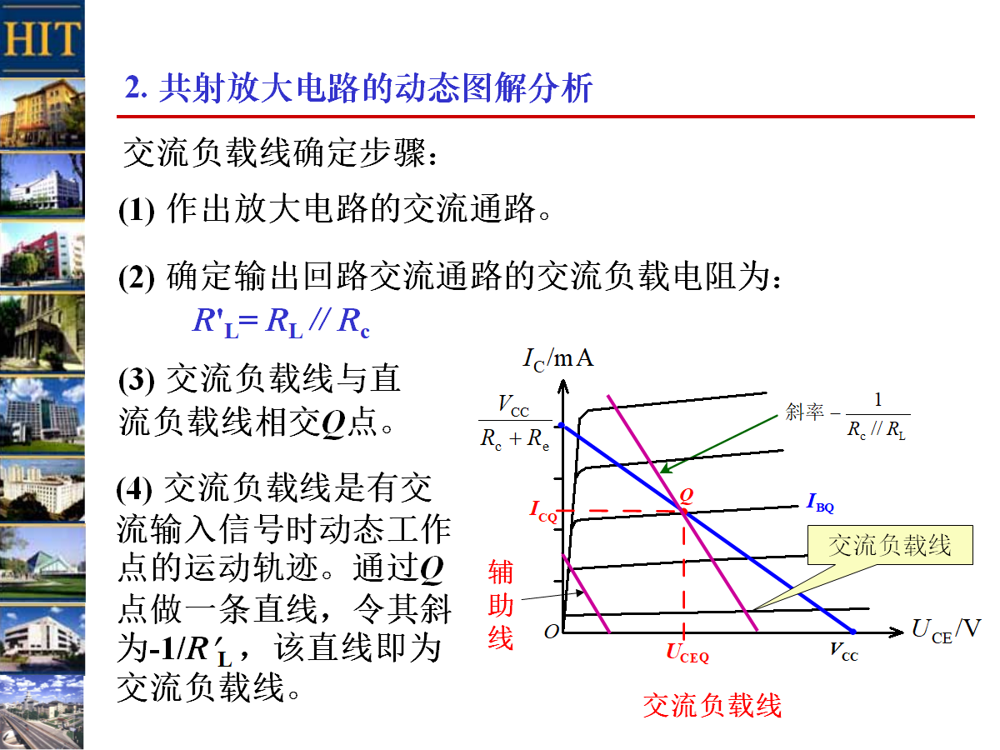

   接下来就是整个过程的画图流程了，首先是输入部分，在输入曲线的静态工作点上，叠加动态信号$u_{be}$，可以得到相应的基极电流$i_B$的变化范围，据此变化范围就可以画出$i_B$的波形。然后是输出部分，我们知道了$i_B$的变化范围，那么就知道了交流负债线上工作点以静态工作点为中心的变化范围，据此又可以得到集电极电流的波形以及$u_{CE}$的波形。到此时，整个电路的动态分析已经结束了。
   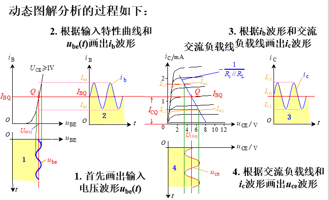
   最终由上述分析可以得到如下结论：即电压放大倍数$A_{uu}$，最大不失真幅度。
   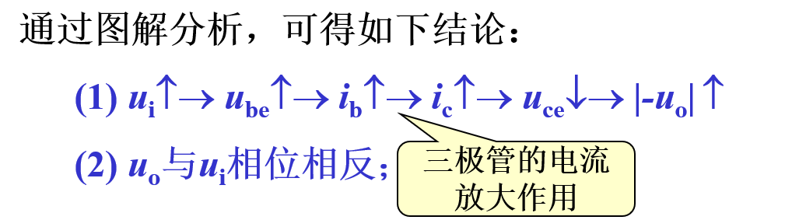
   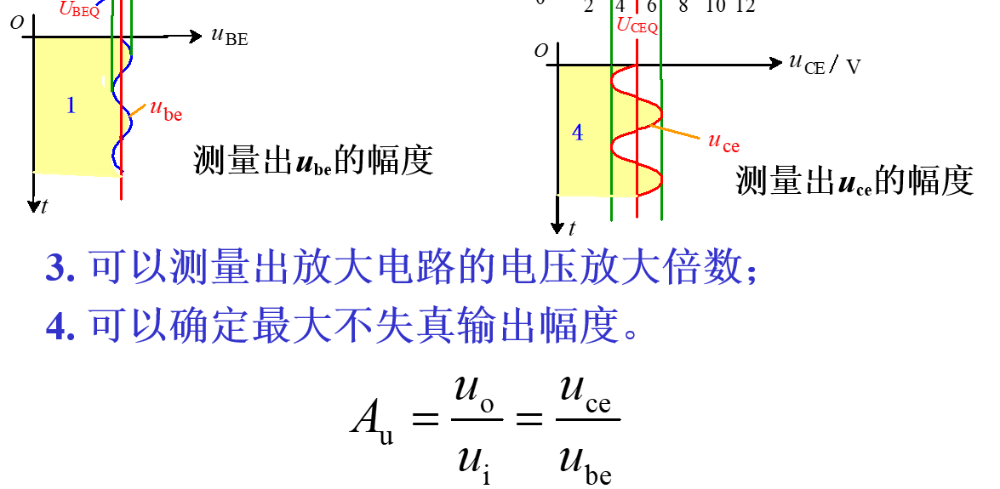
3. 失真的分析：
   截止失真、饱和失真，分别对应工作点沿着交流负载线运动时，跑到了输出特性曲线图的截止区和饱和区。在图形上表现为，**截止失真被剃掉了上头，而饱和失真被剃掉了下头**。其实看交流负载线也能看出对应关系，往下滑是输出电压的上部，上滑是输出电压的下部。
   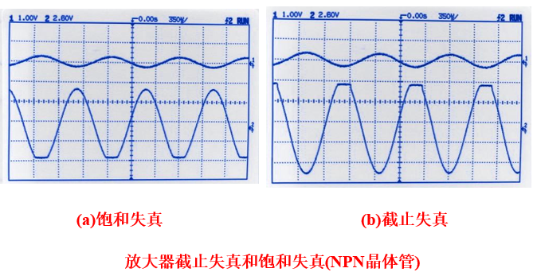

> 上面这张图还会发现，输入信号和输出信号是相位相反，说明这是共射放大模型。因为在此模型中，集电极电流和输出电压的参考方向是相反的，即$u_{ce}=-i_c R'_L$。:smile:
4. **微变等效电路法**

   根本目的是，==将输出和输入电路两个电路进行解耦==，方便电路计算。适用于低频电路，将==非线性的晶体管用线性模型来代替==。（注意，代替的是“晶体管”，不是晶体管那一块电路！）
   推导过程暂且不论，其实概括来说就是，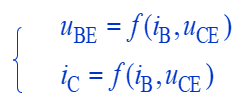，这个方程求其全微分，然后将全微分方程携程复数形式，将每个偏导数设为一个系数，根据其形式解释物理意义，$h_{11}和h_{22}$小到忽略不计，和输出特性曲线和输入特性曲线的斜率有关，具体看PPT，最后得到的$h_{12}和h_{21}$。
   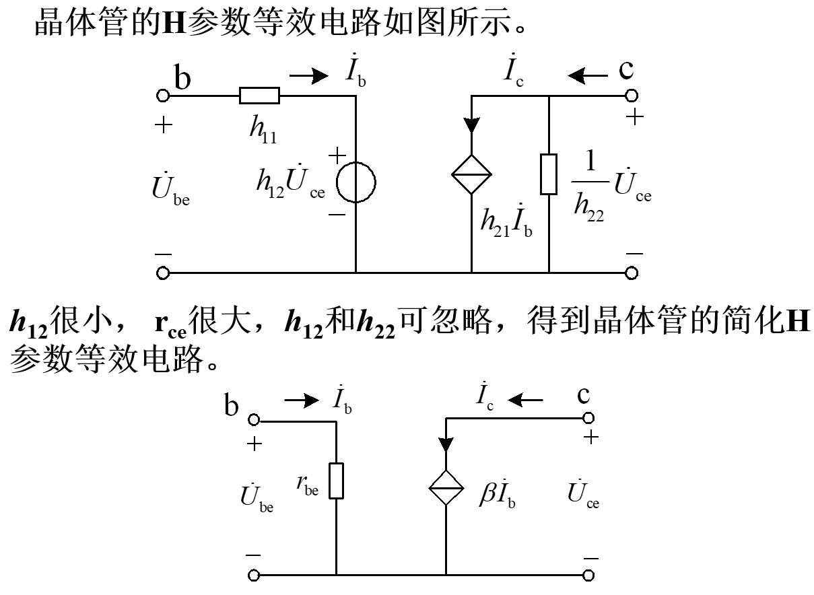
   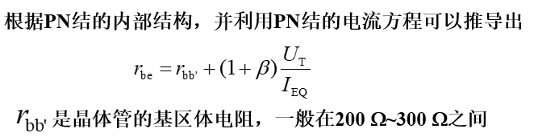

> 晶体管低频小信号模型没有考虑结电容的影响。只适用于放大电路的低频和中频段不适用于高频放大电路。

5. 使用微变等效电路对共射基本放大电路进行分析

   * **静态分析**：和前面所述基本一致，画出直流通路（电容解耦），然后就是通过计算，得到静态工作点，即$I_{BQ},U_{CEQ}$。需要注意的是，这里的计算有两个方法，分歧点是要不要考虑基极电流$I_B$，如果不考虑，即当$\beta$很大时，$I_E=I_C=\beta I_B$，这里，基极可以视为断路，方便电路分析。
     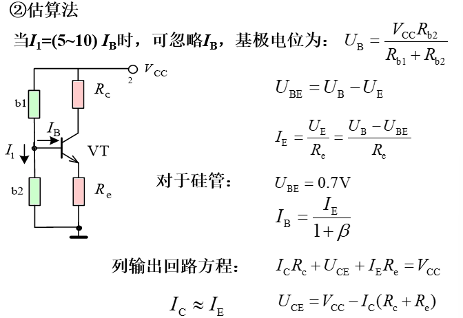

   * **动态分析**：构建交流通路，先把电容短路和直流电源置零，之后再把晶体管用微变等效电路进行替换。即可得到交流通路。动态分析常常关注四个重要参数，电压放大倍数，输入电阻，输出电阻以及源电压放大倍数。

     * 电压放大倍数：即输出电压和输入电压之比。注意区分输入电压和源电压，后者为电源电压，前者为该电源和内阻组成的二端口输出电压。计算方法常借助基极电流这个桥梁，如下：
       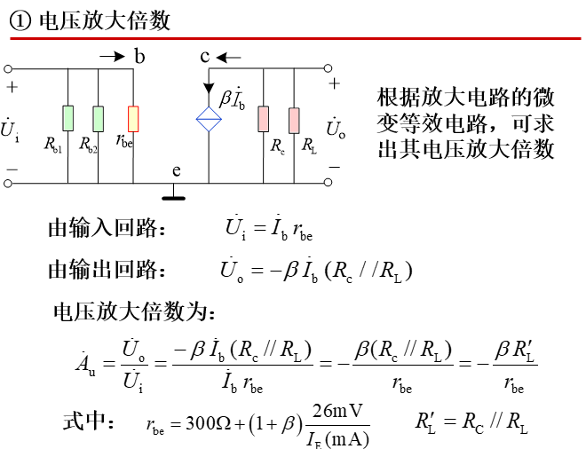
     * 输入电阻：从放大电路输入端看进去的等效电阻。
     * **输出电阻**：从放大电路的输出端看进去的信号源等效内阻。公式如下：可以看到，计算方法就是，输入电压短路，去掉负载电阻，由于输入电压短路，那么基极电流为零，受控源电流也为零，从而可以轻易求出输出电阻。
       $R_{o} = \left. \frac{\dot{U}_{o}}{\dot{I}_{o}} \right|_{\begin{array}{c} \dot{U}_{S} = 0 \\ R_{L} = \infty \end{array}} = R_{c}$
       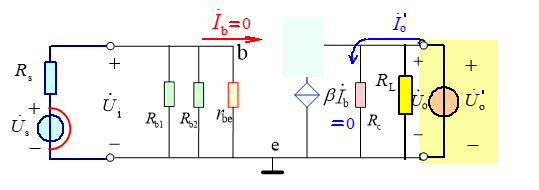
     * 源电压放大倍数：输出电压处于电源电压，可以将源电压和输入电压建立一定代数关系，从而可以通过电压放大倍数求得源电压放大倍数。

     上述过程基本上概括这类大题的基本套路，要注意的就是，在进行微变等效电路时，是对晶体管，三极管进行变换，而非那一块电路！然后就是根据实际情况进行电路计算即可。

6. 静态工作点稳定原理（针对温度的负反馈）

   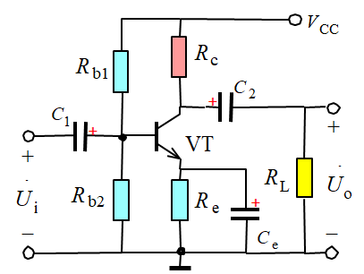
   讨论的其实是三极管发射极这里接的电阻$R_e$和电容$C_e$，这二者是相伴相生的，少了一个造成的效果都不好。当温度升高时，集电极电流增大，如果没有这个电阻的存在，静态工作点就会漂移，不稳定，这是不想看到的。有了这个电阻后，在基极电位通过两个电阻和Vcc的分压确定**（隐含了一个前提，基极电流足够小，忽略不计）**的情况下，就能==构成如下负反馈==。

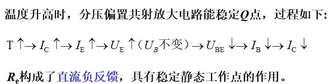

​	以上讨论的是电阻的作用，那么电容呢？假如没有电容，那么动态分析时这个电阻就不能被跳过，会影响刀电压放大倍数，使得电压放大倍数显著减小，因此==电容的作用是增大电压放大倍数==。

### 2.5晶体管三种组态基本放大电路

> 分别有三：共射、共集、共基。重点在于前两者，共射上面已经论述很多了，共基不重要，只做了解。

1. **共集基本放大电路分析（射极跟随器）**
   
   

    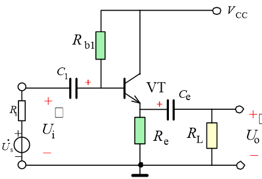
    
    
图一

    
图二

   

   
   > 图一为共集放大电路，图二为共射放大电路
   
   * question
     * 为什么“共集”？
       输入信号从基极输入，输出信号从发射极输出。和共射放大电路不同点是，**发射极并不直接入地**，而是接入了一个$R_e$，且在交流通路中，并没有通过电容短路掉，反而是将负载电阻和它并联。这里，**集电极在交流通路中直接接地**，而共射放大电路是发射极接地，可见，==哪个极接地，就是"共"的那一个极==。
   
   * **直流分析：**
     基本方法没有变，画出直流通路后进行电路分析，利用三极管特性求出静态工作点，不再赘述。
     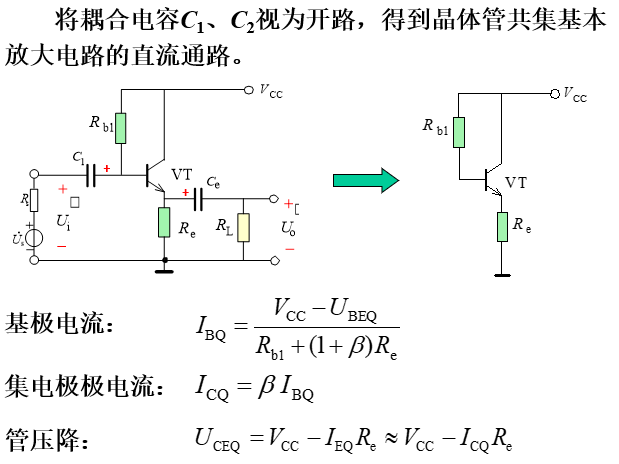
   
   * **动态分析：**
     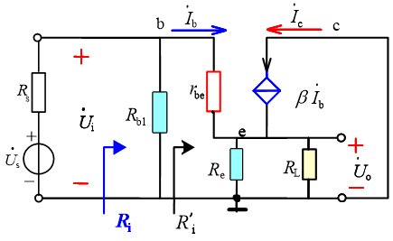
     上图为共集基本放大电路的微变等效电路。分析方法也不再赘述。
   
     * 电压放大倍数：
   
       ==小于等于1==
       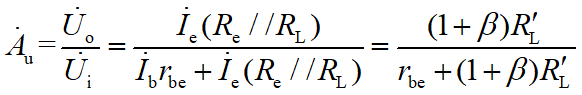
       
   
     * 输入电阻：
   
       ==大输入电阻==$\rightarrow$放大电路从信号源索取的电流越小，放大电路所得到的输入电压越接近于源电压，换言之，信号源的内阻压降越小，信号电压损失越小。
       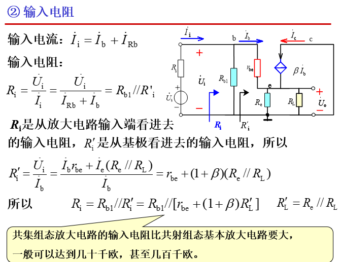
   
     * 输出电阻
       ==小输出电阻==$\rightarrow$负载电阻变化时，输出电压变化越小，放大电路代负载的能力越强。
       输出电阻的求解比共射麻烦些，因为共射放大电路输入信号为零，则基极电流为零，这里并不是，因此不能简单的把受控源断开。下图红线即为本次求解输出电阻的核心。
       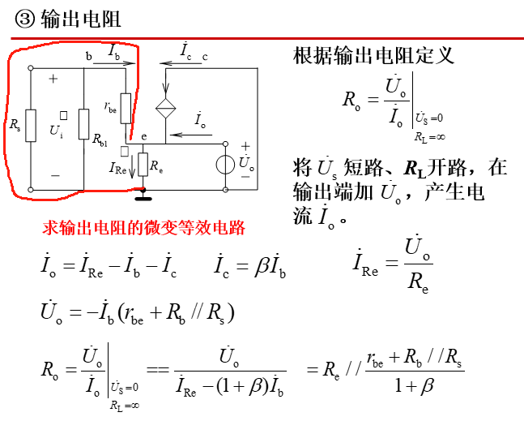
   
     * summary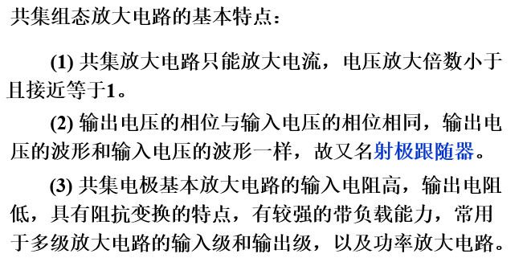

2. **共基组态放大电路**

   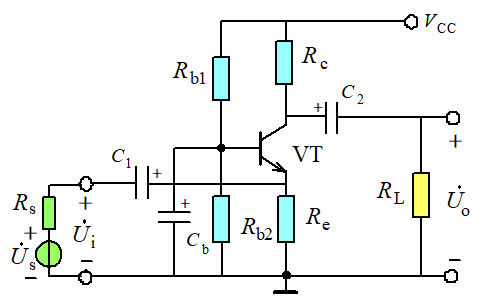
   不详细讲解，记一下结论吧：
   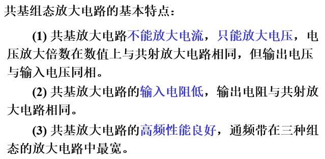

## 集成运算放大电路

### 3.1 多级放大电路的一般问题

1. **直接耦合**
   
   上图即为四种直接耦合的方式，我们一个一个来看：

   * a图

     在这之前，我们先讲讲如何看“第一级”、“第二级”。以虚线为界，我们看到，T1和Rb2，Rc1为第一级，此为共射放大电路。而虚线另一边为第二级，Rc1被两电路复用，也为共射放大电路。
     关键点在，第二级的基极直接连到了第一级的集电极。这意味着，第二级的$U_{be2}=U_{ce1}=0.7V$，我们发现，这对于第一级的三极管是极为危险的，因为$U_{ce1}$太小了，静态工作点容易工作在饱和区，容易引起饱和失真。

   * b图
     为了解决上面这个问题，我们在第二级的发射级加了电阻$R_{e2}$，这样就可以抬高第二级三极管基极的电位，解决了上诉问题，但新的问题随之而来，我们在前面分析中已经发现，如果让$R_{e2}$出现在交流通路中，会导致第二级放大电路的电压放大倍数显著下降。而由于集成放大电路工艺的限制，我们不能在集成放大电路中加入大电容来进行耦合。因此，我们需要一个类似的元件，既能够提升基极电位，又能不影响交流通路，这里就考虑了二极管。二极管的微变等效电阻小，而且直流状态下能提供导通电压。但提供电压较小，虽然串联可以叠加起来，但串起来后故障率增大，可靠性较差。

   * c图
     而稳压管可以解决电压不够的问题。为了给稳压管一个合适的电流范围，使其能稳压，于是多加了一个电阻R，专门为稳压管匹配合适的电流。

   * d图
     NPN和PNP两种三极管的混用。刚好可以互补，不细说。

   直接耦合电路容易出现零点漂移的问题。且静态工作点互相影响。

2. **阻容耦合放大电路**

   ==不能集成化。====Q点相互独立，各自计算工作点。==
   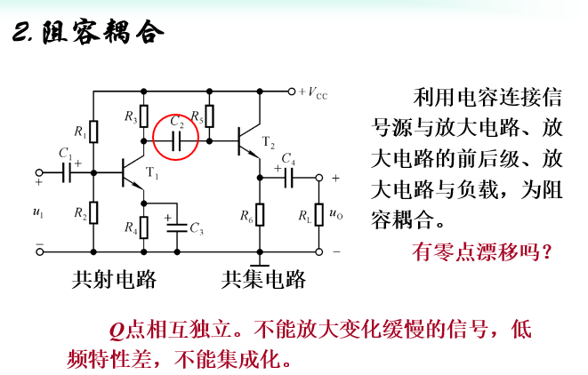

3. **变压器耦合**
   变压器太大。不细说。
4. **多级放大电路的动态分析**
   

下图就是一个共射放大电路和共集放大电路的阻容耦合。分别计算工作点，然后利用二者耦合处的输入电阻输出电阻等联系求解即可，详情看书。
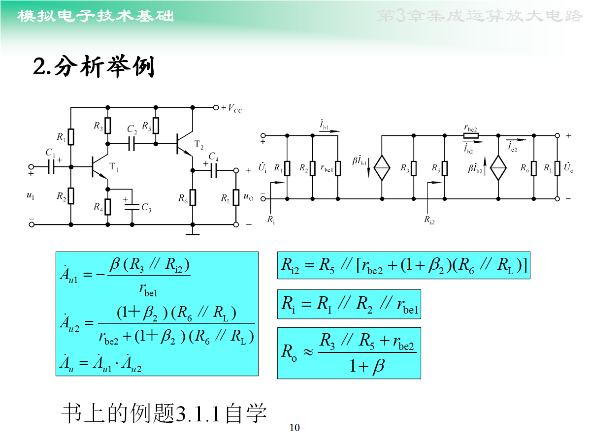

### 3.2 集成运算放大电路概述

1. **集成运放电路结构特点**

   * 直接耦合。阻容耦合虽好，但==由于工艺限制，电容并不适合在集成电路中使用。==
   * 复杂的电路实现高性能的放大电路。==电路的复杂化不带来工艺的复杂性。==
   * 有源元件代替无源元件。如晶体管代替大电阻。（大电阻在集成电路中也不易实现，这点在单端输出长尾式差分电路中出现）
   * 采用复合管。

2. **集成运放电路的四个组成部分**
   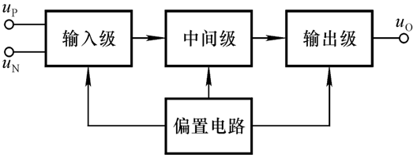

   * **偏置电路**：为各级放大电路设置合适的静态工作点。采用电流源电路。
   * **输入级**：前置级，多采用差分放大电路。要求Ri大，差分放大倍数Ad大，共模放大倍数 Ac小，输入端耐压高。（变化最大的电路）
   * **中间级**：主放大级，多采用共射放大电路。要求有足够的放大能力。
   * **输出级**：功率级，多采用准互补输出级。要求Ro小，最大不失真输出电压尽可能大。

3. **差分放大电路**

   1. 构建原因：直接耦合的放大电路存在着严重的零点漂移现象（主要是晶体管特性对温度敏感导致的温漂），因此，我们构建差分放大电路来消除零点漂移对电路的影响。

      > 零点漂移现象：$Δu_I$＝0，$Δu_O≠0$的现象

   2. 构建思路：为了消除零点漂移，有两个办法：引入直流负反馈、温度补偿。

      * **直流负反馈**：在本笔记上面已有相应陈述。简单而言，就是在共射放大电路的发射极和地之间加一个电阻。
      * **温度补偿**：下图即为理想电路。这个电压源V就是补偿电压，当温度变化时，集电极的电位增加，那么就通过一个电压源抵消掉这个变化的电位，即可消除零点漂移现象。注意，这只是个理想电路，==后续我们就要考虑如何实现这个根据相应变化给予相应电压来抵消温漂的电压源，即构建差分放大电路。==
        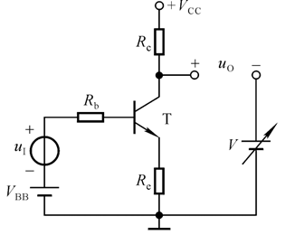
      
   3. 构建目标：

      * 克服零点漂移；

      * 零输入零输出；
      * 抑制共模信号；

      * 放大差模信号。

4. **长尾式差分放大电路**

  **定义重要概念**：共模信号：大小相等，极性相同；差模信号：大小相等，极性相反。

  **构建思想**：由于集成放大电路的工艺，构建一个相同的电路是易于实现的，且由于两个电路在物理尺寸上相距极近，温度传导也几乎一致，因此可以实现非常理想的完全等同。这样，当发生温漂时，两个集电极发生同样的变化，这个变化刚好可以互相抵消，使得$u_O=0$，即共模放大倍数$A_e=0$，这就是最理想的情况。下面这个电路不是最终电路，为了成本的节约，将$R_{e1}$与$R_{e2}$合并为一个$R_e$，即可得到一个双端输入双端输出的长尾式差分放大电路。
  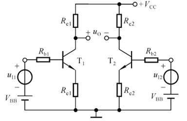

  **电路分析**（双端输入双端输出）：
  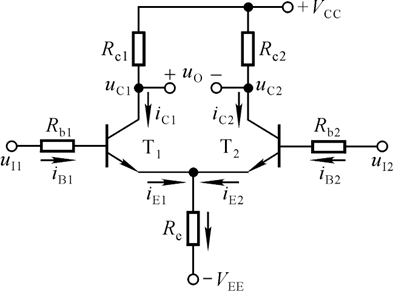

  1. 静态分析
     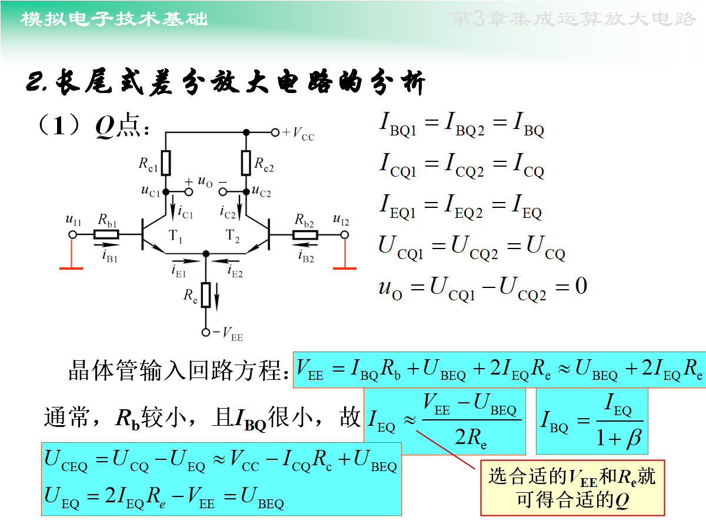
     ==接下来将分别对共模信号和差模信号进行动态分析==

  2. 共模信号动态分析

     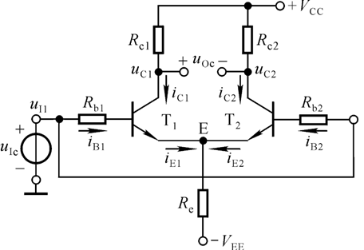

     如上所诉，参数理想时，$A_c=\frac{\Delta u_{Oc}}{\Delta u_{Ic}}=0$
     而$R_e$起到抑制共模信号的作用，和前文提到的在共射放大电路一样，只不过这里是两个共射放大电路的电流共同作用于$R_e$上，抑制每只差分管集电极电流、电位变化。

  3. 差模信号动态分析
     ==该电路对差模信号起放大作用==

     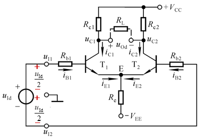
     将一个电压等效分为两个大小相等，极性相反的差模信号，显然，两个电路的各个物理量变化刚好相反。因此，我们关注到E点，会发现，通过$R_e$的电阻的电流不变，也就是说，E点电位在动态分析中始终不变，可以看作“接地”。同理，还有一个“接地”的点，就是负载$R_L$的中值，因为中值的电位为$\frac{u_{c1}+u_{c2}}{2}$，变化一正一负刚好抵消，也是不变的，因此可以将负载一分为二，中间“接地”。这样，就可以画出交流通路：
     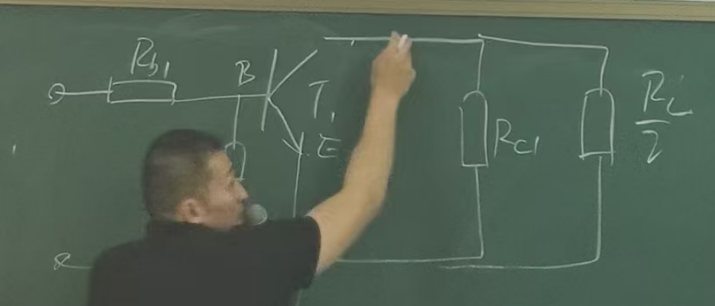

     > 把三极管横着放置，根据集电极所接的电阻和地连起来就可以画出交流通路，再进行微变等效，即可得到下面：

     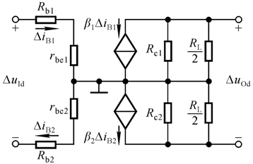
     进行电路分析，可以得到：
     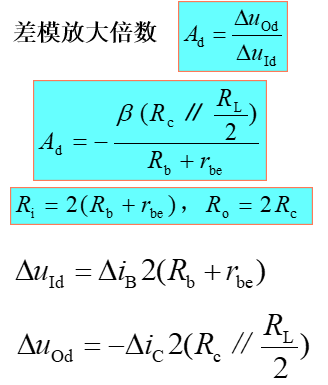

  4. 系统的缺点
     ==共模抑制比==$K_{CMR}=\abs{\frac{A_d}{A_c}}$，综合考察差分放大电路放大差模信号的能力和抑制共模信号的能力。
     理想情况下，上诉电路的共模抑制比为无穷大。这是极好的，但，上述电路有致命的缺陷，导致了他并不在实际使用中被采用，即==“浮地”。==
     没有共同的地，就没有共同的参考点，信号就不可靠。因此，针对这个问题，才衍生出后续的几种接法，分别是：**双端输入双端输出、双端输入单端输出、单端输入双端输出、单端输入单端输出**。

5. **双端输入单端输出的长尾式差分放大电路**
    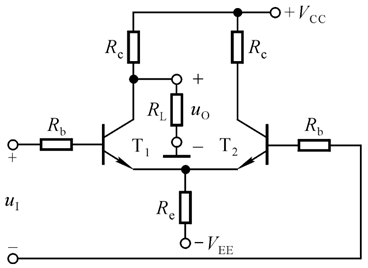
    可以看到，左端的集电极挂了一个“沙袋”，即负载$R_L$，这种方式提供了地这个参考点，但也导致了两个电路的不对称，不对称，那么共模信号就不会被消除，电路的表现也会因此而下降。

    1. 电路分析
       和上面的电路比较可以发现，基极以下的电路，在进行电路分析时是没有区别的，因此，两条电路仅在基极以下的区域是和双端输入双端输出保持一致的。
       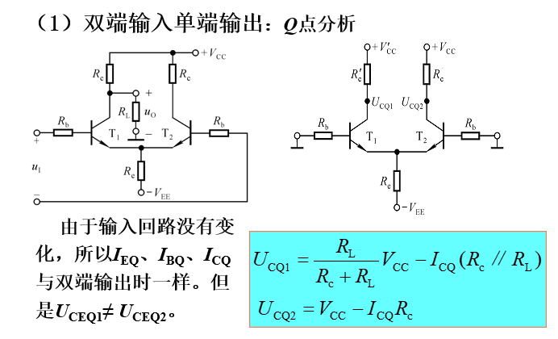
    
    	**差模信号分析：**
    	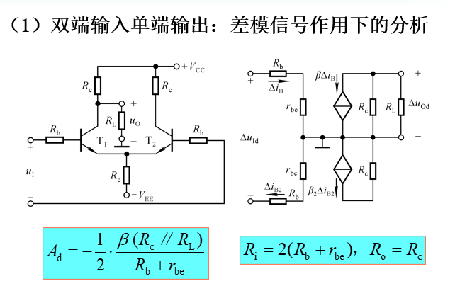
    
    	**共模信号分析：**
    	
    	电路的等效过程课本上讲的很好：
    	
    	需注意，这之中把$R_e$进行了等效替换，然后b图是对左边的管子进行的等效电路。
    	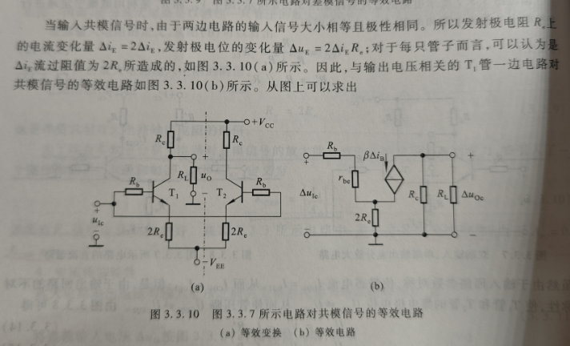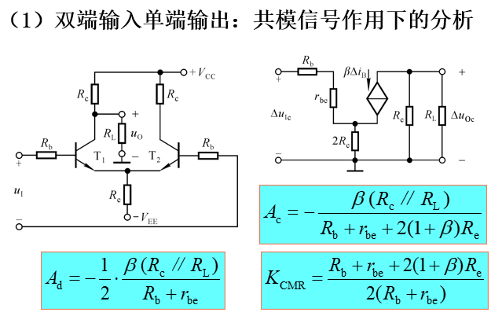
    	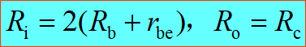
    	
    2. 优化方向：
       从上面$A_c$的表达式可以看出来，增大$R_e$可以最高效地减小共模放大倍数，增大共模抑制比，使得差分放大电路信号更好。但如果一味增大电阻，必须得配合增加$V_{EE}$，否则无法保持静态电流在一个合适的工作点，但电压增大与集成电路相悖（处理信号，电压不能大，否则既不安全，也散热不好）。**需在低电源条件下，设置合适的IEQ，并得到得到趋于无穷大的Re。**
       因此，我们想到，可以用电流元来取代，一举两得。我们用一个共射放大电路来近似，当满足$I_2>>I_{B3}$时，可以得到$I_1$为恒定值，那么自然$I_{C3}$也是恒定值，这就实现了电流源的近似。（课本上也有很好的说明）
       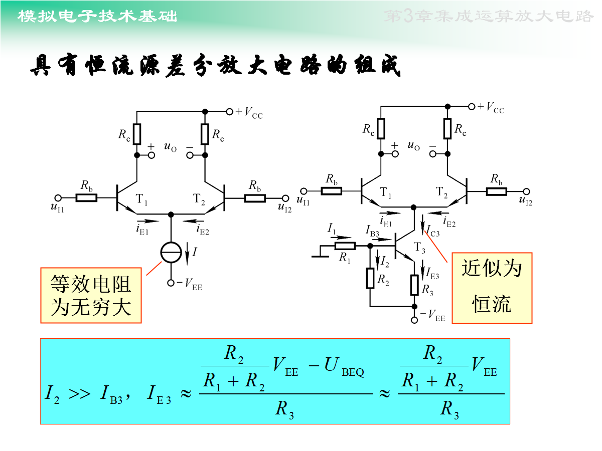
    
6. 单端输入双端输出电路的处理——使其等效于双端输入。
    
    注意下面提到了，此种情况下，==共模信号和差模信号的计算方式。==
    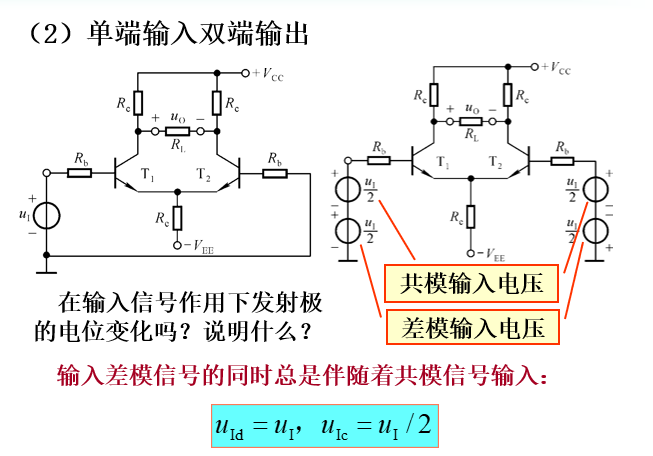
    从图中看到，将一个单端输入信号变为了双端共模信号和差模信号，这样就可以和上面的电路分析保持一致了。
    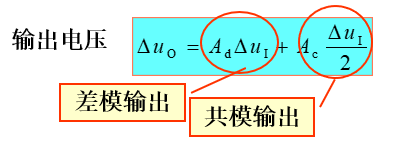
    
7. 四种接法的比较：
    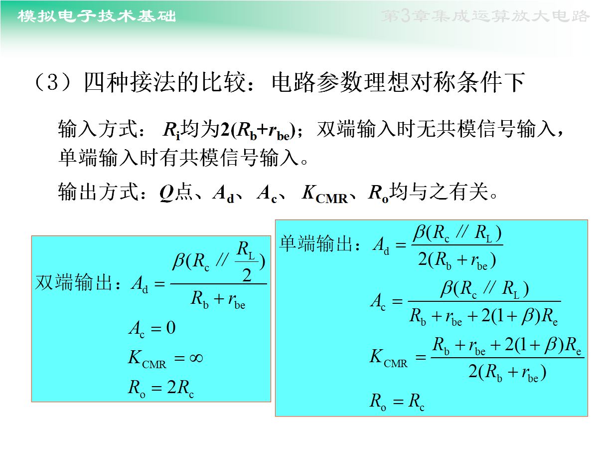

### 3.3 电流源电路

> 为各级提供合适的静态电流、作为有源负载代替高阻值电阻从而提高放大电路的放大能力

1. ==镜像电流源==
   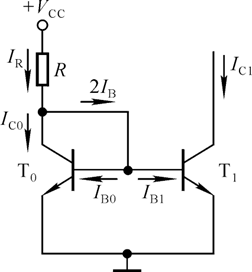

   * 电路分析
     基本原理，充分利用两个特性完全相同的晶体管，构成镜像关系。比较特殊的是，三极管的基极与集电极通过一根导线连接了起来，这使得二者电位相等，而三极管工作在放大区的条件之一就是$u_{CE} \geq u_{BE}$，可见，此时三极管恰好工作在放大区。$I_R$称为基准电流，当三极管的$\beta$足够大时（纵向晶体管通常在百倍以上），可以认为$I_{C1} \approx I_R$，具体电路分析如下，由下可知，我们可以通过调整Vcc和R就可以调整基准电流，从而实现镜像三极管一个电流源输出。
     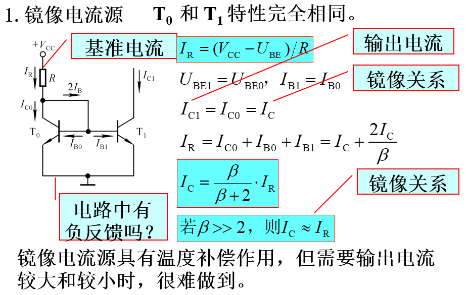
   * 负反馈分析
     重点在于电阻R，和前面所述的大多数电阻在负反馈实现的功能一致，电流变大，电位变小，电流变小。
   * 缺点分析
     如果要输出大电流，那么R的功耗也就增大，发热增加；如果小，那么R就要很大，集成电路无法实现。

2. 比例电流源
   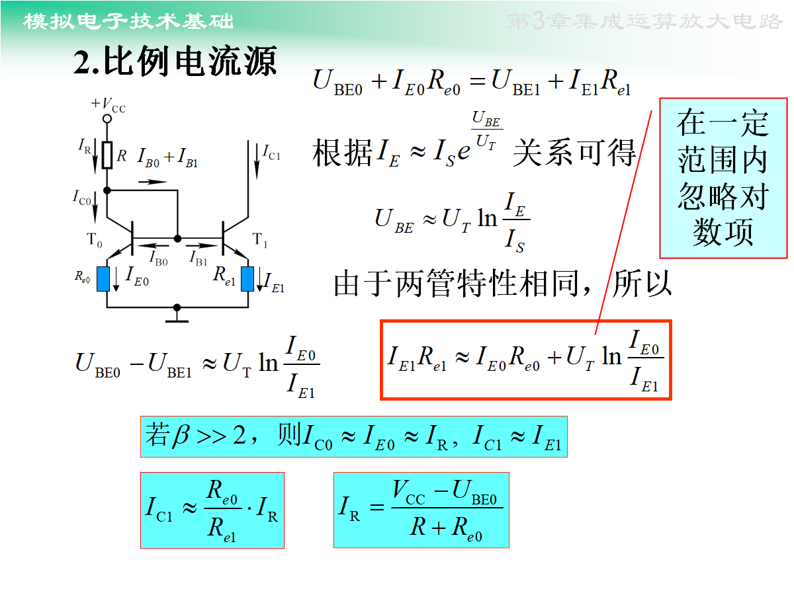

   这个电路的突破就是，允许$I_{C1} > I_R$，这点从$I_{C1}$的表达式可以看出，从而解决了镜像电流源无法输出大电流和小电流的缺点。
   在电路分析中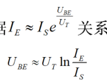，这个公式，记住即可，在课本P145的注释部分有所解释，即忽略基区电阻$r_{bb'}$上的电压时得到的晶体管发射机电流与$u_{BE}$d的关系。
   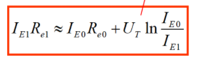
   这个公式，当电流较大，满足一定的取值范围时，只取前者，这时为比例电流源。若电流较小，如在微电流源电路时，$I_{C1}$只有及时微安，此时要忽略的就是前者了。

3. 微电流源
   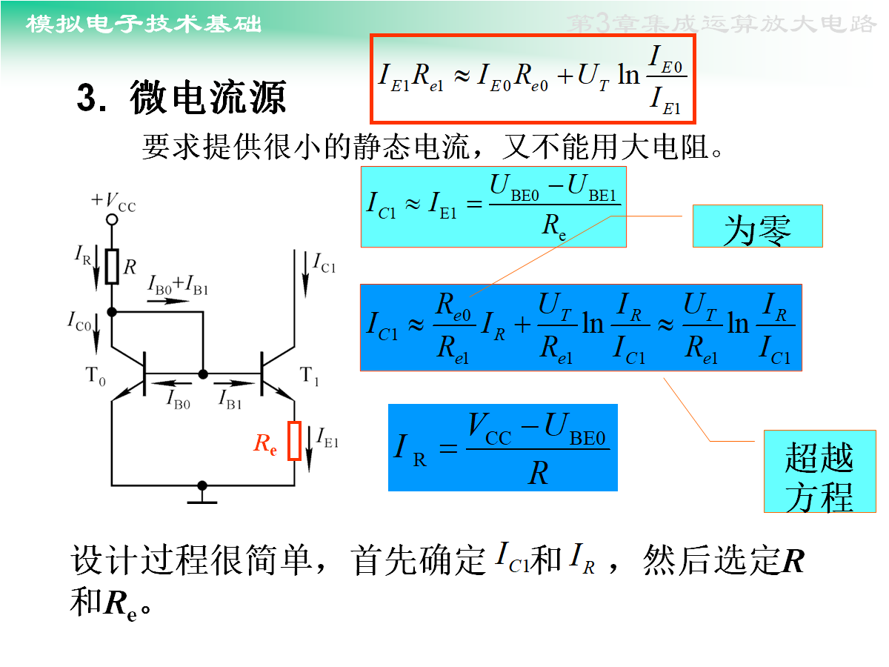
   紧接着上面所述内容。微电流源在比例电流元的基础上，直接去掉了在比例电流源输出电流方程中作为分子的$R_{e1}$，从而可以使用较小的电阻又可以实现非常小的电流。具体的电路分析见PPT，可以看到，去掉了电阻后，直接是两个三极管的发射结压降相减处于电阻值，输出电流的值大大减小。
   但有个点，这个方程是==超越方程==，是无法直接解出来的，我们只能够对他赋值，然后解出对应的电阻。

4. 多路电流源
   这个就是前面的复杂化的应用，以第一个为例，其实就是一个基准电流，三个不同比例的输出端。
   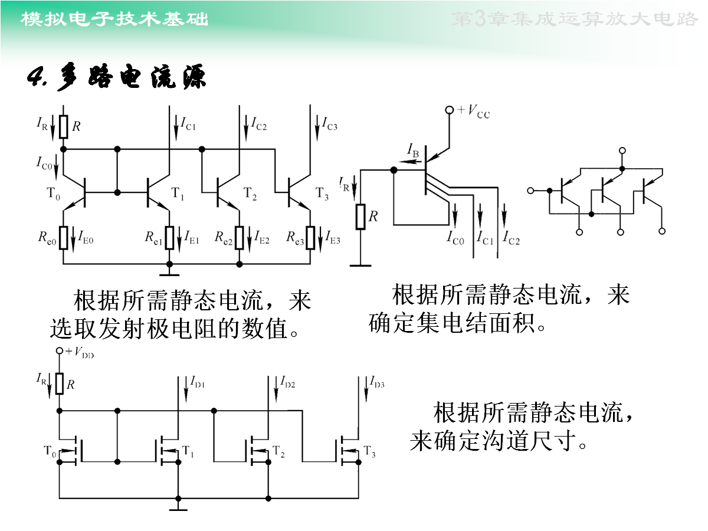

5. 有源负载
   这就是电流源电路的重要应用场景了。如下图，红色框框就是镜像电流源。这部分老师没怎么细讲，课本上有说明。
   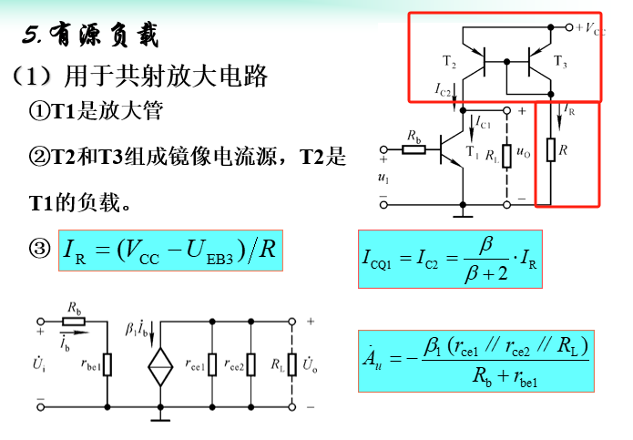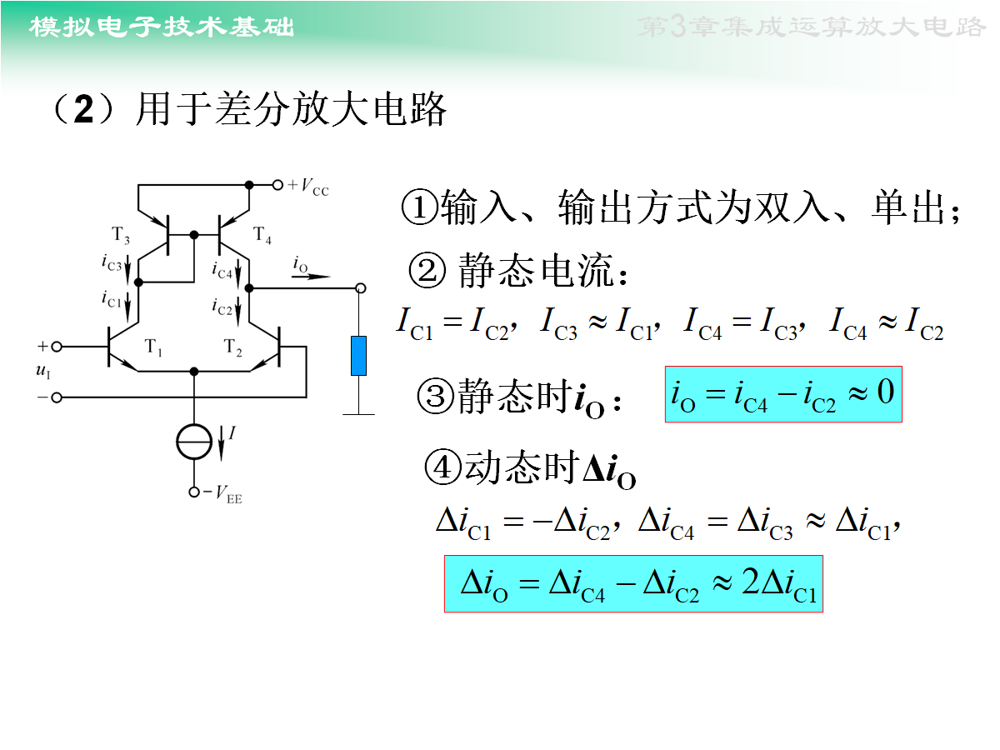

### 3.4 互补输出级

1. 电压放大电路的输出级的要求：
   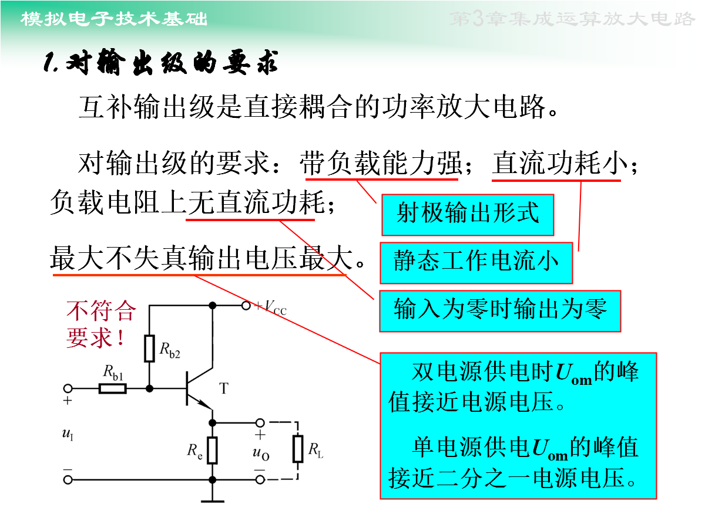

2. 直接耦合互补输出级
   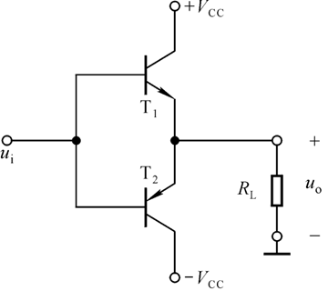

   * 基本电路
     电路由上下两个电源，一个输入，两个相反的三极管，一个输出构成。总体来说就是，==两个共集基本放大电路，又称射极跟随器==拼接而成。

     > 射极跟随器在这里可以认为，放大倍数等于1，即ui=uo。
     
     静态时，ui=0，两个管都截止，满足输入为零时输出为零的要求。
     假若三极管的输入特性曲线是理想的，即没有导通电压，若输入电压为正，那么T1管导通，T2管截止，此时上边的电路导通，Vcc供电，T1管以射极输出形式将正半周信号传递到负载。若输入电压为负，则相反。
     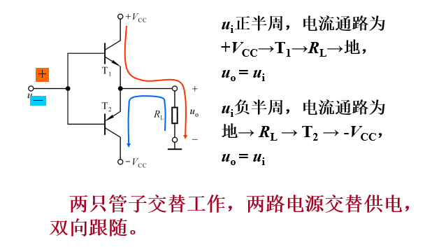
     
   * 交越失真
     上面的分析中，我们假设三极管的输入特性曲线是理想的，但实际上，三极管的输入特性曲线并不是一个在零点的折线，而是有开启电压的。也就是说，在实际情况下，如果输入电压，以正弦波为例，如果电压太小，则两个管都会截止，也就会导致失真。在零点附近会出现一段平的直线。
     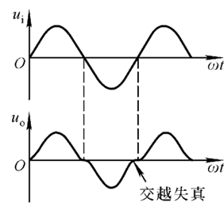
   
3. 消除交越失真的互补输出级

   * 用二极管电路

     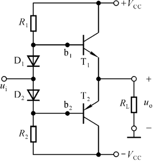
     其实就是通过静态工作点的设置，让两个管子都处于==“微导通”==的状态，从而使得再小的输入信号也可以被传过去。**如果晶体管与二极管都采用同一种材料，那么就可以通过调整R1和R2的阻值来改变二极管压降**。 由于==二极管动态电阻很小，所以可以认为ui与两个晶体管的基极电位相同==。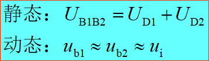

     * 为什么输入信号大于零的时候，不会被D1管子挡住呢，这里就是二极管在动态电路中的角色——动态电阻的原因了，也就是说，==二极管在交流通路中是一个非常小的动态电阻！==
     * 为什么选用二极管，因为二极管也是个PN结，刚好不就能提供个和T1和T2发射结相匹配的压降吗。假设ui是一个交流电源一端接在电路，一端接地，静态分析时，相当于端点电位为零，和两个二极管相匹配。
     * 为什么会改为下面的$U_{BE}$倍增电路，因为==二极管和三极管的电压实际上很难匹配==，所以==改为电阻，实现可调的电压==。

   * 用$U_{BE}$倍增电路
     
     注意，这个电路是下面两个电阻和一个三极管共同组成的，别看错了。
     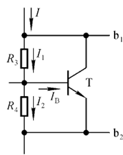
     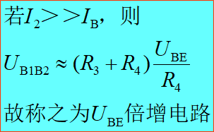

4. 准互补输出级
     要寻找特性完全相同的NPN和PNP管子是较为困难的，但若同类，则较轻松。（复合管没讲，不深究）
     
     为了增大T1管和T2管的电流放大倍数，以减小前级的驱动电流，采用红圈的复合管结构。从输出端看进去，T2和T4采用了同类型管，较容易做到特性相同。
     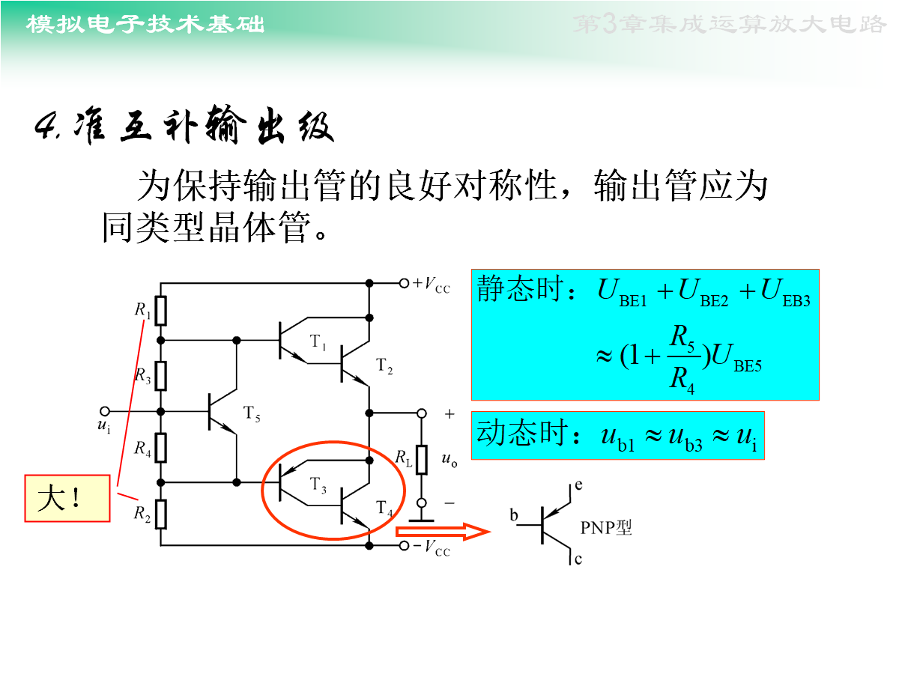

### 3.5 集成运放电路简介

1. 这一部分看PPT，没什么好说的。
   

### 9.1 直流电源的组成

1. 直流电路的组成

   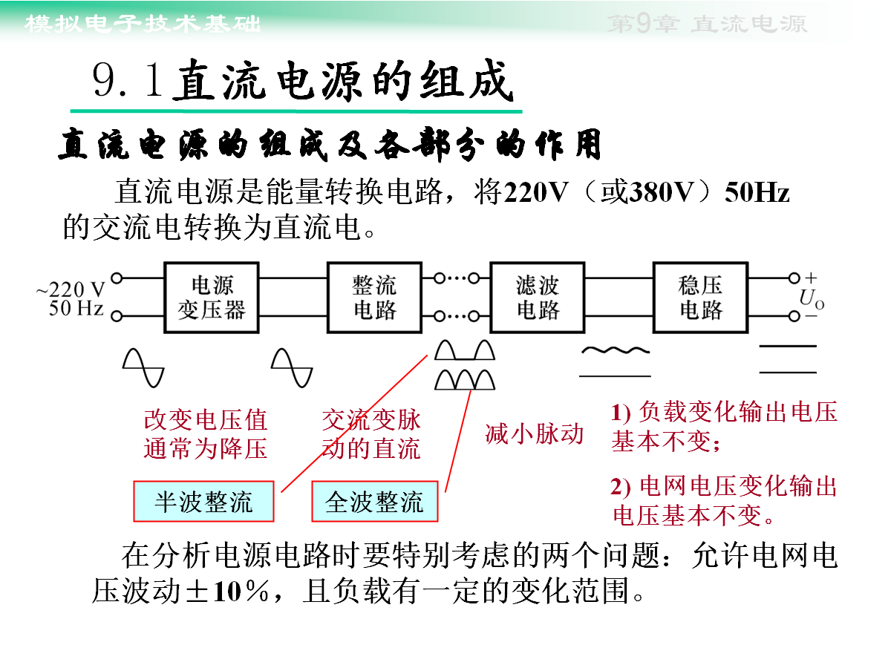

   * 电源变压器：降压；可有可无。
   * 整流电路：将交流电变为单一方面的脉动电压。
   * 滤波电路：减小电压的脉动，通过低通滤波电路滤波，使输出电压平滑，即，减小交流分量。
   * 稳压电路：使输出电压基本不受电网电压波动和负载的电压的影响，从而获得足够高的稳定性。

### 9.2 单相整流电路

> 本章节电路分析都有两个前提，第一，二极管为理想二极管；第二，变压器内阻为零

1. 单相半波整流电路
   原理非常简单，就是加了理想二极管，把变压器输出的电压波形的下端给截掉了。值得注意的是，当电压反向的时候，所有的电压都由二极管承受。
   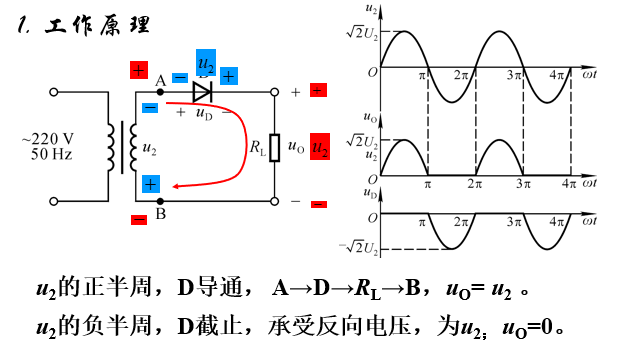
   参数的计算也很简单，包括后续的其他电路，都是对电压表达式积分求其有效值，然后再对负载$R_L$欧姆定律得到电流有效值，即可得到整流后的电压和电流。考虑到电网的波动，因此二极管物理量的安全极限值要提高至少百分之十。

   注意，$U_{o(AV)}$为电压输出的平均值，$I_{L(AV)}$为电流输出的平均值。下标，$I_D$代表二极管电流，$I_F$代表二极管的电流极限参数。U2是变压器副边电压有效值。$U_R$代表二极管的电压。
   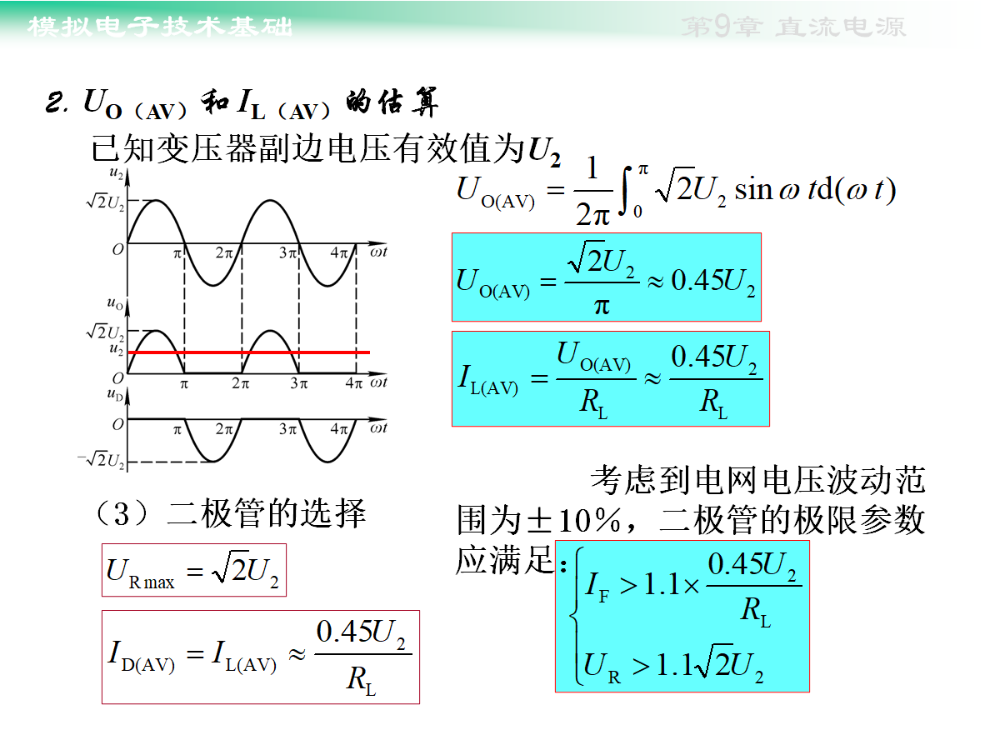

2. 单相桥式整流电路
   通过四个二极管组成的“桥”，实现了反向电压翻转，正向电压不变。最终效果是实现了电压的倍频。电路如下：
   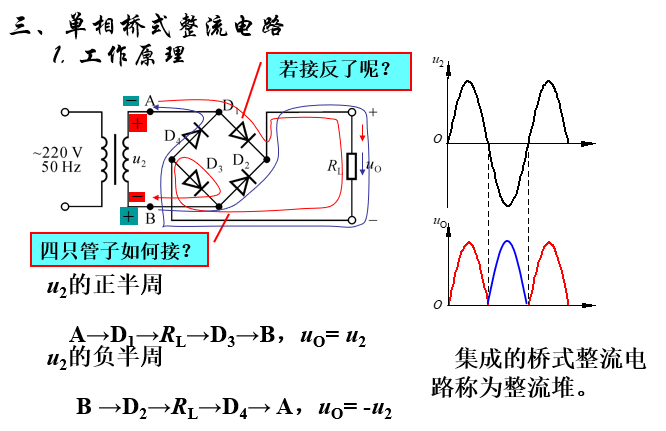
   参数计算如下：
   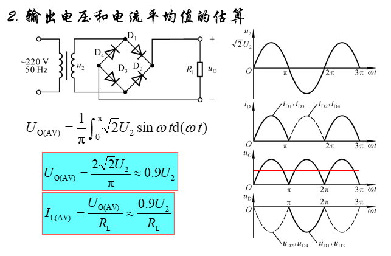
   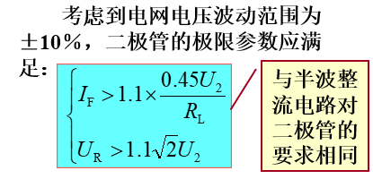

### 9.3 滤波电路

1. 电容滤波电路

   * 为什么要加滤波电路？如果直接使用脉动电的话，可以想象，电低到一定程度，电器不就周期性无法工作了？所以需要进行滤波，消除电的交流量，让他能够提供相对稳定的直流电。
   * 为什么采用电解电容？电解电容的容值很大，但有极性，使用时注意别接反了。

   在滤波电路里，电容的作用就是担当了一个充放电的角色，在输出电压低于电容电压时，由电容电压输出电流，消耗电容能量，电容电压下降，直到和变化的输出电压相等，转而电容充电，由输出电压供电，如此循环往复。如下图所示。
   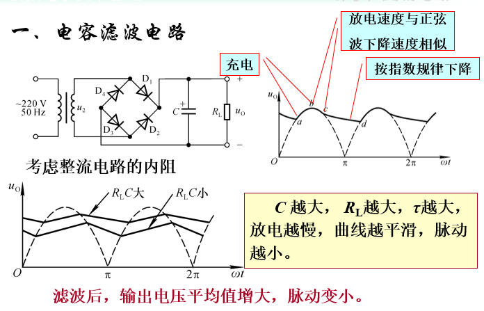

   另外，电容和负载乘积的大小会影响滤波效果。越大，滤波效果越好。但并不是越大越好，因为牵扯到一个概念，叫二极管导通角。$R_L C$越大，二极管导通的时间就越小，而且在这短暂的时间里，二极管内还会一下流过大电流，这对二极管的寿命有极大损害，因此并不是越大越好，一般推荐为$R_LC=(3\sim5)T/2$，此时$U_{o(AV)} \approx 1.2 U_2$。
   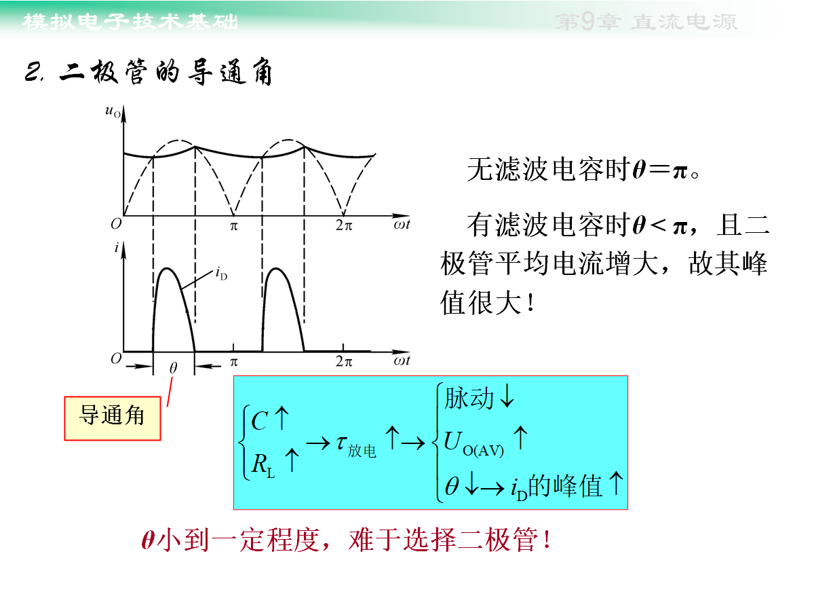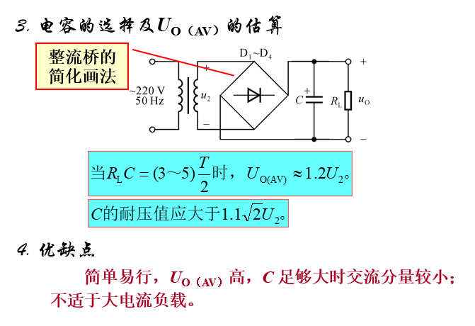
   当负载为小电阻时，会发现，此时想要达到良好的效果，电容就必须非常大，且会使得输出电流非常大，对二极管产生不好的影响，因此，电容滤波电路不适用于小负债电路需求。

2. 电感滤波电路
   这个电路的特性和电容相反，和电感相对应，电感是阻止电流的变化，产生感应电动势阻止电流的减小，从而增大二极管的导通角。

   > 为什么增大导通角：电感产生的感应电动势与加在它两端电压等大反向，也就是说，如下图，减小了二极管一端的电位且增大了负载端的电位，那么就可以让二极管始终导通，导通角达到了$\pi$。

   下面分别对交流和直流分量进行分析，R是线圈电阻，忽略不计的话，则直流分量为0.9U2，而交流分量，负载电阻越小，交流分量越小，滤波效果越好，因此，电感滤波电路适用于小负载电阻。

   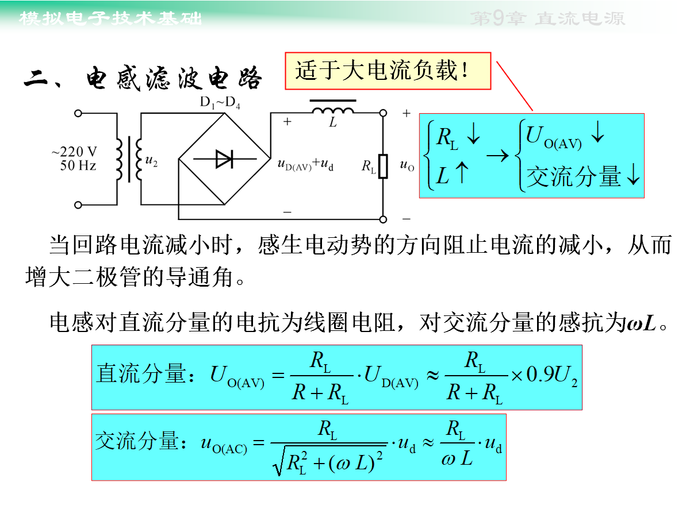

3. 倍压整流电路

   在电路分析中，我们均假设电容是能够充满的。这个电路结构就是电容的电压逐渐充电然后累加的过程。
   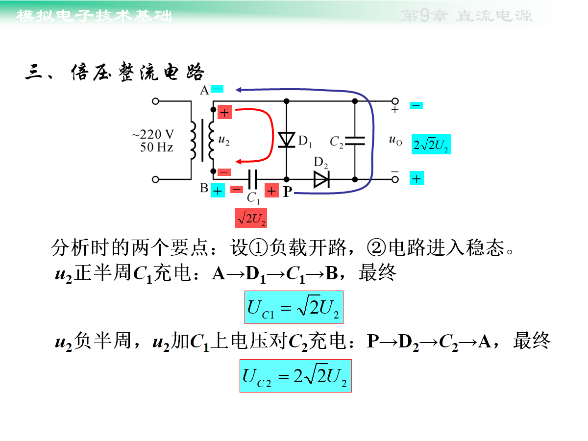

### 9.4 稳压管稳压电路

1. 稳压电路的性能指标：

   * 输出电压
   * 输出电流
   * 稳压系数：表明电网电压波动时电路的稳压性能。
     
   * 输出电阻：表明负载电流变化时电路的稳压性能。$R_o=\abs{\frac{\Delta U_o}{\Delta I_o}}|_{U_I}$
   * 纹波电压：测试出的输出电压的交流分量。

2. 稳压管稳压电路
   
   * 在此之前，对稳压管进行一定的回顾：
   
   * 稳压电路如下所示：
   
   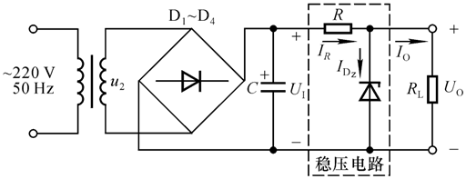
   电路简单易懂，就是简单的并联上了一个稳压管。
   稳压管在实际应用时离不开与之匹配的==限流电阻，即图上的R==。这个电阻起到了电压补偿的作用，该电路之所以可以稳压，和稳压管一个特性有很大关系，即==稳压管工作时其动态电阻极小，微小的电压波动，会导致非常大的电流波动==，而这个电流波动就会传导到限流电阻上，使其电压产生波动，对稳压管的电压进行了补偿，从而引入了负反馈。具体过程如下所示：
   
   > 注意，下图展现的是两种形式的波动，电网电压波动和负载电阻波动
   
   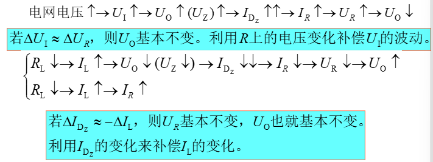 
   
   上面两个蓝色框框讲的内容对后续的电路分析很重要，即稳压管电路，==（默认是工作正常，即有稳压效果的话）电网电压加在限流电阻上，负载电流的变化由稳压管电流来提供。==
   
   * 电路设计：
     具体系数设计围绕着稳压管的工作电流这个区间展开，即要达到最小的稳压电流，又不能过大导致过热。因此，可以看到：
     
   
   上面第一个，输入电压的限制，此点是根据经验设计，没有道理。在进行设计时，我们遵循以下这个顺序：
   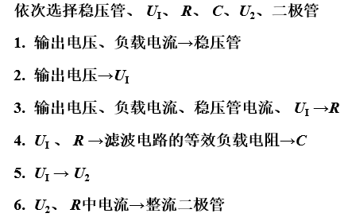
   
   * 电路的缺点：由于稳压管的原因，输出电流被限制的死死的，不够大。
   
3. 串联型稳压电路

   * 电路设计：（以下两张图只是画法不同）
     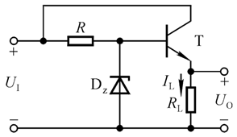

     可以看到，与稳压管电路的主要不同就是加入了一个三极管，他==对原本稳压管电路的输出电流进行了$(\beta +1)$倍的放大，使得负载电流的范围被扩大了。==

   * 负反馈
     负反馈的关键点在：==由于稳压管的存在，认为三极管的基极电位保持不变。==因此，若输出电压产生变化，可以从三极管的输入特性曲线得到，基极电流会发生相应的更大的改变。这个基极电流又会使得输出电流的变化，从而抑制输出电压。
     可以看到，稳压电路通过晶体管保持稳定，因此称晶体管为“调整管”。

   * 缺点：输出电压依然不可调，且输出电压虽$U_{BE}$变化而变化，稳定性较差。

4. 具有放大环节的串联型稳压电路
   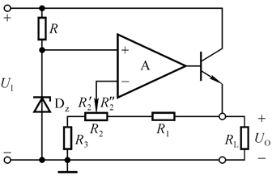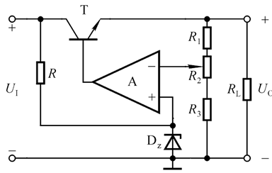
   图一为原理电路，图二为常见画法。
   根据上面提到的问题，就有了此电路。在分析电路时，注意一个关键点，==运放有负反馈，因此，具有虚短和虚断两个性质。==

   * 电路分析
     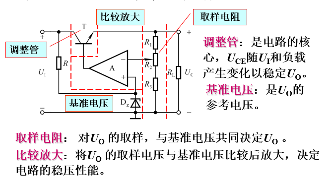
     上图对电路的分析比较透彻。实际上都是过往电路的叠加。可以看到，稳压管的电压，通过运放的虚短，就是$R'^2+R_3$的电压，通过调节R2这个可调电阻的阻值，可以调节输出电压。而至于负反馈，其实还是在看调整管，和串联型稳压电路是一样的原理。
     
   * 参数选择
     
     依次进行解释：
     
     1. 第一条式子有两个前提，R1上的电流和基极电流可以忽略不记，最后得到，满载电流要小于集电极最大电流。
     2. 第二条式子同理，当输入电压最大且输出电压最小，此时三极管承受的压降最大，必须要小于其最大的承受能力。
     3. 第三条就是功率了。
     
     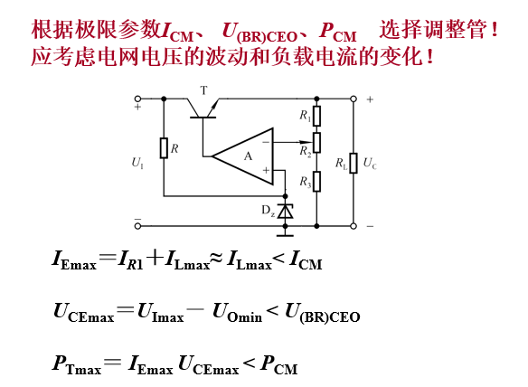
   
5. 三端稳压器
   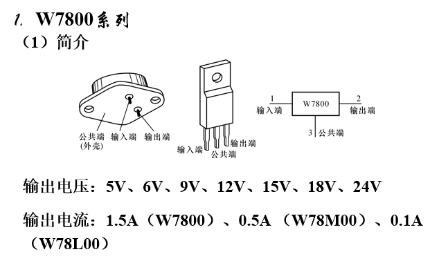

   * 应用电路
     * 基本应用
       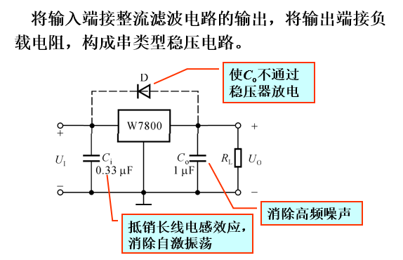
     * 同时输出正、负电压
       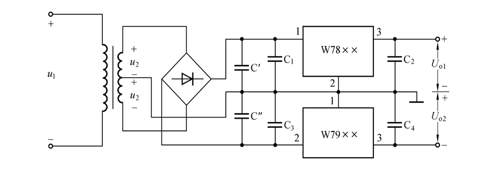
     * 输出电流扩展电路
       
     * 输出电压扩展电路
       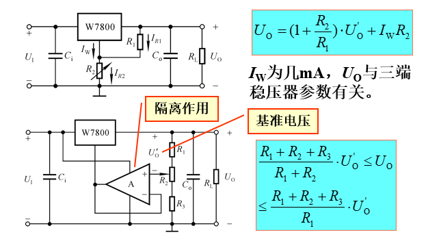
     * 基准电压源三端稳压器
       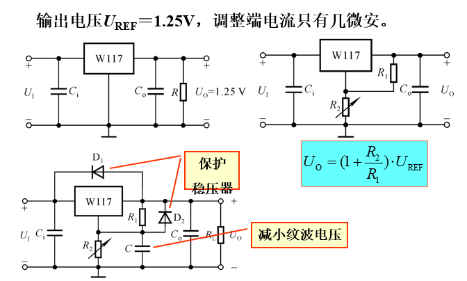
