## 一、二章

1. 该部分内容较为简单，以下仅记录知识点，主体内容查阅PPT即可。

   * 拉普拉斯变换

   * 时域中的数学模型

     * 机械系统
       * 弹簧、质量、阻尼系统
     * 电气系统
       * RLC电路

     > 这部分如何建模需要一定的物理电路知识，尤其是机械系统，应多多积累。

   * **线性定常系统（LTI）**的传递函数$G(s)$
     

     * 典型环节的传递函数
   
2.  系统==方框图==模型

     * ==各项典型系数==
       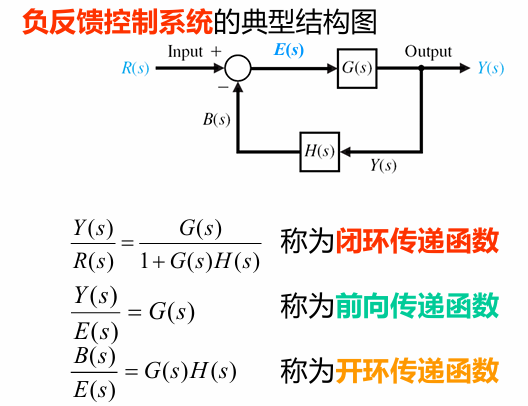

       > 对于负载效应的理解，只有当负载效应可以忽略的时候，系统才可解耦成一个又一个传递函数的方框串联

     * 方框图的基本单元——信号线、分支点、相加点、方框

     * **框图的基本变换**

       > 有很多化简原则，基本都是输入和输出的等效，和电路戴维南类似。这种题也是多积累即可，具体的变化规则若常用后续可补充至此，详情见PPT。

       * 合并串联方框、相加点后移、相加点前移、分支点后移、分支点前移、消去反馈回路、并联方框、相邻相加点之间移动、相加点与分支点互换位置。

3. ==信号流图==

   * 组成元素

     * 节点：表示系统的变量，用“o”表示。
       * 对所有来自于流入支路的信号作加法运算
       * 将流入信号之和传输给所有的流出支路
     * 支路
     * 信号

   * 相关术语

     输入节点、输出节点、混合节点、通路、前向通路、回路、回路/通路增益、不接触回路
     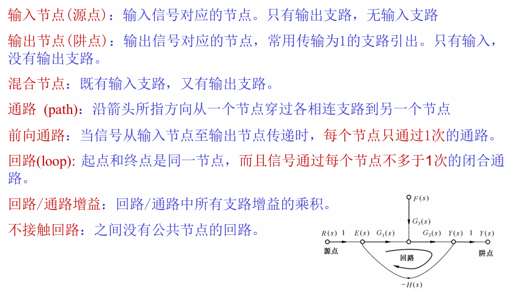

   * **梅森公式**
     $P=\frac{1}{\Delta}\sum_{k=1}^{n}P_k\Delta_k$
     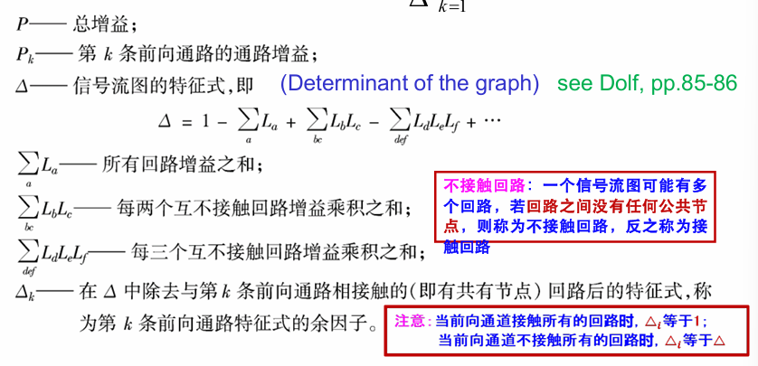

     > 做题步骤，找回路并筛选互不接触（$\Delta$）——找通路（$P_k$）——删回路（$\Delta_k$）
     >
     > 做题技巧：遍历有反馈输入支路的节点。在其中找互不接触的回路，在此基础上继续找三个不接触，以此类推，可得到$\Delta$。此后就可以开始筛选$\Delta_k$了。

## 第三章

### 时域响应

1. 典型输入信号

   * 单位脉冲信号    $R(s)=1$

   * 单位阶跃信号	$R(s)=\frac{1}{s}$
   * 单位斜坡信号    $R(s)=\frac{1}{S^2}$
   * 单位抛物线信号   $R(s)=\frac{1}{S^3}$

   > 由上到下，依次为积分关系，其响应也是如此。例如，常见的为，阶跃响应的导数为冲激响应（单位脉冲响应）

   * 正弦信号    $Asin(wt+\phi)->R(s)=\frac{w}{s^2+w^2}$

2. 瞬态性能指标

   * 延迟时间$T_d$：从0上升到稳态值的50%所需要的时间

   * 上升时间$T_r$

     * 从0上升到稳态值所需时间（有振荡系统）
     * 从稳态值10%上升到90%所需时间（无振荡系统）

   * 峰值时间$T_p$：系统响应达到最大峰值所需要的时间

   * （最大）超调量$\sigma\% \triangleq \frac{y(T_p) - y(\infty)}{y(\infty)} \times 100\%$

     > 常以百分比表示

   * 调节时间$T_s$：$\left| y(t) - y(\infty) \right| \leq y(\infty) \delta, \quad t \geq T_s$

   * 振荡次数$N$：调节时间内，$y(t)$偏离$y(\infty)$的振荡次数

3. 一阶系统时域分析$G(s)=\frac{1}{Ts+1}$

   * 单位阶跃响应
     * 稳态误差为0；延迟时间、上升时间、调节时间均与**T**成正比
     * 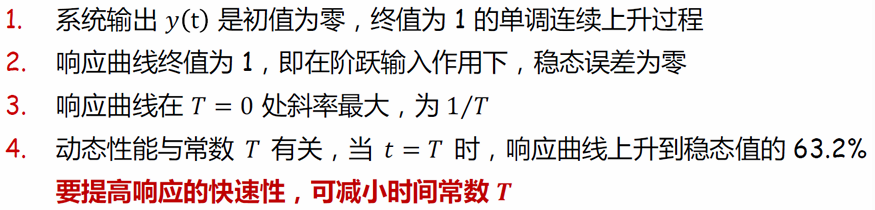
   * 单位脉冲响应
     * 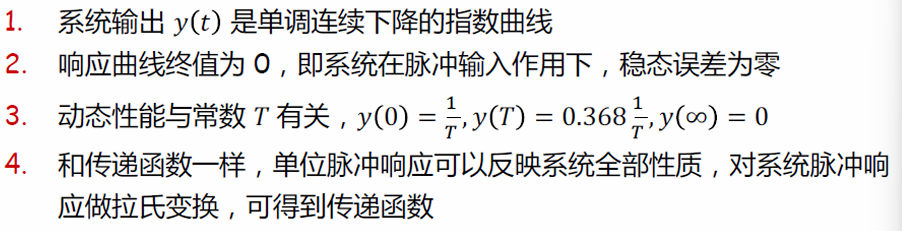
   * 单位斜坡响应
     * 
   
4. 二阶系统时域分析

   * 标准数学模型

     * 标准二阶系统微分方程：$\ddot{y} + 2\xi \omega_n \dot{y} + \omega_n^2 y = \omega_n^2 r$
     * ==标准二阶系统闭环传递函数==：$\Phi(s) = \frac{Y(s)}{R(s)} = \frac{\omega_n^2}{s^2 + 2\zeta\omega_n s + \omega_n^2}$

     > 上述公式要记住。
     >
     > $\zeta$：阻尼比
     >
     > $\omega_n$：无阻尼自然振荡频率
     >
     > $\omega_d=\omega_n \sqrt{1-\zeta^2}$：阻尼自然振荡频率

     * 标准二阶系统特征根：$s_{1,2} = -\zeta \omega_n \pm \omega_n \sqrt{\zeta^2 - 1}$

   * 二阶系统地单位阶跃响应$Y(s) = G(s) R(s) = \frac{\omega_n^2}{(s^2 + 2\zeta\omega_n s + \omega_n^2)} \cdot \frac{1}{s}$

     * 欠阻尼$0<\zeta<1$
       $y(t)=1 - e^{-\zeta\omega_n t} \frac{1}{\sqrt{1 - \zeta^2}} \sin(\omega_d t + \theta) \quad t \geq 0$
       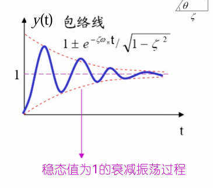

       * 暂态分量是衰减的正弦震荡
       * 暂态分量的衰减速度取决于$\zeta \omega_n$
       * 系统输出稳态值为1
       * 在阶跃信号作用下不存在稳态误差

     * 无阻尼($\zeta=0$)
       $y(t)=1-cos\omega_nt$
       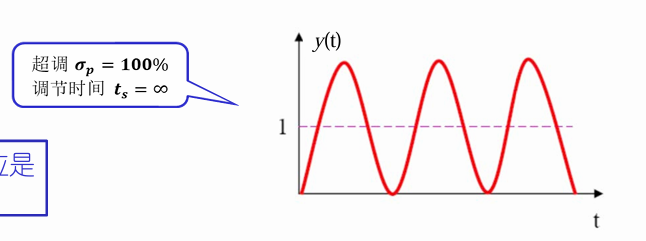

       无阻尼单位阶跃响应是一个等幅振荡过程

     * 临界阻尼（$\zeta=1$）
       $y(t)=1-e^{-\omega_nt}(1+\omega_nt),t\geq0 $
       临界阻尼单位阶跃响是 一个稳态值为1的无超调单调上升过程。类似于一阶系统的单位阶跃响应，但有区别！即零点的斜率是从0开始的。

     * 过阻尼（$\zeta>1$）
       $y(t)= 1 - \frac{1}{2\sqrt{\zeta^2 - 1}} \left( \frac{1}{\zeta - \sqrt{\zeta^2 - 1}} e^{-\frac{t}{T_1}} - \frac{1}{\zeta + \sqrt{\zeta^2 - 1}} e^{-\frac{t}{T_2}} \right), \quad t \geq 0$
       当$\zeta>>1$时，$y(t)=1-\frac{1}{2\sqrt{\zeta^2 - 1}}(\frac{1}{\zeta - \sqrt{\zeta^2 - 1}} e^{-\frac{t}{T_1}})$
       过阻尼单位阶跃响应是一个稳态值为1的单调上升过程。

     * 负阻尼（$-1<\zeta<0$）
       $y(t) = 1 - \frac{e^{-\zeta\omega_n t}}{\sqrt{1 - \zeta^2}} \sin(\omega_d t + \theta) \quad t \geq 0$
       负阻尼单位阶跃响应是发散的正弦振荡，系统不稳定

   * **欠阻尼**二阶系统评价指标

     * ==峰值时间==$T_p$
       **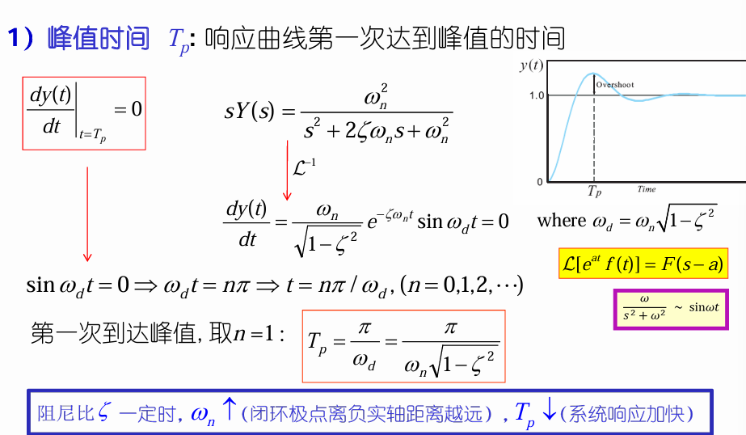**
       
     * ==超调量==$\sigma \%$
       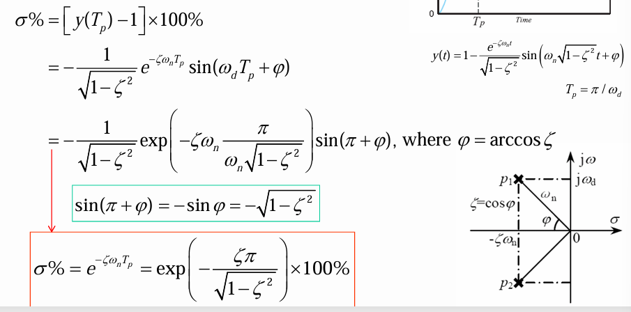
       **超调量只与阻尼比有关！**
       表达式要背下来。
       
     * 上升时间$T_r$
       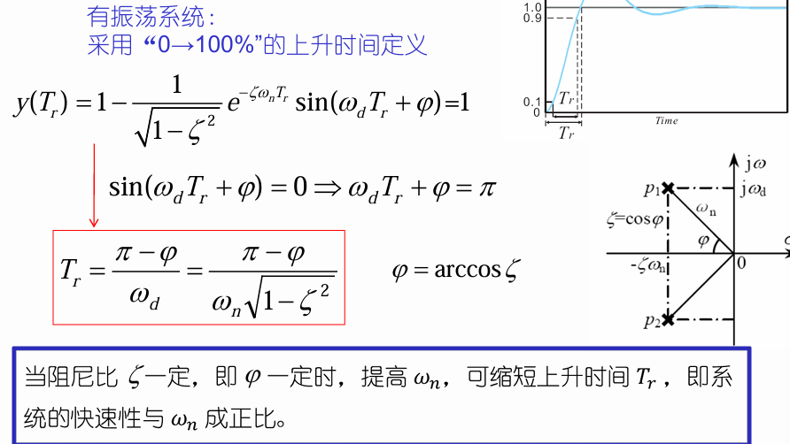
       
     * 调节时间$T_s$
       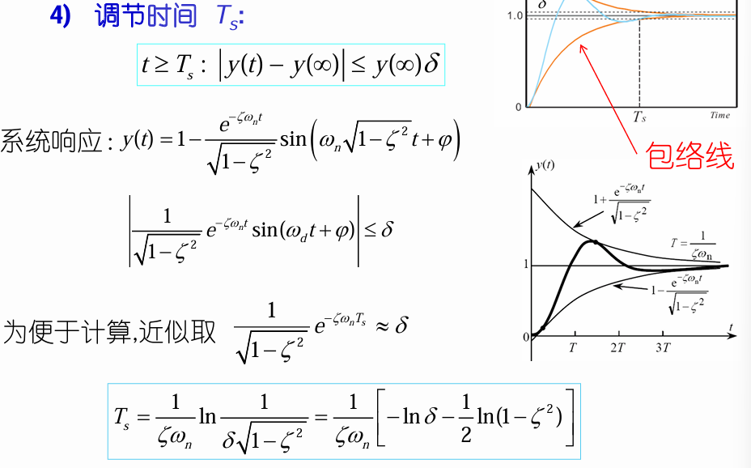
       
     * 延迟时间$T_d$
       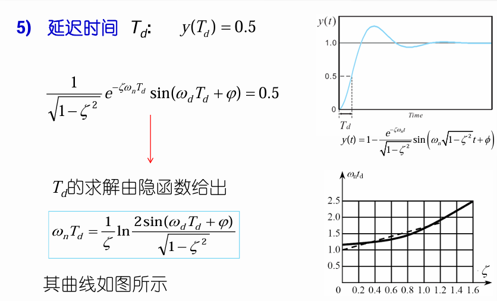
     
     * 震荡次数$N$
       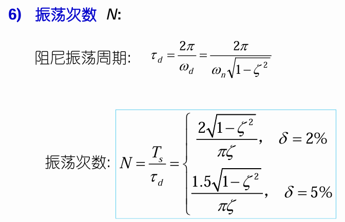
     
     * Note
     
       1. 兼顾超调量和响应时间，控制系统常选择$\zeta=0.4\sim0.8$，相应的$\sigma\%=25.4\%\sim1.5\%$
     
          > 实际系统常选取工作在欠阻尼状态。只有对超调有很大要求时，才选择过阻尼状态
     
       2. 二阶工程最佳参数$\zeta=1/\sqrt{2}=0.707$，相应的$\sigma\%=4.3\%$
   
4. 具有零点的二阶系统的单位阶跃响应
   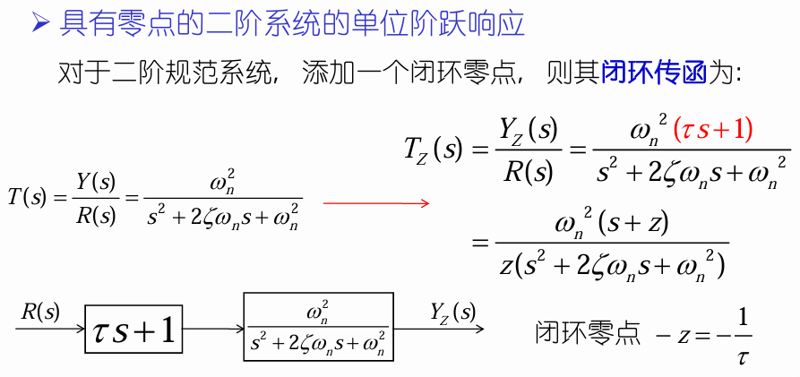
   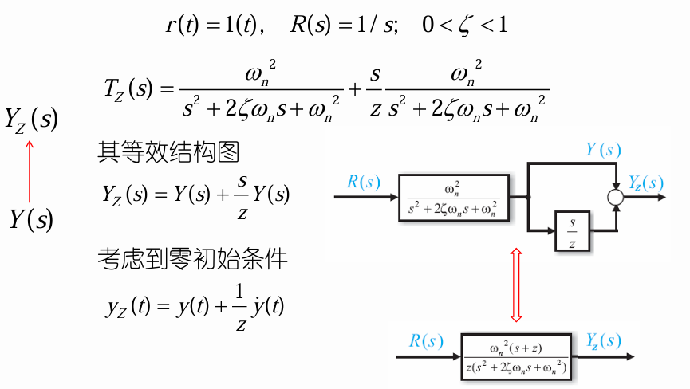
   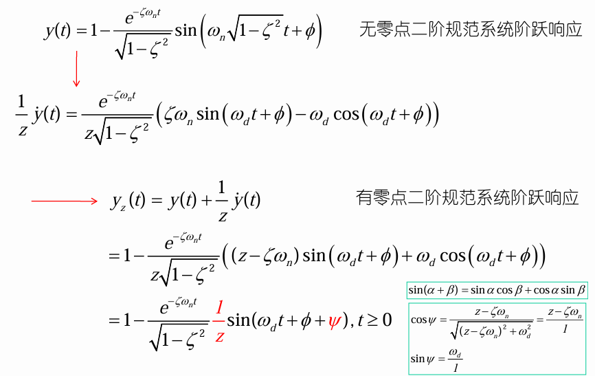
   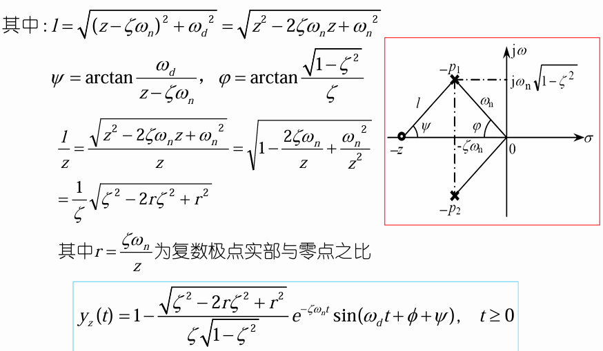
   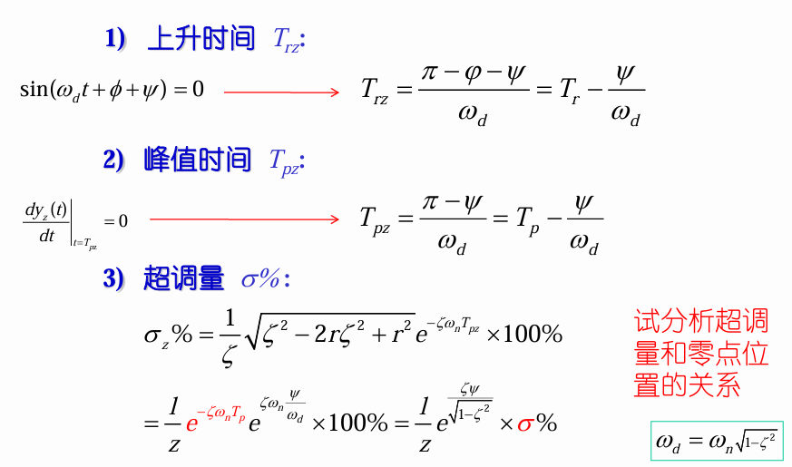
   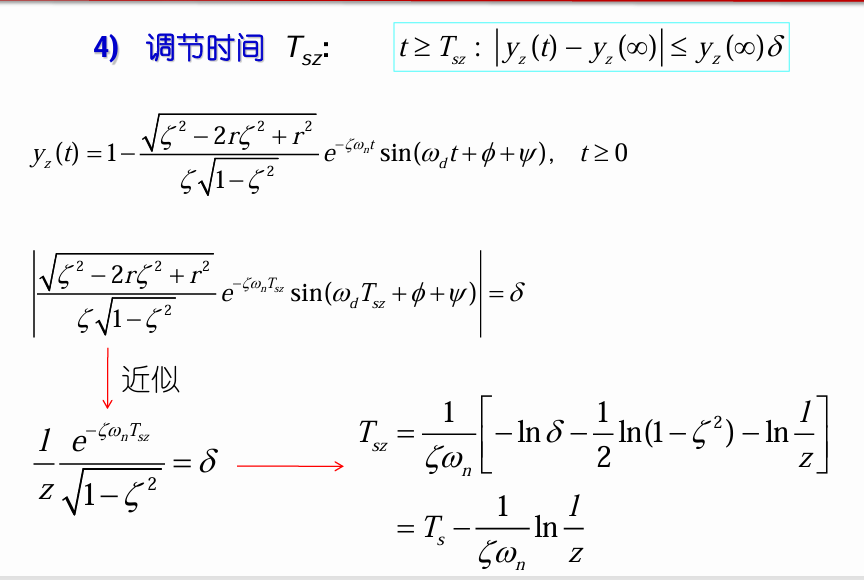
   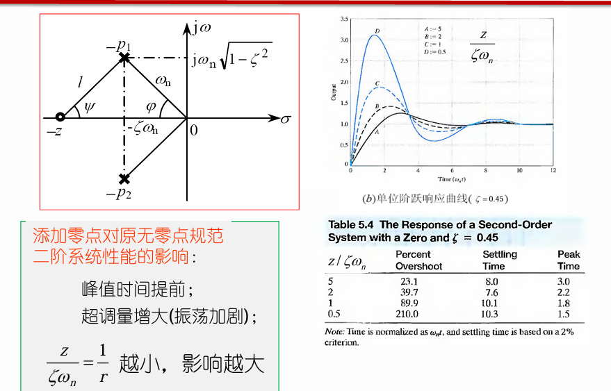
   
4. 二阶系统单位脉冲响应$R_{(S)}=1$
   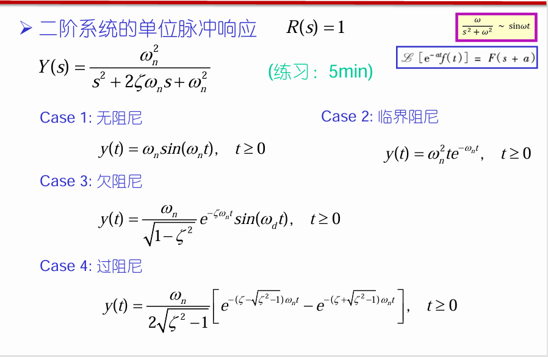
   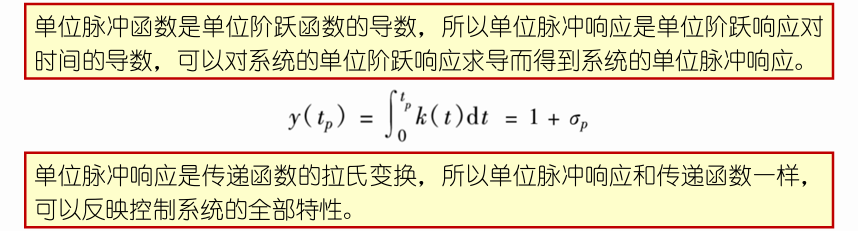
   
   > 分析部分忽略，本质就是求出$y(t)$，下同。
   
7. 二阶系统单位斜坡响应$R_{(S)}=\frac{1}{S^2}$
   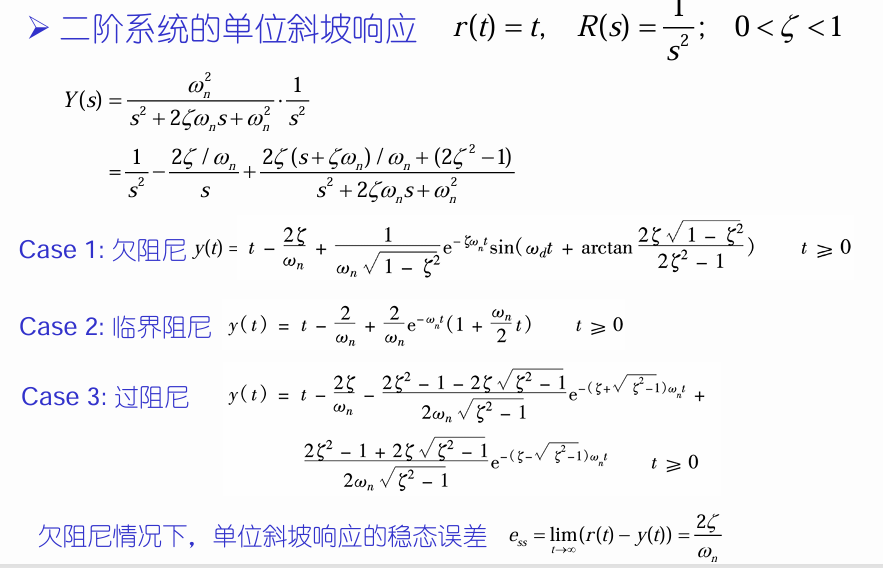

8. 高阶系统时域响应
   
   * 以典型三阶系统单位阶跃响应为例$0<\zeta<1$

     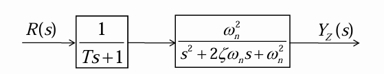
     $y(t)= 1 - \frac{e^{-\beta \zeta \omega_n t}}{\zeta^2 \beta (\beta - 2) + 1} - \frac{\beta \zeta}{\sqrt{\zeta^2 \beta (\beta - 2) + 1}} \times \frac{e^{-\zeta \omega_n t}}{\sqrt{1 - \zeta^2}} \sin(\omega_d t + \gamma), \quad t \geq 0$
     其中，$\gamma = \arctan \frac{\zeta (\beta - 2) \sqrt{1 - \zeta^2}}{\zeta^2 (\beta - 2) + 1}\quad\beta=\frac{p}{\zeta\omega_n}$
   
     > $e^{-\beta \zeta \omega_n t}$的系数总为负数，分母大于0
   
     * 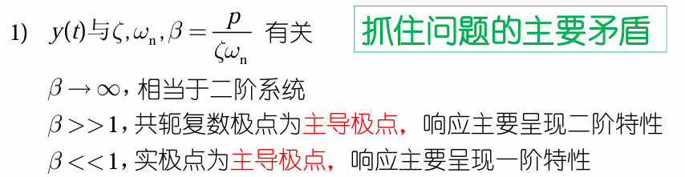
     * 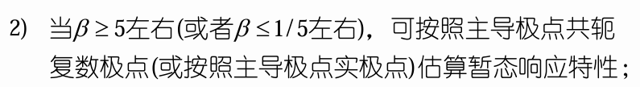
     * 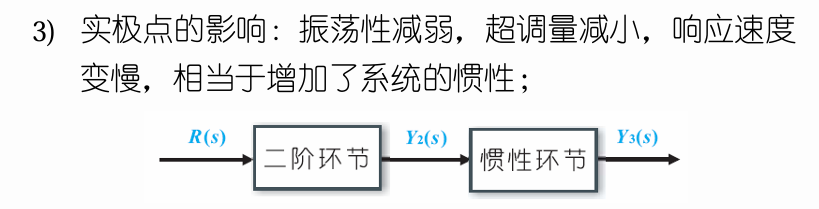
   
   * 一般性高阶系统单位阶跃响应（时域响应）
     
   
     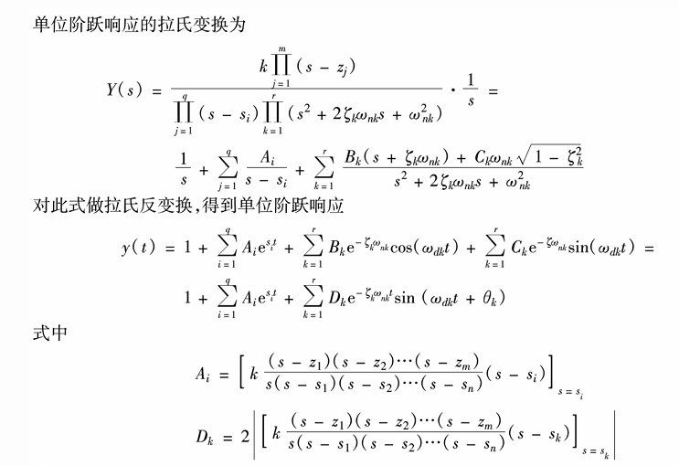
   
     * 如果高阶系统的**闭环极点全部具有负实部**，即全部在复数平面的左半平面，则**系统单位阶跃响应的暂态分量最终衰减为零。**
   
       > 闭环极点：闭环系统的极点
     
     * 在暂态分量中，每一项**衰减的快慢**取决于相应实数闭环极点的绝对值$|s_i|$，或复数闭环极点的实部绝对值$|ζω_nk|$。系统闭环极点在复数平面左半平面距离虚轴越远，式（3.5.1）中与之相应的项衰减得越快；反之，越靠近虚轴闭环极点所对应的项衰减越慢。
     
       > 式3.5.1为：$y(t)=1 + \sum_{i=1}^{q} A_i e^{s_i t} + \sum_{k=1}^{r} D_k e^{-\zeta_k \omega_{nk} t} \sin(\omega_{dk} t + \theta_k)$
     
     * **高阶系统单位阶跃响应中暂态分量的各项系数不仅和闭环极点有关，而且也与闭环零点有关。**在复数平面上，如果某一闭环极点靠近一零点，而又与其他极点相距较远，则式（3.5.1）中相应项的系数A或D较小，在暂态分量中的影响较小；若有一对闭环零、极点非常接近，称做一对偶极子，则该极点对暂态过程几乎没有影响；若某极点附近没有零点，并且距虚轴较近，则式（3.5.1）中相应项的系数就较大，对暂态过程的影响较大
     
     * **结论：**
       实部为负的极点，
       越靠近虚轴，衰减速度越慢，对过渡过程的影响越大；
       越远离虚轴，衰减速度越快，对过渡过程的影响越小。
     
     * 闭环主导极点
       
     
       > 确定主导极点后，一般为二阶系统。这时忽略之前的其他极点，就按照以这两为极点的二阶系统来算就行！例如，$\alpha_1,\alpha_2$，则$G'(s)=\frac{\alpha_1\alpha_2}{(s-\alpha_1)(s-\alpha_2)}$
       
     * 连续系统瞬态响应与系统极点位置密切相关
       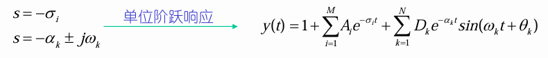
     
       上式展现了极点实部和虚部对阶跃响应的影响。对应下图可以看出极点位置对于系统响应振荡、稳定、响应速度等的影响。
       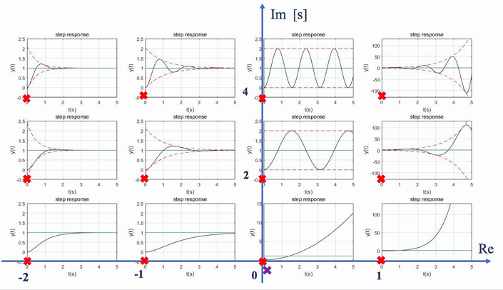
       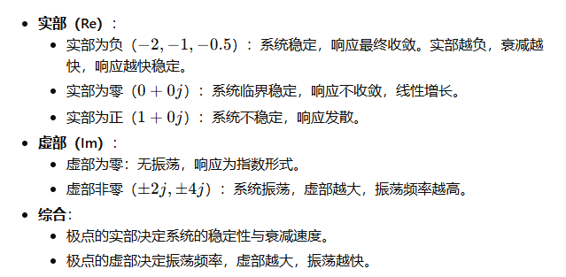
   
9. 例题

* 下题，直接求出闭环传递函数，根据超调量和峰值时间计算k1和k2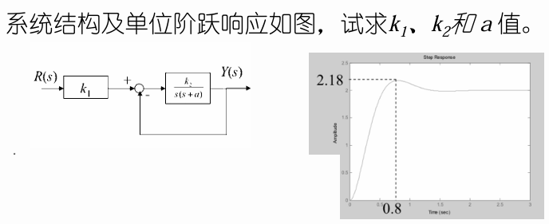
  观察前向传递函数的形式，$k_2$只能是$\omega_n^2$。
10.  **Attention list**
	所谓单位负反馈，就是负反馈环节的增益k=1，前向传递函数等于开环传递函数。

### 系统稳定性

1. 连续系统稳定性定义及劳斯判据

   * 稳定性的概念

     * 定义：在扰动作用下系统偏离了原来的平衡状态，如果扰动消除后，系统能够以足够的准确度恢复到原来的平衡状态，则系统是稳定的；否则，系统不稳定。
     * 数学定义：（简单来说）线性定常系统，初始条件为0，输入一个理想单位的脉冲，当t趋于无穷，系统的输出响应收敛到原来的零平衡状态，则系统稳定。

   * ==系统稳定的充要条件：==系统的所有闭环极点均具有负的实部，或所有闭环极点均严格位于左半s平面。

     > 稳定性是系统的一种固有特性，只取决于系统的结构和参数。
     >
     > :fire:**在经典控制理论中，临界稳定归为不稳定。**

   * 稳定性判据
     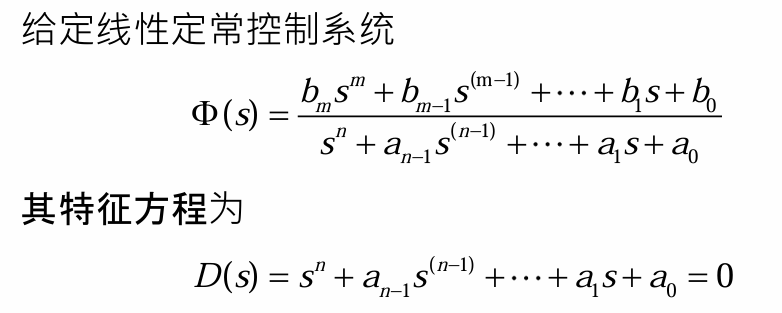

     * **必要条件：**$a_i>0\quad i=0,1,2,\dots,n-1,n$

     * **劳斯稳定判据**
       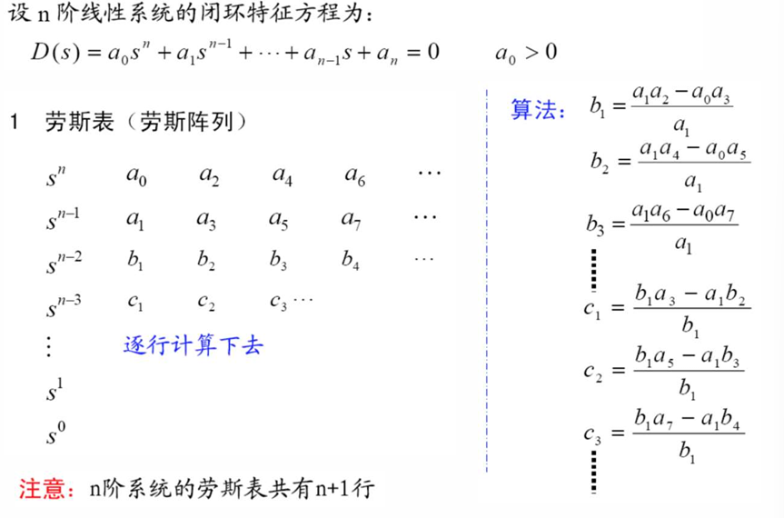
       ==结论：==劳斯表的第一列系数全部大于零时，系统稳定。而且，劳斯表中第一列元素符号改变的次数就等于正实部根的个数。

       1. 在计算劳斯表的过程中，某行同乘或同除一个正数，结果不变。

       2. 当劳斯表某行第一个元素为零，而该行不全为零时：
          系统不稳定。
          

       3. 劳斯表中出现全零行：
          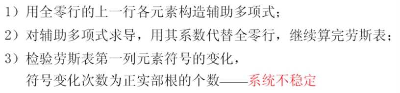

          例子如：
          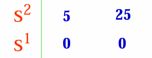
          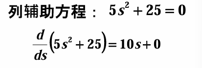
          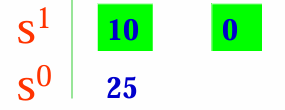
          
     
     * 利用劳斯判据求取保证系统稳定的条件
     
       > 即，写出劳斯表，根据稳定性的条件求未知参数相关信息
     
       * 对于**单位负反馈系统**，其特征方程就是**闭环传递函数分母**或**开环传递函数的分子+分母**。
     
       * 系统闭环稳定与开环稳定之间没有直接关系
     
       * 辅助方程的根是原特征方程的根的一部分。辅助方程一般为偶次方程，它的根是成对出现的，由绝对值相同、符号相反的根组成。
         即，==辅助方程解出来的纯虚根就是原特征方程的根！==且$y(t)=1 + \sum_{i=1}^{q} A_i e^{s_i t} + \sum_{k=1}^{r} D_k e^{-\zeta_k \omega_{nk} t} \sin(\omega_{dk} t + \theta_k)$，即==纯虚根对应的虚部数值即为响应的振荡角速度$\omega_dk$。==
         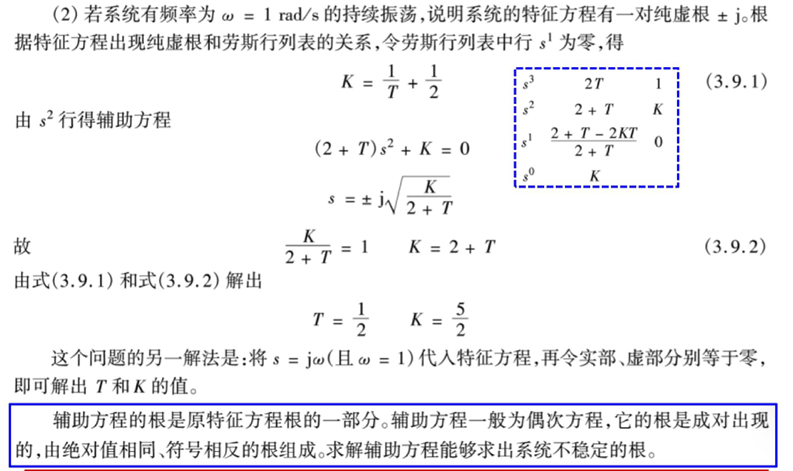
     
       * 利用换元手法，求出特征根与某些直线的位置关系。
         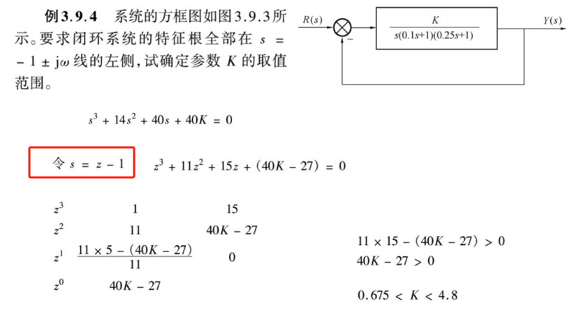
         
         > :fire:易错！注意，==换元是$s=z-a(a为平移)$。当s=-1时，z=0，因此，a=1，s=z-1。==
     
     * 关于系统的稳定性
       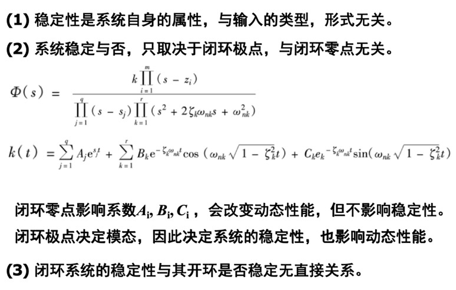
     

2. 控制系统的稳定误差、动态误差系数

   > 计算稳态误差以系统稳定为前提
   >
   > 只讨论系统的原理性误差，不考虑由于非线性因素引起的误差

   * 定义
     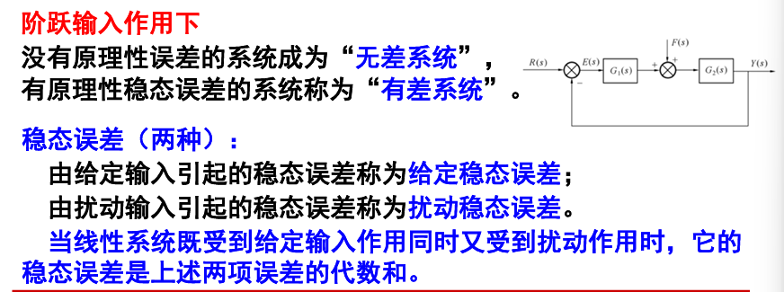
     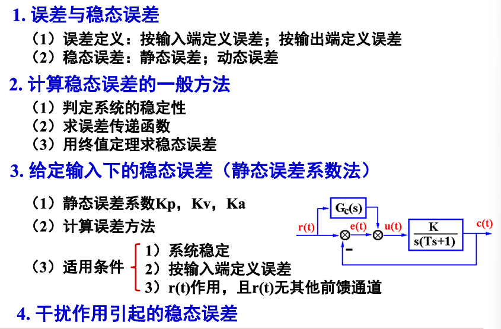
     
   * 线性控制系统的稳态误差
     * 按输入端定义的误差、按输出端定义的误差
       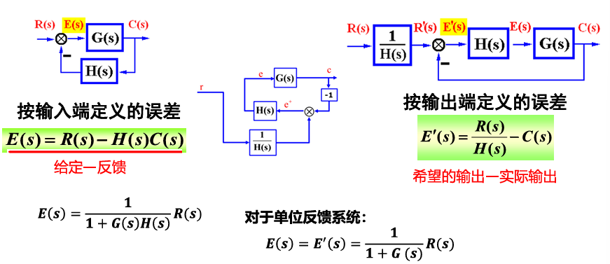
       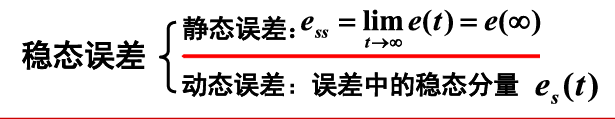
     
     * 误差公式推导
       误差定义$e(t)=y_r(t)-y(t)$
     
       在设计负反馈控制系统时，一般情况是希望反馈信号和输入信号一致。也就是说，$Y_r(s)=\frac{1}{H(s)}R(s)$
     
       则，$E(s)=Y_r(s)-Y(s)=\frac{1}{H(s)}\frac{1}{1+G(s)H(s)}R(s)$
     
       对于单位负反馈系统，$E(s)=\frac{1}{1+G(s)}R(s)$
     
       稳态误差$e_{ss}=\lim_{t\rightarrow\infty}e(t)=\begin{cases} 
       \lim_{s \to 0} sE(s) \\
       \lim_{t \to \infty} e(t)
       \end{cases}$
     
       > ==**终值定理应用条件：**==$\lim_{t\rightarrow\infty}e(t)$存在，这相当于$sE(s)$的极点都在S平面的左半平面（包括坐标原点） 
     
     * 计算稳态误差的一般方法
       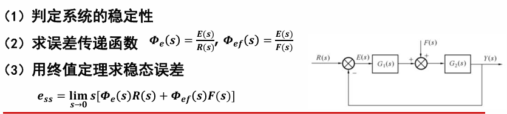
     
       * 例题
         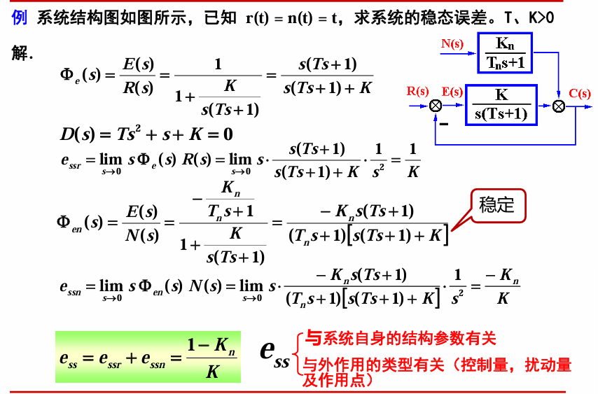
       * 
     
     * 控制系统的型别
     
       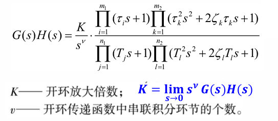
     
       > $E(s)=\frac{1}{1+G(s)H(s)}R(s)$
     
       根据开环传递函数包含积分环节的个数v称为系统的型别（类型）：
     
       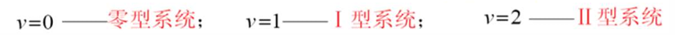
       
     
     * 给定输入下的稳态误差推导
     
       1. 阶跃输入作用下的稳态误差	$K_p = \lim_{s \to 0} H(s)G(s)$
          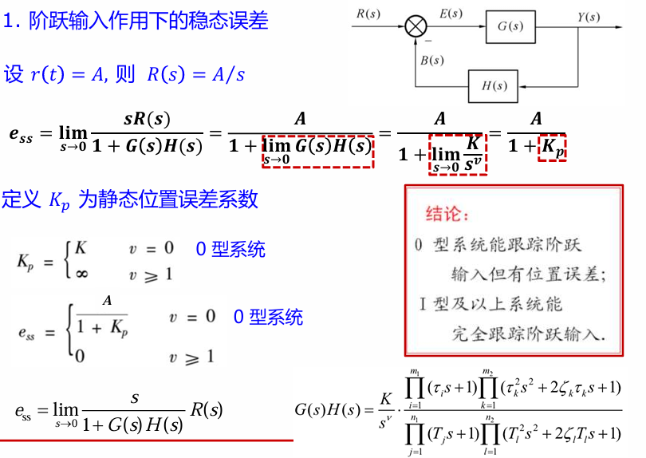
          
       2. 斜坡信号输入下的稳态误差     $K_v= \lim_{s \to 0} sH(s)G(s)$
          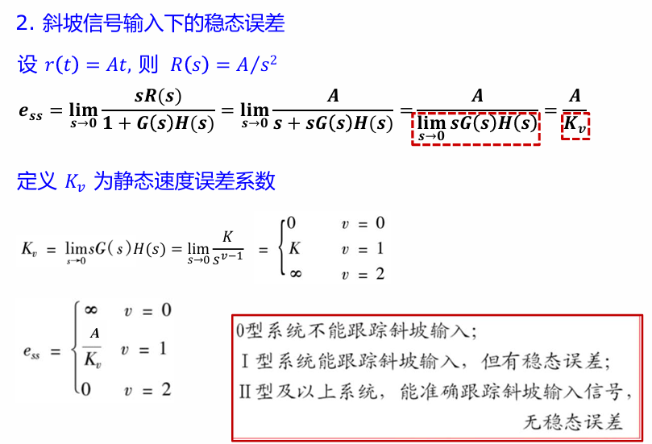
          
       3. 加速度信号输入下的稳态误差    $K_a= \lim_{s \to 0} s^2H(s)G(s)$
          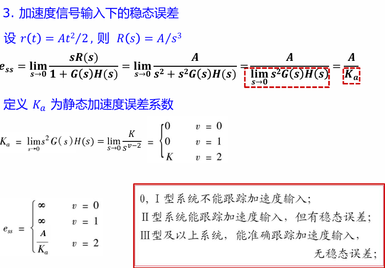
          
       4. 总结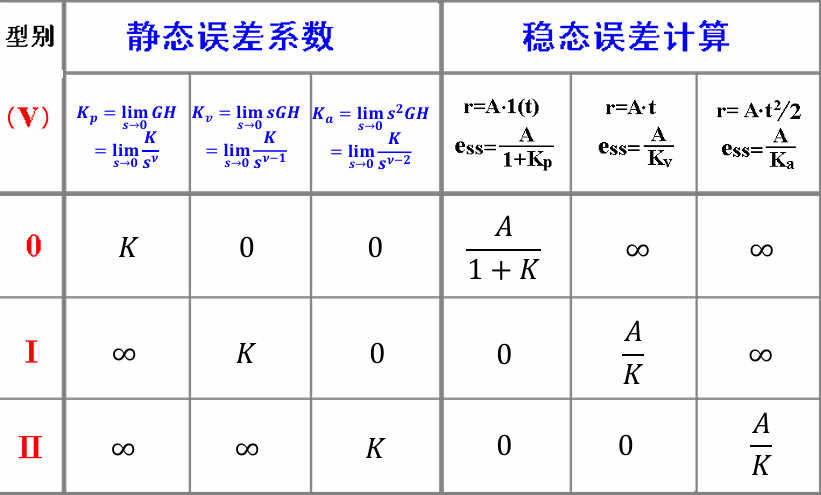
          
          
       5. 例题
     
          主要方法是将题目所给的传递函数化为标准形式，得到K。此后，再将信号分解为典型信号，查表可以直接得到稳态误差。
     
          注意，随意给定一个系统，在求其稳态误差前，要根据劳斯判据说明其稳定，从这之中也可得到一些未知数条件。之后再求解稳态误差。
     
          对于非典型系统，不能直接使用表格的，则追根溯源，求出误差传递函数，使用终值定理来求解。
          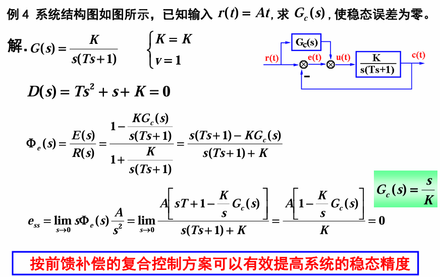
     
     * 干扰信号作用下的稳态误差
     
       > 系统在扰动作用下的稳态误差大小，反映了系统的抗扰动能力。
       >
       > 由于给定输入与扰动信号作用在系统的不同位置上，系统对某一给定输入的稳态误差为零，对同一形式的扰动作用稳态误差未必是零。
       >
       > 同一系统面对同一形式的扰动作用，由于扰动的作用点不同，其稳态误差也不一定相同。
     
       1. 常用稳态误差公式的推导
          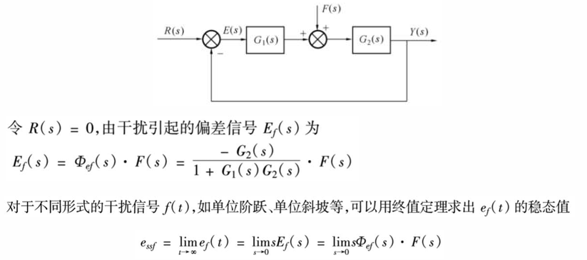
          :fire:$\Phi_{ef}(s) = \frac{-G_2(s)}{1 + G_1(s)G_2(s)}$
     
          记住上面的式子，之后再用终值定理求即可。
     
   * 动态误差系数法
   
     * 推导
   
       对误差传递函数进行泰勒展开，认为给定信号初始值为0，因此进行拉氏逆变换后，得到信号一系列导数。而通常信号不超过二阶。
       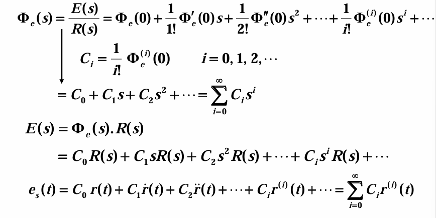
   
     * 计算
   
       常见做法是，首先得到$\Phi_e(s)$，使用长除法，得到$s,s^2,s^3$一系列系数，即需要使用的$C_0,C_1,C_2$，即可得到动态误差系数。
   
       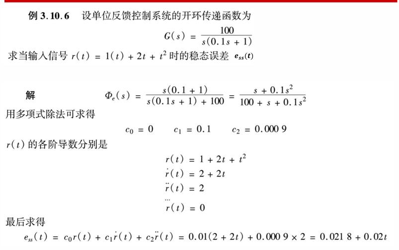

## 第四章

1. 根轨迹的基本概念

   * 根轨迹定义：当系统某一参数（如开环增益）变化时，**闭环系统特征方程的根**在S平面上变化的轨迹。

   * 特征方程：$G(s)H(s)=-1$

     > 闭环传递函数$\Phi(s)=\frac{G(s)}{1+G(s)H(s)}$
     >
     > 由特征方程推出模值条件、相角条件

     * 模值条件
       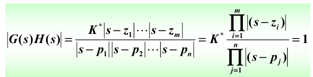

       对s平面上任意的点，总存在一个$K^*$，使其满足模值条件，但该点不一定是根轨迹上的点。

     * 相角条件
       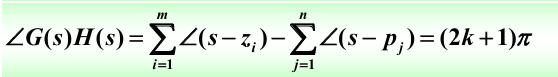

       > 上述式子都利用了复数的性质，即$\frac{z_1}{z_2}$的模和幅角，等于模相除，幅角相减。
       
       s平面上满足相角条件的点一定在根轨迹上。
     
        * ==满足相角条件是s点位于根轨迹上的充分必要条件。==
          
          ==根轨迹上某点对应的$K^*$值，应由模值条件来确定。==
   
2. 绘制根轨迹的法则

   * **法则一**	根轨迹的起点和终点：
     根轨迹开始于开环极点，终止于开环零点；
     如果开环极点个数n大于零点个数m，则有n-m条根轨迹终止于无穷远处。
     
     > 推导思路：起点为$K^*=0$，终点为$K^*=\infty$，开环极点处为0，开环零点处为$\infty$
     
   * **法则二**    根轨迹的分指数，对称性和连续性：
     根轨迹的分支数 = 开环极点个数；
     根轨迹连续且对称于实轴
   
     > 推导思路：一般的传递函数，默认分母阶数大于等于分子，即开环极点个数大于等于零点个数，因此，分支数=起点个数=开环极点个数。
     >
     > 又因，特征方程的根只能是实数或者共轭复数，因此，根轨迹必然是关于实轴对称的
   
   * **法则三**      实轴上的根轨迹：
     从**实轴上最右端**的开环零、极点算起，==奇数==开环零、极点==到偶数==开环零、极点之间的区域必是根轨迹
   
     > 推导思路：利用到法则二的对称性质，共轭复数和实轴上的点的相角和相加总为360°。由此可以简化整个运算。
   
   * **法则四**       根之和：$\sum_{i=1}^n\lambda_i=C\;(n-m\geq2)$
     n-m大于等于2时，闭环跟之和保持一个常值。一部分根左移，另一部分根必右移，且移动总理为零。
   
     > 推导思路：利用代数运算性质得到。
     > 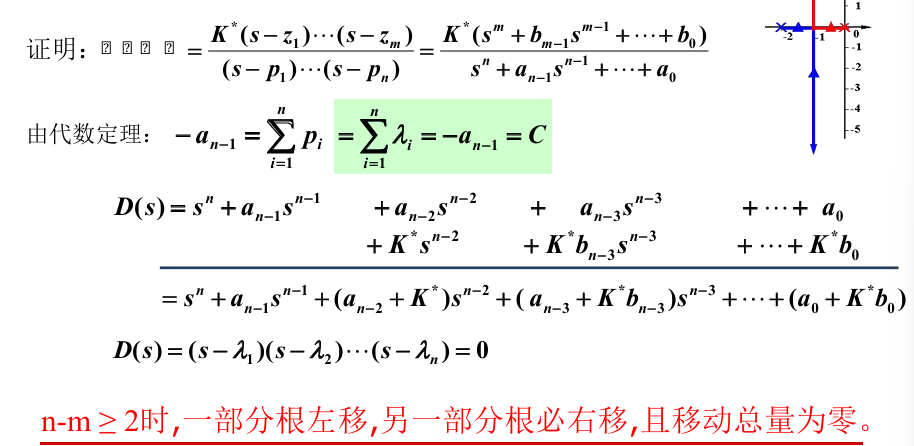
     > 常常用来验证，多条根轨迹变化时，大致的变化方向。比如一条轨迹始终变小，那另一条轨迹就不可能一会大一会小，而是会和他抵消。
     
   * 定理：若系统有2个开环极点，1个开环零点，且在复平面存在根轨迹，则复平面的根轨迹一定是以该零点为圆心的圆弧。
     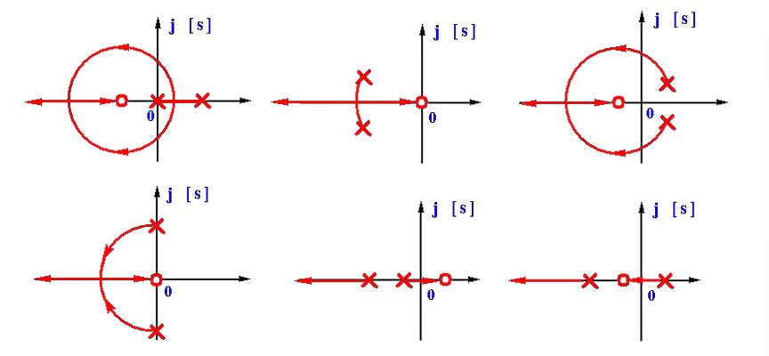
   
     > 直接求解此类特征方程根，就可以得到这个结论。
     
   * **法则五**      渐近线：
     $\left\{
     \begin{array}{l}
     \sigma_a = \frac{\displaystyle\sum_{i=1}^{n} p_i - \sum_{j=1}^{m} z_j}{n - m} \\
     \varphi_a = \frac{(2k + 1)\pi}{n - m}
     \end{array}
     \right.$
     $n > m$时，n-m条根轨迹趋于无穷远处的规律。
   
     > 证明思路里有个有意思的点，在渐近线无穷远处，所有点都可以看成一个点。这种近似结果再和正常情况下长除法得到的系数一对比即可得到近似的结果。
   
   * **法则六**     分离点d：
     $\sum_{i=1}^{n} \frac{1}{d - p_i} = \sum_{j=1}^{m} \frac{1}{d - z_j} \quad \text{（对应重根）}$
   
   * **法则七**     与虚轴交点：$\left\{\begin{array}{l}\text{系统临界稳定点} \\s = j\omega \text{ 是根的点}
     \end{array}
     \right.$
   
   * **法则八**      出射角/入射角
     $\sum_{j=1}^{m} \angle(s - z_j) - \sum_{i=1}^{n} \angle(s - p_i) = (2k + 1)\pi$
   
     > 在起点处的切线与正实轴间的夹角称做出射角
     >
     > 在终点处的切线与正实轴的夹角称做入射角
   
     s是目标点附近的一个点。离目标点无限近，与其他点的角度可视为目标点与之的角度，而与目标点的角度则用未知数代替。幅角计算直接算$s-z_j$实部虚部即可。
     
   
   * **定理**：若开环零极点均为偶数个，且关于一条平行于虚轴的直线左右对称分布，则根轨迹一定关于该直线左右对称。
     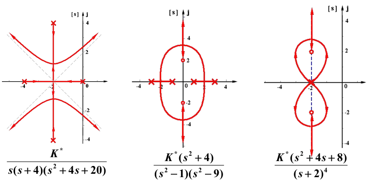
   
3. 根轨迹绘图例题

   * 绘图步骤，主打一步一步探索，先画实轴上的根轨迹，然后画渐近线，求出射角，分离点，虚轴交点等。
     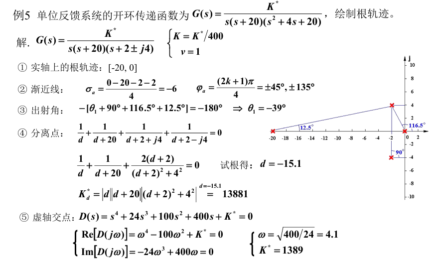
     
   * 重根
     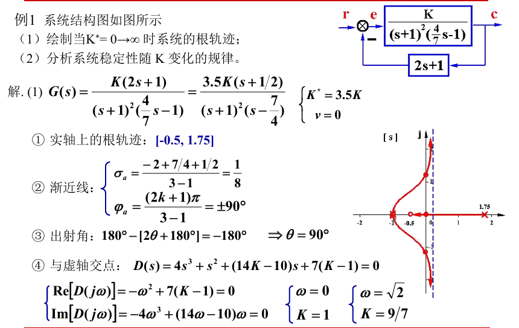
     
   * **参数根轨迹——除$K^*$之外其他参数变化时系统的根轨迹**
     核心思路就是通过特征方程，构造一个等效的开环传递函数，使目标参数变成该等效开环传递函数的$K^*$，再使用常规的根轨迹画法画出根轨迹
   
     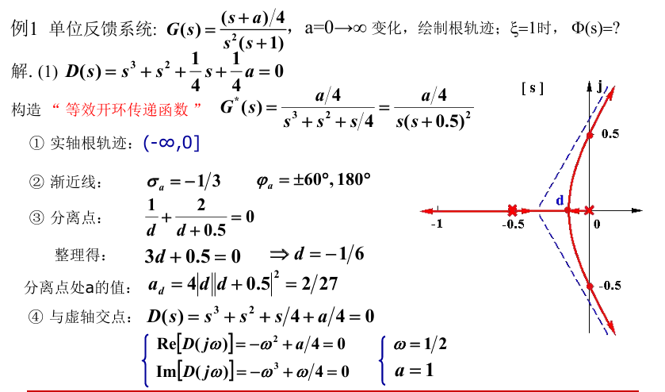
   
   * **零度根轨迹——系统实质上处于正反馈时的根轨迹**
   
     * 根轨迹基本概念变化
       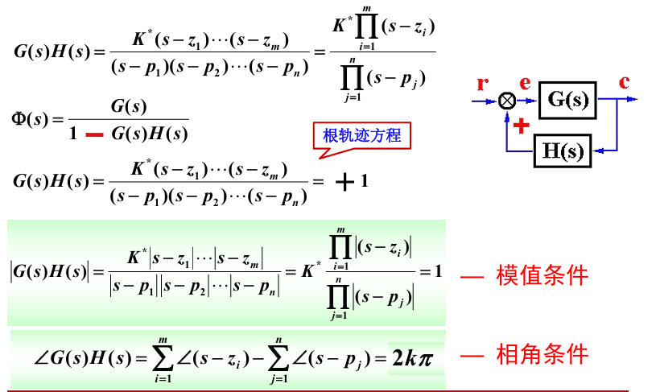
     * 根轨迹法则变化
       1. 实轴上的根轨迹（偶互换）
       2. 渐近线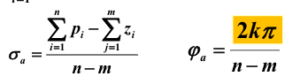
       3. 出射角/入射角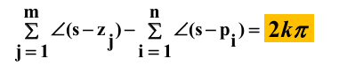
     * 例题
       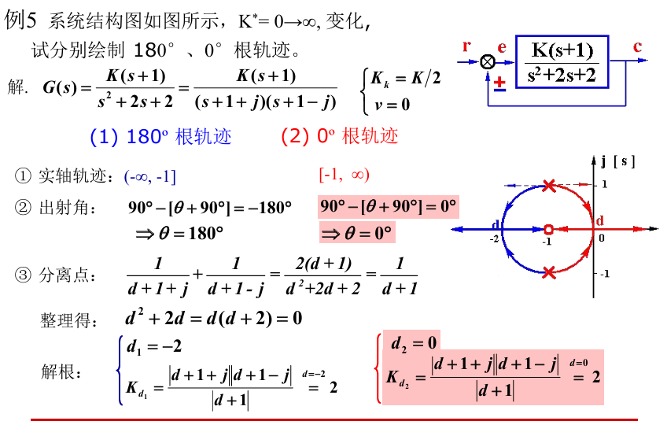
   
## 第五章

### 5.1 频率特性的基本概念、几何表示法

1. * 当正弦输入$u_{(t)}=M_isin(w_it+\varphi_i)$通过线性时不变系统$G_{(s)}$后，输出的稳态值$x_{ss_{(t)}}$与输入保持同样的频率$w_i$，但振幅变化了$|G_{jw_i}|$倍，相位移动了$\angle G(j\omega_i)$

   * 频率响应：线性系统稳态正弦响应的幅值、相角随输入频率变化的规律性

   * 频率特性$G(j\omega)$的定义
     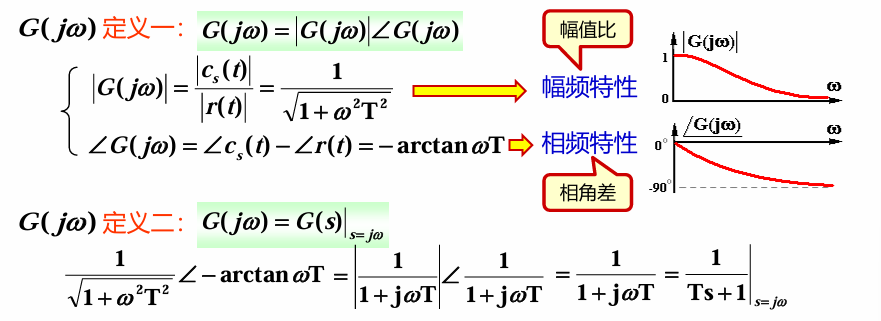

     > 这里的$T$指的是传递函数的$\frac{1}{1+TS}$的$T$。

   * **a few tips**

     * 频率特性是从正弦==稳态响应==求出的！
       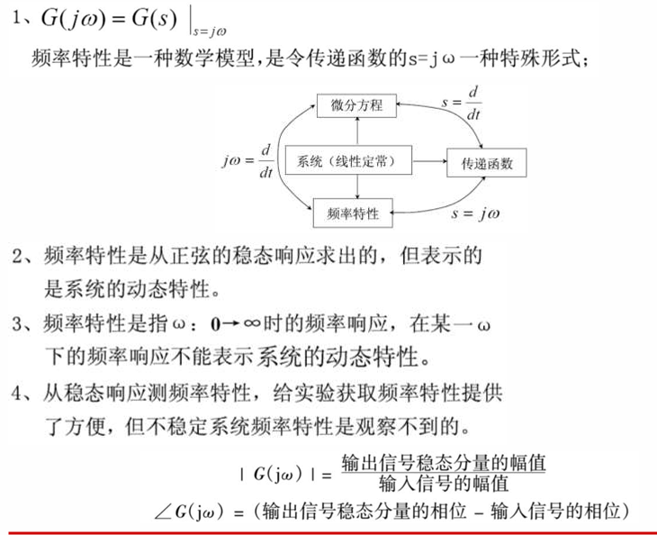

   * 计算例子

     利用传递函数可以得到频率特性的幅频特性和相频特性，代入$\omega$后可以方便的求出正弦信号的响应。

     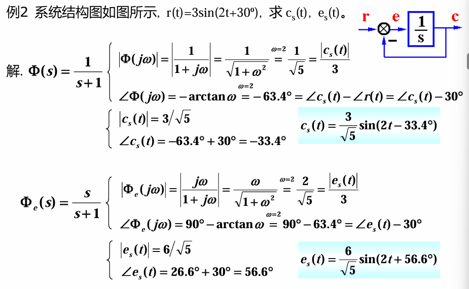

2. 频率特性的几何表示

   > 当$\omega$从$0 \to \infty$变化时，$G(j\omega)$的变化
   >
   > 这部分内容可以参考《控制之美》

   * 幅相特性Nyquist
   * 对数频率特性Bode
   * 对数幅相特性Nichols

   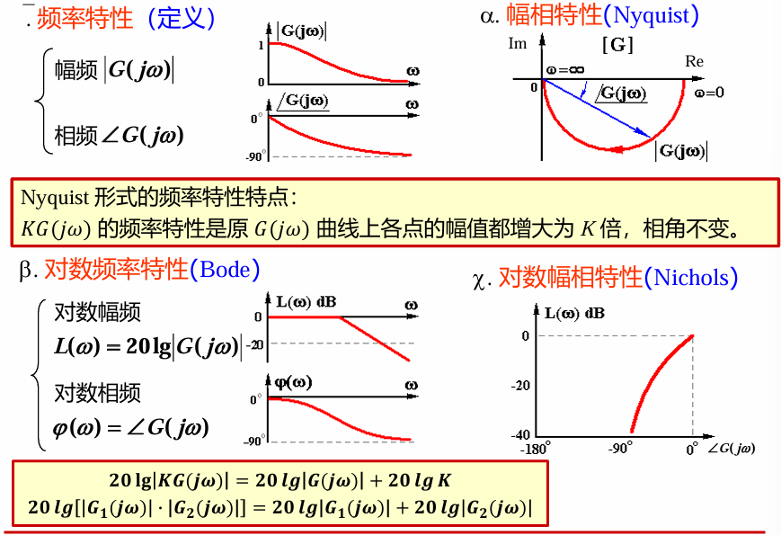
   
   ==无论是Bode图还是Nyquist图，研究对象都是系统的开环传递函数！==通过开环传递函数以研究闭环传递函数，Nyquist图体现在其Nyquist判据，而Bode图则是暂时没学的裕度分析。

### 5.2 典型环节的频率特性

1. **非最小相位环节与最小相位环节的区别**在于：**开环零、极点的位置**。非最小相位环节对应于s开右半平面的开环零点或极点，而最小相位环节对应S左半平面的零点或极点

2. 典型环节的幅相频率特性（**Nyquist图**）

   * 比例环节$G(s)=K,G(j\omega)=K$
     

   * 微分环节$G(s)=s,G(j\omega)=j\omega$

   * 积分环节$G(s)=\frac{1}{S},G(j\omega)=\frac{1}{j\omega}$

     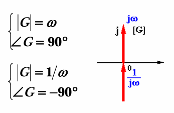

   * **惯性环节**$G(s)=\frac{1}{1+Ts},G(j\omega)=\frac{1}{1+j\omega T}$
     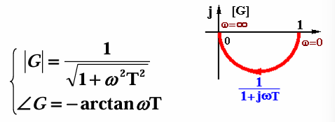

     > 有时会考察根据幅相曲线求系统传递函数。此时要注意的点一般有实轴的交点，决定K值。

   * **Nyquist**形式的频率特性特点：
     $KG(j\omega)$的频率特性是原$G(j\omega)$曲线上各点的幅值都增大为K倍，相角不变。

   * 不稳定惯性环节$G(s)=\frac{1}{Ts-1},G(j\omega)=\frac{1}{-1+j\omega T}$
     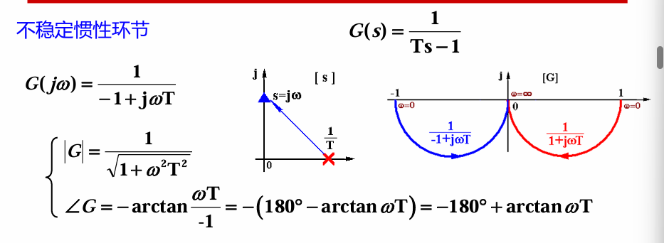

     > 蓝色为不稳定，红色为稳定

   * 一阶微分$G(s)=Ts \pm1,G(j\omega)=\pm1+j\omega T$
     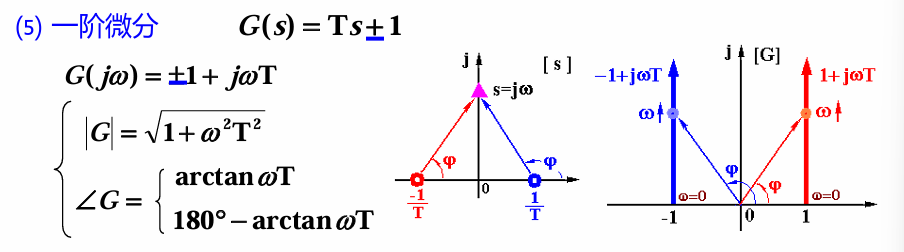

   * **振荡环节**
     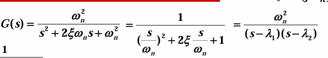
     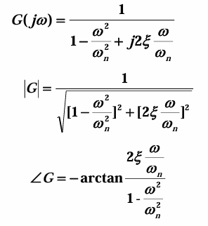

     * $G(j0)=1\angle0°,G(j\infty)=0\angle-180°$。决定了曲线的起点和终点。

     * 当$\xi$变化时，越小，曲线越往外扩。
       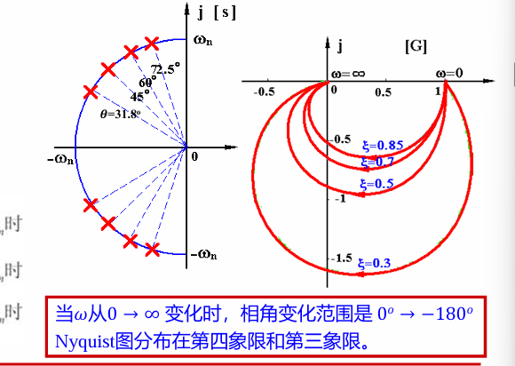

     * 谐振现象：频率特性的幅值出现峰值
       只有$\omega_r<\omega_n,0<\xi<\frac{\sqrt{2}}{2}$时，才会出现谐振峰，谐振点为
       $\omega_r=\omega_n\sqrt{1-2\xi^2},M_r=|G(j\omega_r)|=\frac{1}{2\xi\sqrt{1-\xi^2}}$

       > 推导过程就是对模求极点。

     * 转折点，即曲线与负虚轴的交点。
       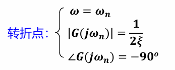

   * 不稳定振荡环节（非最小相位）
     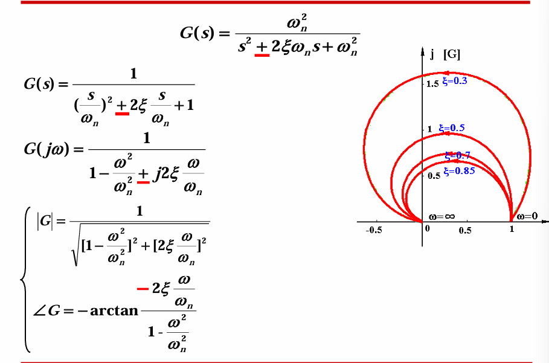

   * 二阶微分
     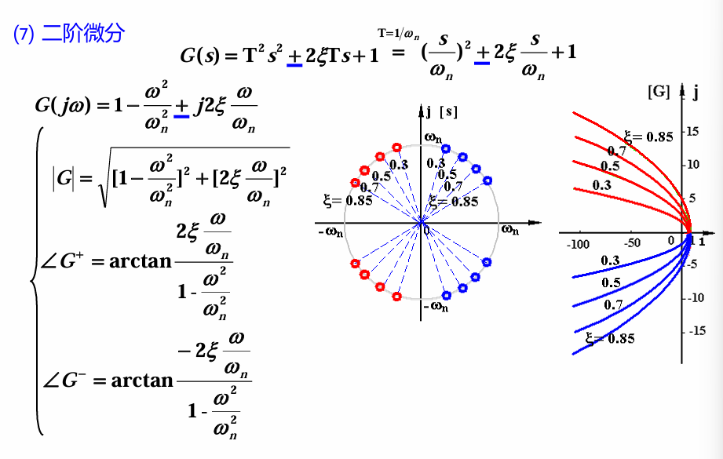

   * 延迟环节
     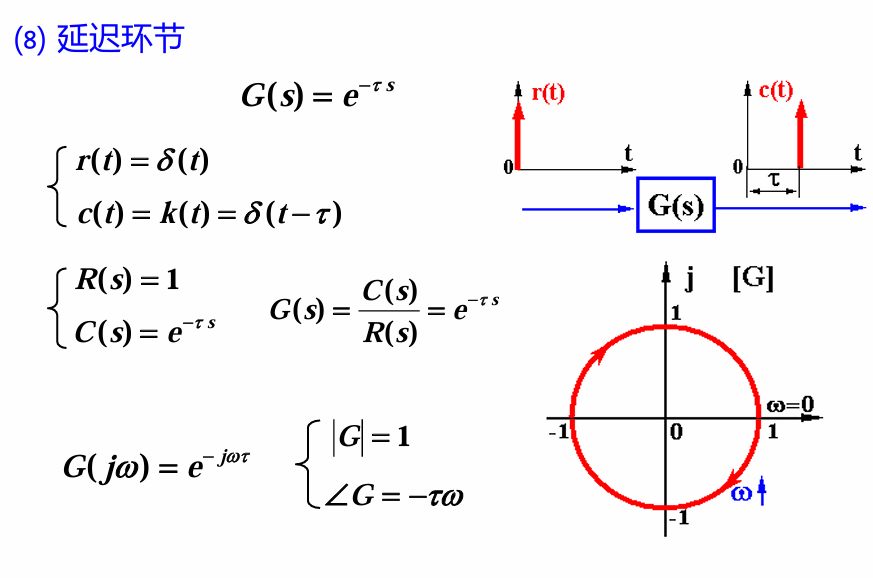

3. **开环幅相特性曲线的绘制**
   

   * 概略图画法：关注起点、终点、象限、与负实轴的交点

     * 起点：即$\omega \to 0$处，对于最小相位系统来说，$\angle G(j\omega)\to-90° \times v$（其中，v为积分环节个数）
     * 终点：即$\omega \to \infty$处，若$n>m$，则$|G(j\omega)|\to 0$即：终点在坐标原点。
     * 与负实轴的交点：在-1的左边还是右边（暂略）

   * 例子

     注意积分环节与起始角度的联系。
     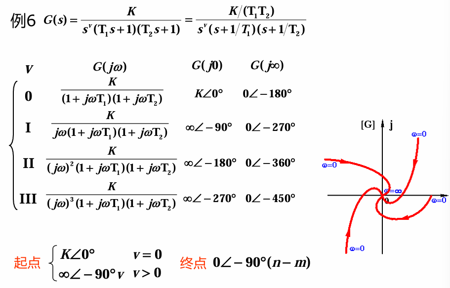

### 对数幅频特性（Bode图）

1. Bode图

   * 横轴：
     * 按$lg \omega$刻度，按$\omega$标定，等距等比，无$\omega=0$这一点
     
       > 非线性增加！画图时注意。
       >
       > 即，横轴自变量是$\omega$，但是按照$lg \omega$在标尺度，即同样是一个单位长度，可以是1到10，也可以是10到100，这都是$\omega$的取值，对于对数来说，都是只差了1，因此是等距的。
     
   * 纵轴：
     * $L(\omega)=20log|G_{j\omega_i}|\;\;\;\;dB$线性分度，单位：分贝
     * $\varphi(\omega)=\angle G(j\omega)$   单位"度"（°）
     
   * 特点
     * 幅值相乘=对数相加，便于叠加作图
     * 可在大范围内表示频率特性
     * 利用实验数据容易确定$L(\omega)$，进而确定$G(s)$

2. 典型环节的伯德图

   * 比例环节
     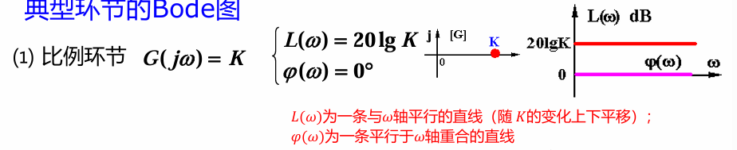

   * 微分环节
     

     > 用$\omega=1$来确定一点，再用斜率画出直线

   * 积分环节
     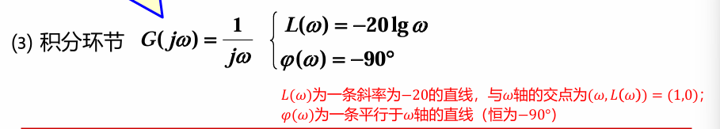

   * 惯性环节
     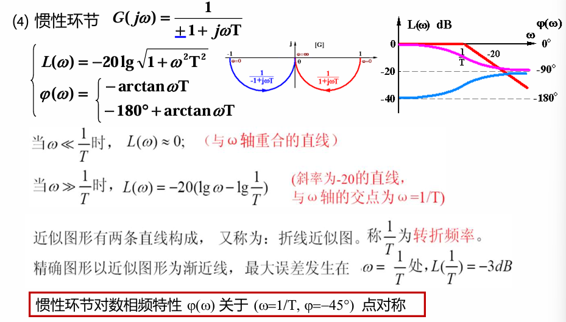

   * 一阶环节
     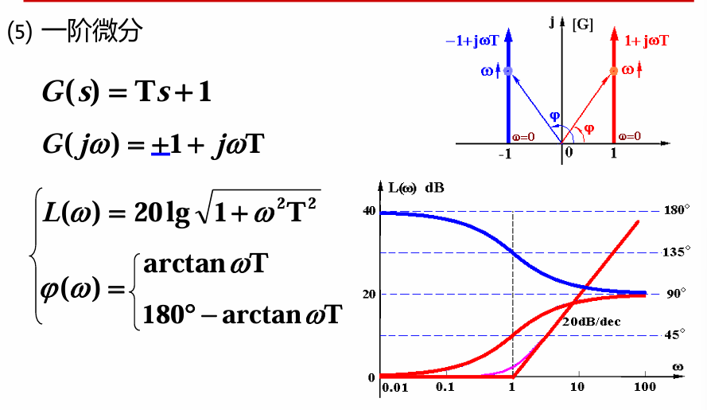
   
   * **振荡环节**
     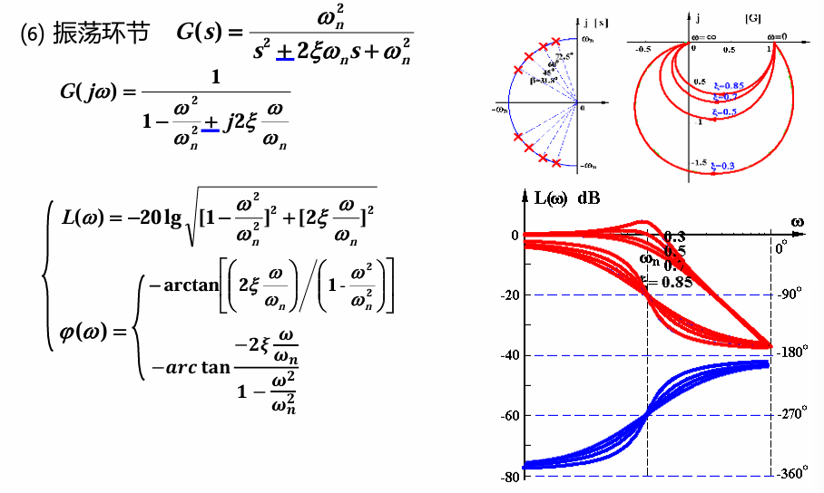
   
     > 对应Nyquist图，可以发现，当$\xi$越来越小时，出现谐振峰，对应bode图，可以看到曲线逐渐开始有了凸起。 
   
   * 二阶微分
     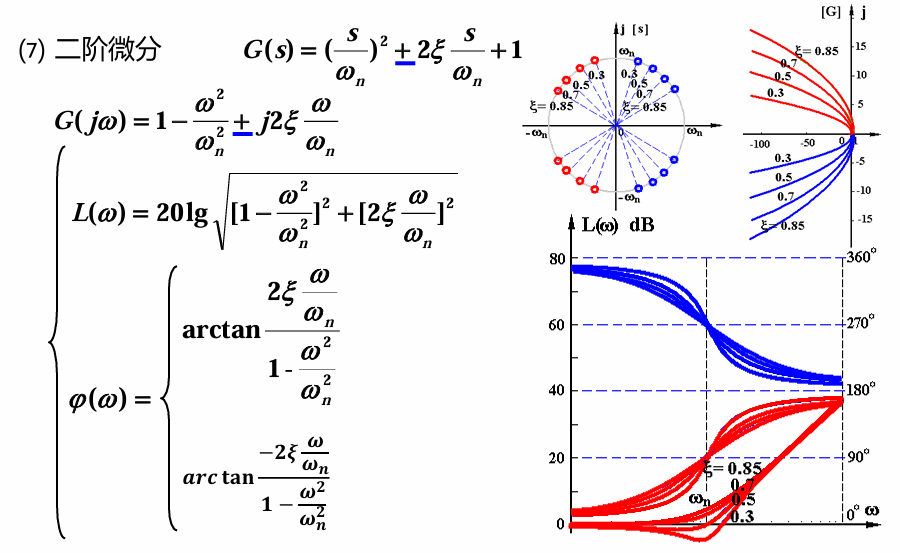
   
   * 延迟环节
     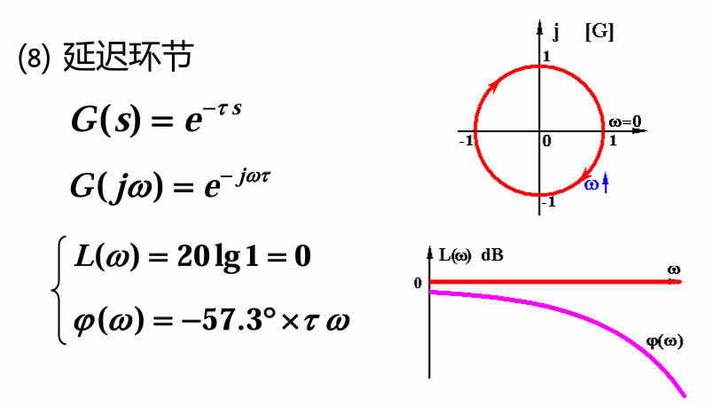
   
   * 总结
     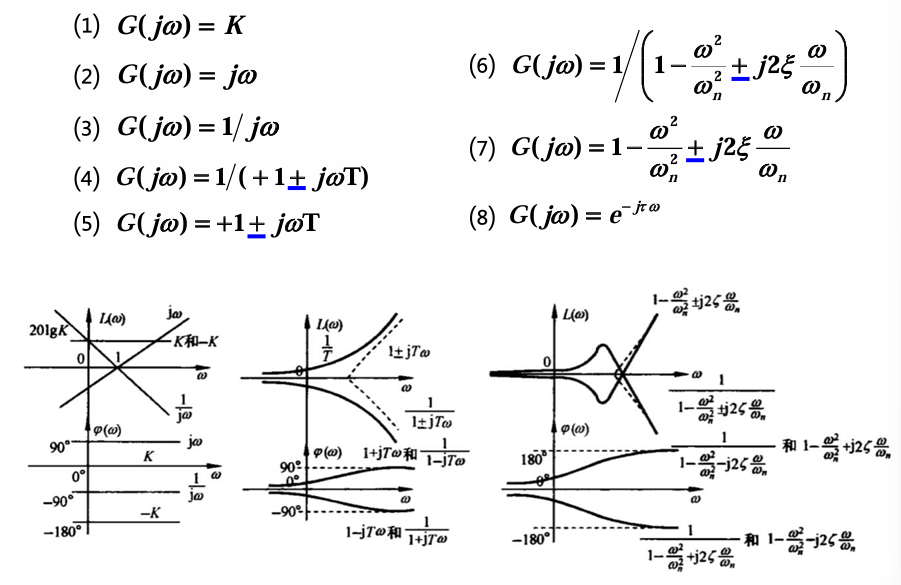
     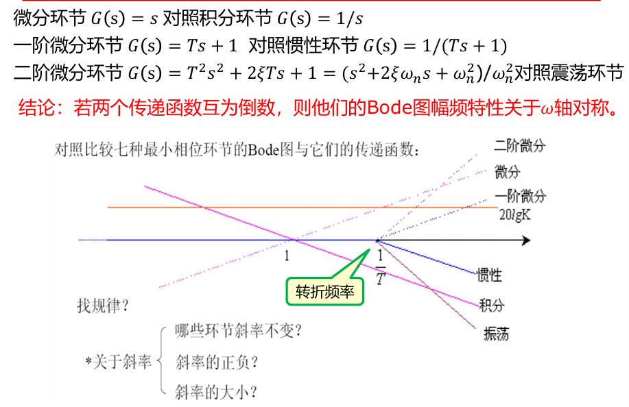
   
3. Bode图叠加

   * 剪切频率$\omega_C$，即Bode图幅值曲线与横轴的交点，即$L(\omega)=20lg|G(j\omega)|=0$。
   * 由对数的$lgMN=lgM+lgN$的性质，可以使用叠加的方法画出复杂系统的Bode图。
     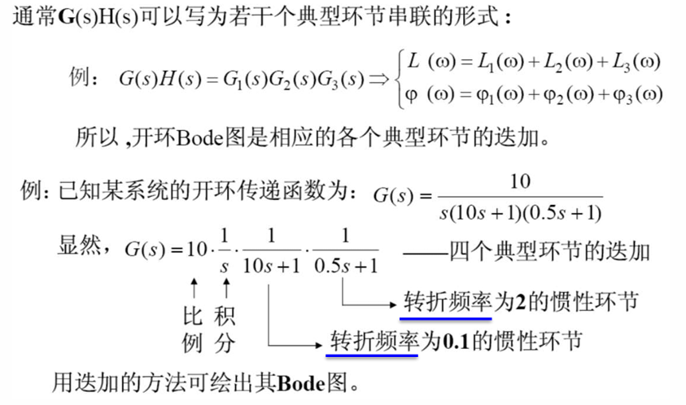
   * 做法
     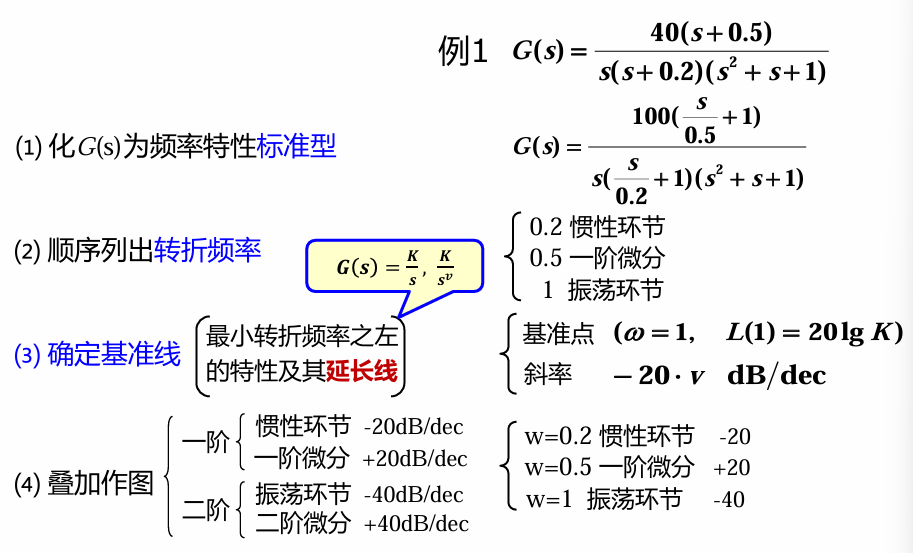
     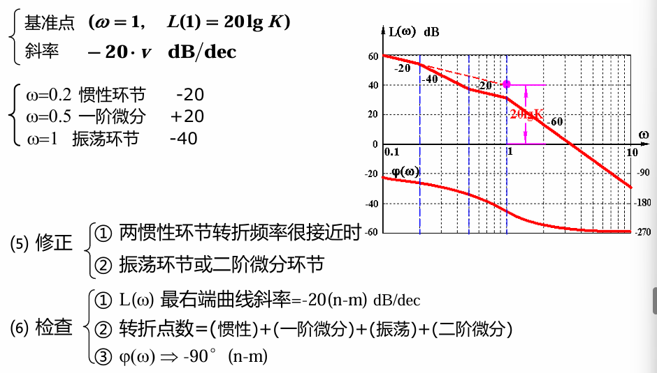
   * 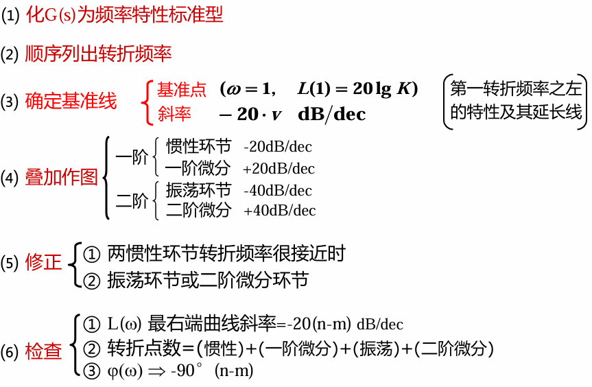
   
4. **Bode图绘图经验**

   * 首先找到系统开环传递函数的各个转折频率，列出来，举个例子，$0.1,1,10$，那么，**横轴的起点**应该选为$0.01$，最低转折频率到起点应有一定距离，以显示频率特性，一般一个单位长度即可。

   * 在这之后，找出基准点。$(1,lgK)$

     > 之所以选取基准点，是由于只有积分环节、微分环节、比例环节在系统最低转折频率前的幅度不为0，而这几个环节在$\omega=1$这点的幅度为$20lgK$，好计算。
     >
     
   * 在基准点的基础上，根据上述三个环节画出**基准线**，一直延伸到横轴起点与纵轴交，算出纵轴交点 。
   
   * 然后再从起点开始到系统最低的转折频率，根据斜率开始一个一个画。
   
   * 对于**振荡环节或二阶微分环节**，可能需要进行一定程度的修正，与其中参数$\xi$有关。
   
   * 振荡环节和二阶微分环节，一般情况下默认转折频率即为误差最大的点。但有些题会将二者区分开，具体来说，对于振荡环节，谐振点==$\omega_r=\omega_n\sqrt{1-2\xi^2},M_r=|G(j\omega_r)|=\frac{1}{2\xi\sqrt{1-\xi^2}}$==
     $\omega_r$为谐振点，$\omega_n$为转折频率
   
   > 以下为画图技巧
   
   * 有关如何计算图中的纵轴或横轴的值，首先要记住这个纵轴单位是$dB/dec$，如果想根据斜率算点，应该列出表达式计算，比如斜率为-20时，$0-6=-20(lg\omega_1-lg\omega_2)$，其中$(\omega_1,0),(\omega_2,6)$。
     类似原理也可以用来，当Bode图没有给出基准点时，但给了参考点，比如和横轴交点，可以自己设出基准点，列出该斜率式子求解K。

### 频率域稳定判据

1. 稳定性判据总结
   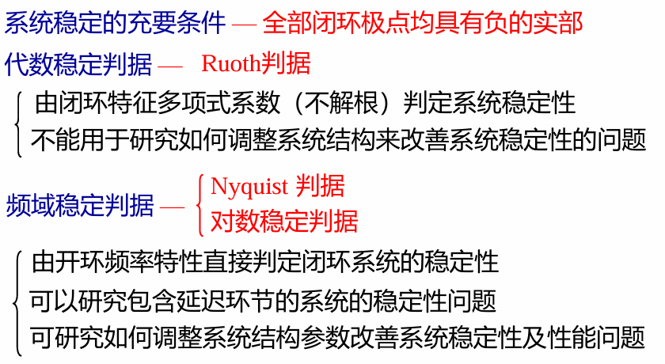
   
2. **Nyquist判据数学基础**
   * 辅助函数$F(s)=1+G(s)H(s)$以及其与系统的关系
     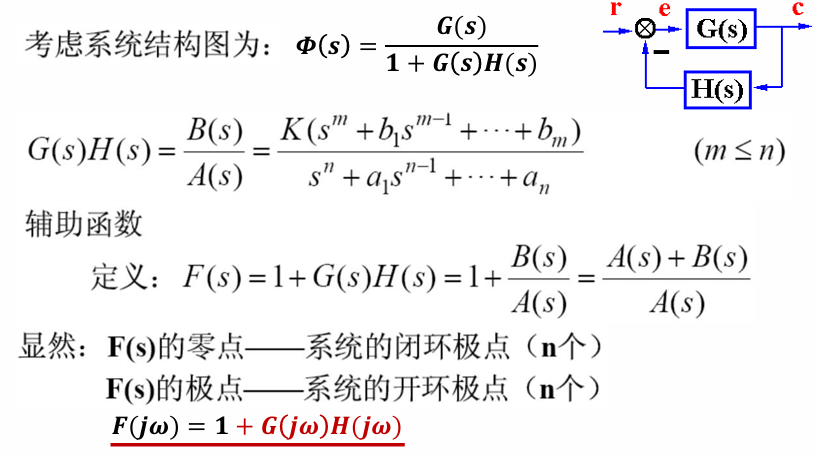
     
   * 柯西俯角定理、奈氏路径（Nyquist围道）
     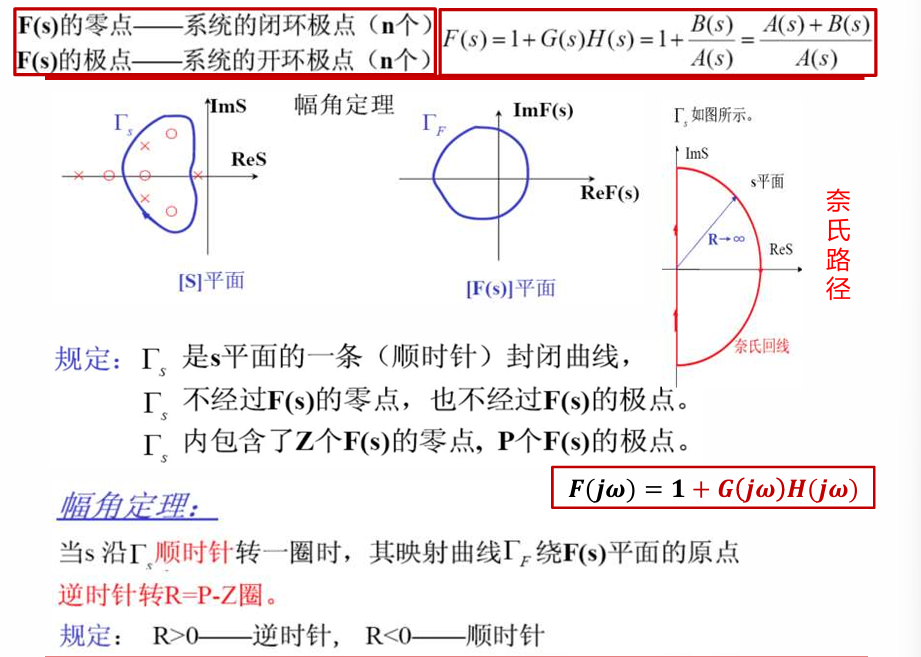
     
   * 由柯西俯角定理推导**Nyqusit稳定性判据**
     * $\Gamma_s$选取为奈氏路径。**Nyquist围道**通过**$F_{(s)}=1+G(s)H(s)$**映射后得到$\Gamma_F$。
     
       > 映射，就是单纯的经过函数变换而已，比如s平面的a点就变为F（s）平面的$1+G(a)H(a)$点。
       >
       > 原理可以看《控制之美》。围道外侧圆周部分最终都映射为一点（无穷远，幅值无穷大，而$G(s)H(s)$一般为真分式，则$\frac{0}{\infty}=0$，相角类似）。实际上只有虚轴部分映射为曲线，而这个$s$从$-\infty\to\infty$的过程，在最后从对称，取s从$0\to\infty$一半，再令$s=j\omega$，即为Nyquist曲线
     
     * ==$P$=右半平面$F(s)$的极点=$G(s)H(s)$的极点==
     
     * ==$Z$=右半平面$F(s)$的零点=$G_{cl}(s)$右半平面极点==
     
     * 从$F(s)$到$G(s)H(s)$，仅仅是-1，因此，$\Gamma_F$绕$F(s)$平面的原点等于绕$G(s)H(s)$平面的$(-1,0)$点。即==$R$=$F(j\omega)$包围原点的圈数=$G(j\omega)H(j\omega)$包围$(-1,0)$的圈数。==
     
     * 因此，==稳定性判据，即根据P和R求出Z，判断闭环传递函数是否存在在右半平面的极点。==
     
     * 在后续应用中，认为$R=2N$，==N为穿越次数==
       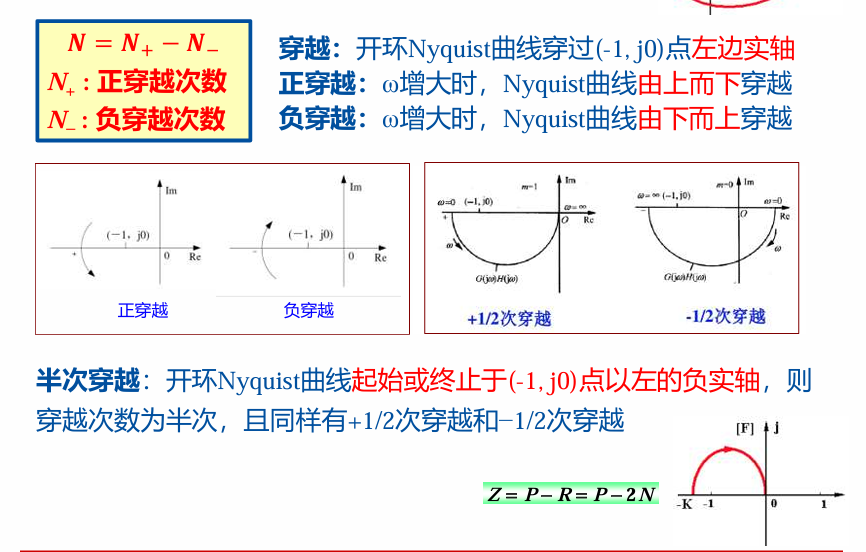
     
       > 为什么R=2N。
       > 将奈氏曲线$\Gamma_s$（一个闭环圈）映射过来应当也是一个圈$\Gamma_F$或$\Gamma_{GH}$。$\Gamma_s$关于实轴对称，则$\Gamma_{GH}$也关于实轴对称。我们只画一半，同时代入$s=j\omega$，就是$G(j\omega)H(j\omega)$的Nyquist图。因此R=2N。
     
     * 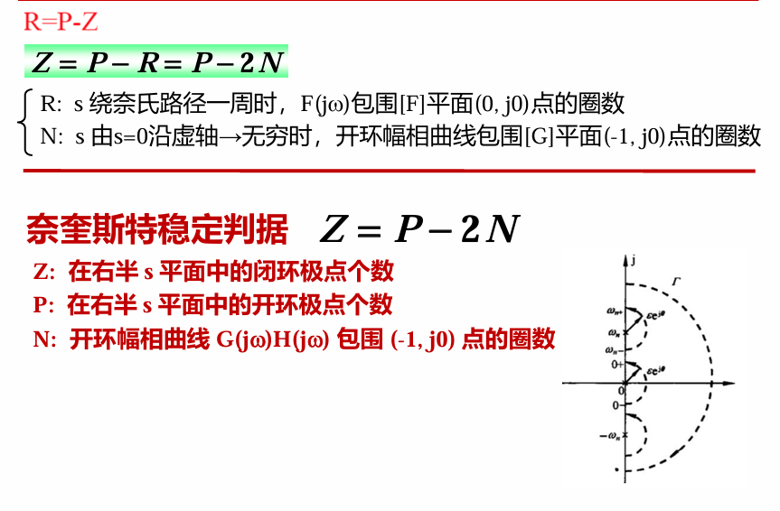
     
   * 总结
     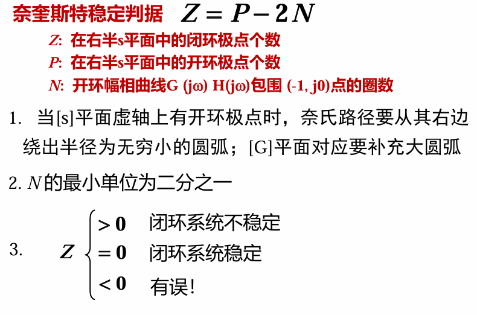

