## 状态空间模型

1. 状态空间表达
   $$
   \begin{cases}
   \dot{x} = Ax + Bu \\
   y = Cx + Du
   \end{cases}
   $$
   相关术语：
   
   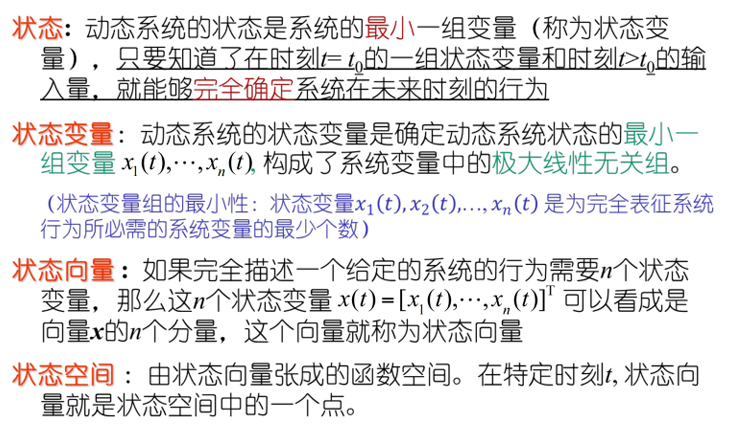
   
   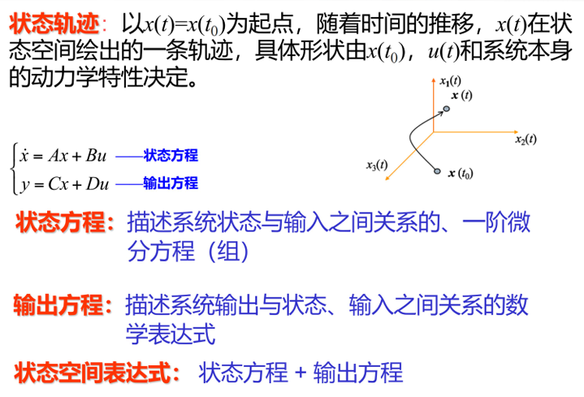
   
   * **线性定常系统（LTI）**的状态空间表达式
     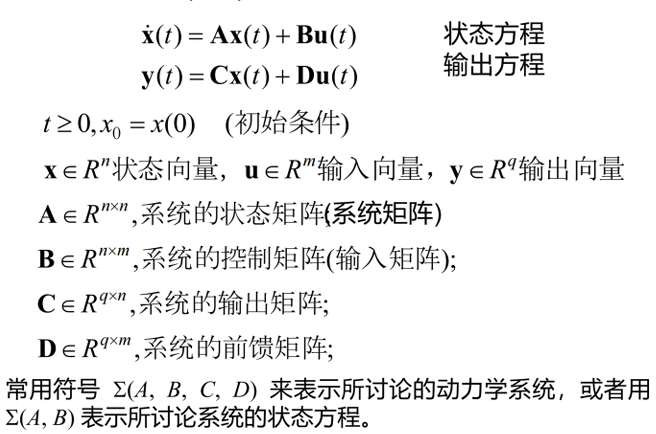
     * 状态空间表示的线性系统方框图
       
     * 同一个系统可以有不同的状态空间表达式（通过状态量的选取），这些不同的状态空间表达式之间存在联系，系统矩阵$A$的特征根是相同的。
     * 在对系统建模时，状态变量的选取尤为重要。一个系统的状态变量是能够完全描述其动态行为的最小变量集合。对于这个有两个自由度（两个小车的独立运动）的力学系统，其动态由二阶微分方程决定，因此通常选择广义坐标（两小车的位移 x1,x2）和广义速度（两小车的速度 x˙1,x˙2）作为状态变量，总共需要 2×2=4 个状态变量才能唯一确定系统在任意时刻的状态。
       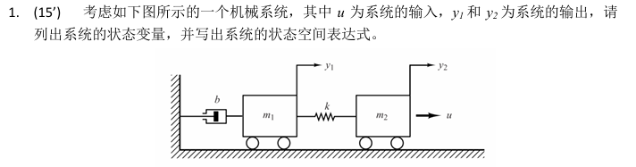
   
2. 传递函数转换为状态空间模型

   * 当传递函数分子为常数项时
     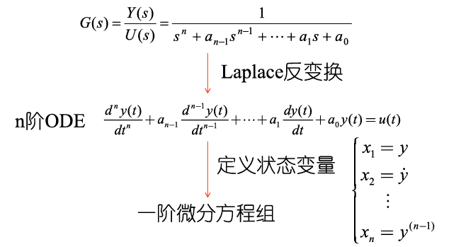

     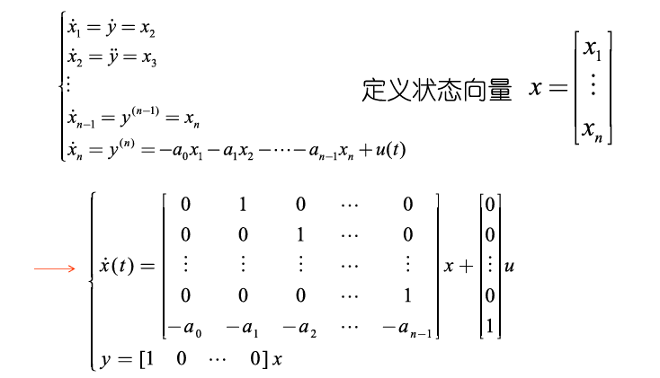

   * 当传递函数的分子项为多项式，

     * 中间变量法
       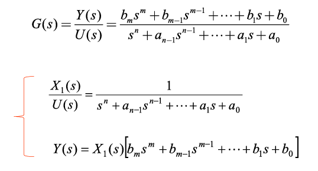
       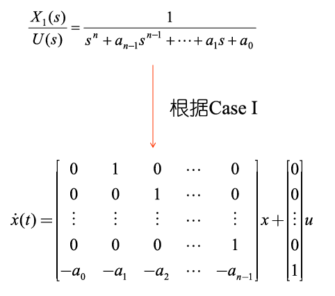
       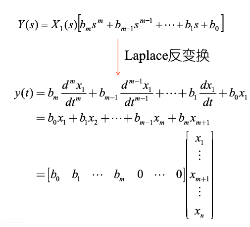

     * 展开传递函数
       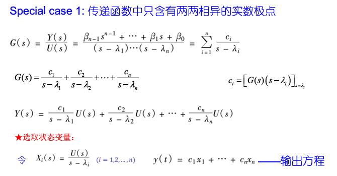
       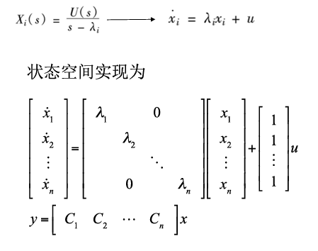

       > 从上式看出，在这种状态变量的选取下，$x_i$的状态只和自己和输入有关
   
3. 状态空间模型转换为传递函数

   * 数学推导

     ==传递函数矩阵：==$C(sI-A)^{-1}B+D$
     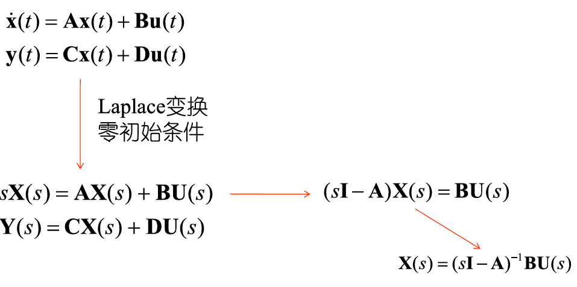
     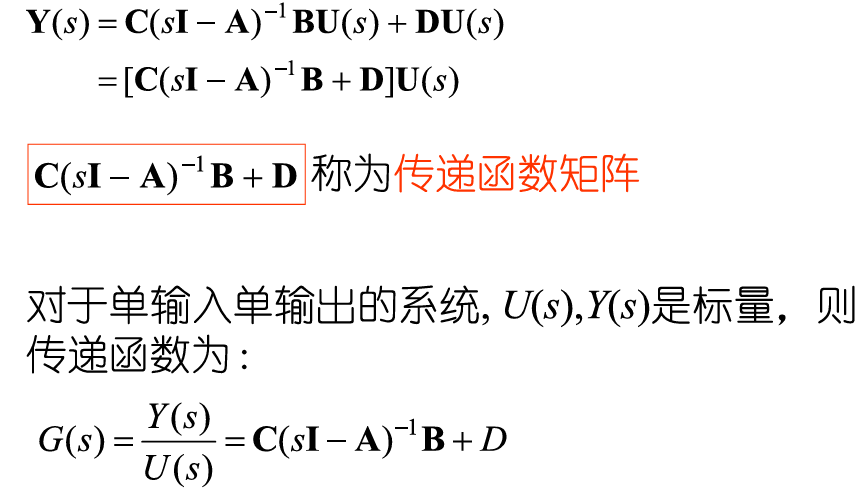

4. 状态空间模型之间的等价关系

   * 定义
     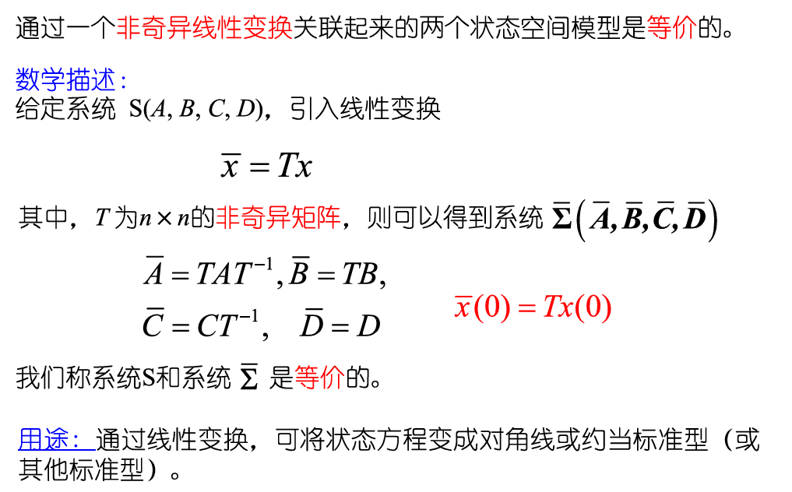

     > 数学描述的结论推导过程，直接把线性变换带进去状态空间模型里，变量进行等价即可。

   * 性质

     * 等价的状态空间模型具有相同的传递函数
     * 等价的状态空间模型具有相同的特征多项式、特征方程和极点。

   * 相关理解

        * 相似变换的核心（等价的数学本质）
   
             * 定义：核心公式为 Ā = TAT⁻¹，其中 T 为非奇异矩阵。我们称矩阵 A 与 Ā 相似。
             * 系统意义：相似矩阵描述的是同一个线性变换在不同坐标系（基）下的表现。等价系统，其系统矩阵 A 和 Ā 必然相似。
             * 相似变换不变量（系统等价下的不变属性）
   
                 * 特征值、特征多项式、行列式、迹均保持不变。

                     > 推导核心：det(λI - Ā) = det(λI - A)，这保证了特征值（系统极点）完全相同。
                 * 系统的传递函数保持不变。
   
        * 状态方程可变为对角标准型或约当标准型的条件
   
             * 每个特征值的几何重数 = 代数重数，则可对角化。
             * 某个特征值的几何重数 < 代数重数，则变为约当标准型。
   
             > 约当标准型：一种上三角矩阵，主对角线上是特征值，主对角线上方可能有一些1。
   
             * 代数重数：一个特征值作为特征多项式的根的次数。
             * 几何重数：对应于某个特征值的线性无关的特征向量的个数。
   
        *              为什么变换矩阵 T 必须是非奇异的
   
             * 非奇异定义：可逆、行列式不为0、所有行/列向量线性无关、所代表的线性变换是一一映射。
             * 变换要求：非奇异性保证了坐标变换可逆，使得系统信息不丢失，并保持了状态空间的维度。

## 线性离散系统数学模型

> 这部分内容和信号分析与处理高度重合，因此大部分内容不做笔记，复习时请查阅PPT，以免疏漏

1. 零阶保持器

   * 简单来说，当接收到一个新的采样点数值时，它会立即将输出电压跳变到该数值，并一直“保持 (Hold)”这个电压值不变，直到下一个采样点到来，最终输出一个阶梯状的波形。
     实现方式很简单，利用芯片寄存器即可。

   * 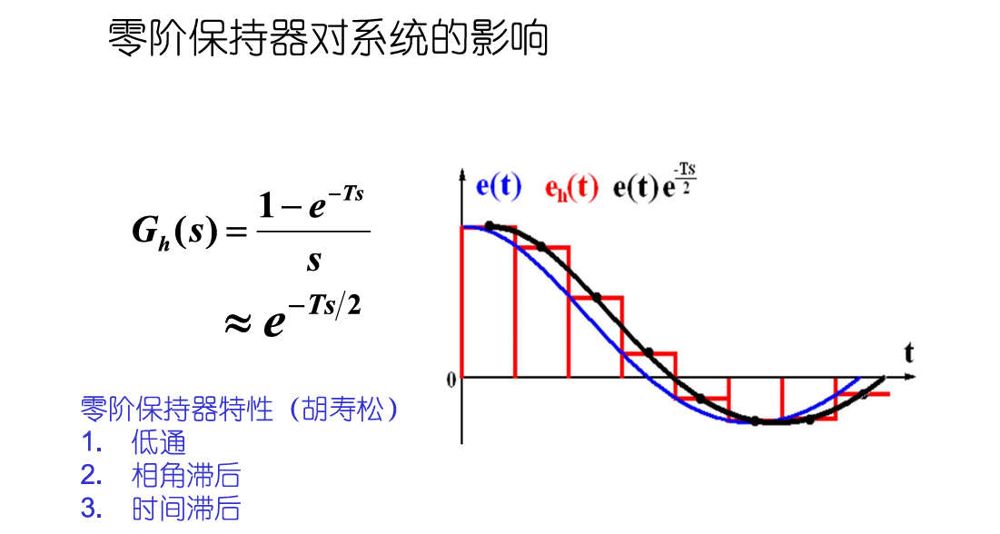
     从图中看到，零阶保持器会引入一个$\frac{T}{2}$的延迟。

   * 缺陷：

     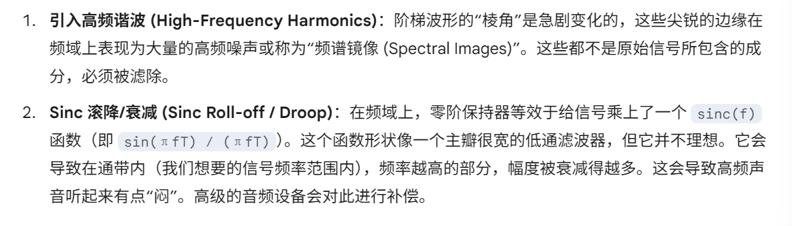

   * 阶梯状波形从DAC输出后，需要经过一个模拟低通滤波器，用来平滑信号，滤掉高频信号，拟合原始信号。
   
   * 零阶保持器的Z变换定理：
     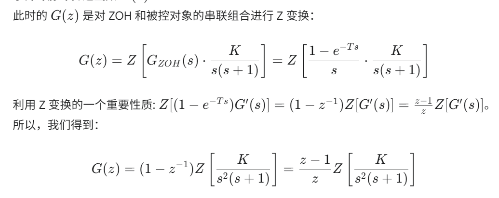
     **简单来说：把$1-e^{-Ts}$提出去，把s合并进去，再求Z变换。**
   
2. **Z变换**

   * 定义

     $X(z)=Z[x^∗(t)]=Z[x(t)]=∑_{n=0}^∞x(nT)z^{−n}$

     * z变换只对离散信号而言，$X(z)$只对应唯一的$x^*(t)$，不对应唯一的$x(t)$
     * 从S域到Z域的变换$e^{Ts}=z$，**适用于采样信号的拉氏变换和z变换之间。**对于连续信号的拉氏变换是不可直接应用此等式变换为z域的，需要借助时域的桥梁，拟造一个采样过程，才可变为z变换。

   * z变换性质和定理

     * 线性
     * 位移定理（实平移定理）
       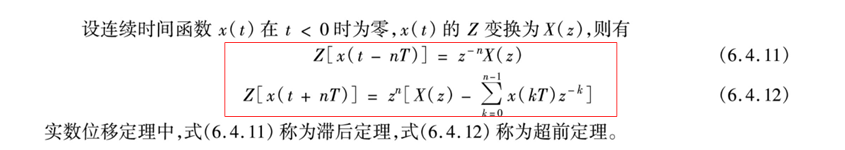
       证明：
       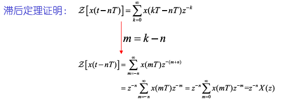
       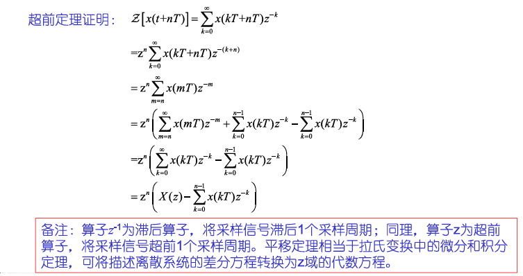
     * 初值定理
       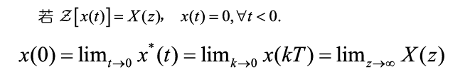
     * 终值定理
       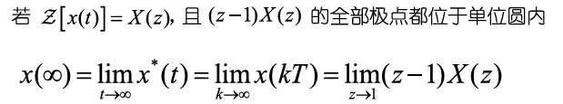
     * 离散定理
       

   * z变换的方法

     * 级数求和法
       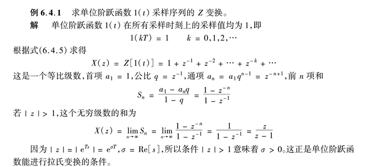
       

     * 部分分式展开法
       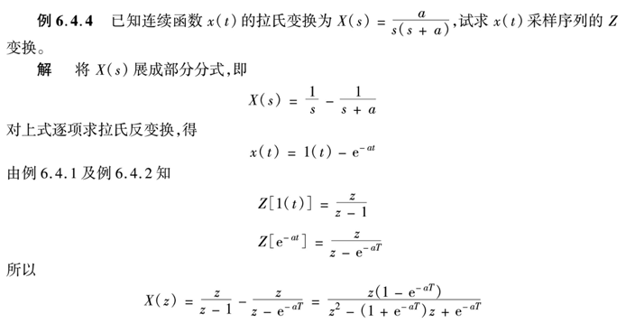

     * 留数法

       * 公式
         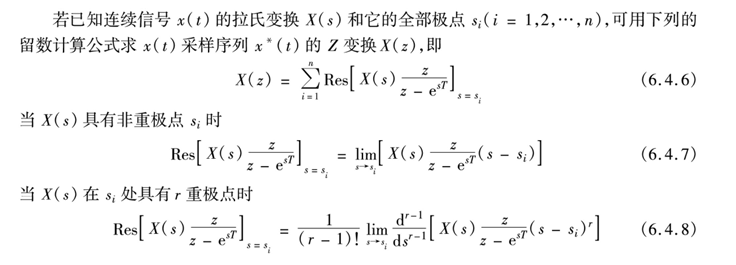
       * 例题
         

       **z变换表格**

     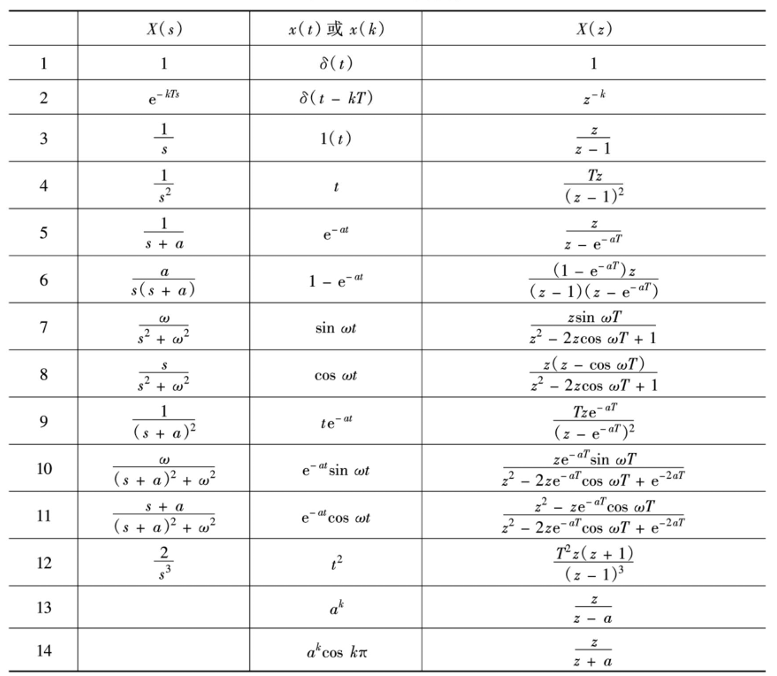

   * z的反/逆变换方法
     对$X(z)$进行z的反变换得到相应的时间序列$x(kT)$或$x(k)$（仅为采样瞬间的时间序列，非唯一的$x(t)$）

     * 长除法
       * 公式
         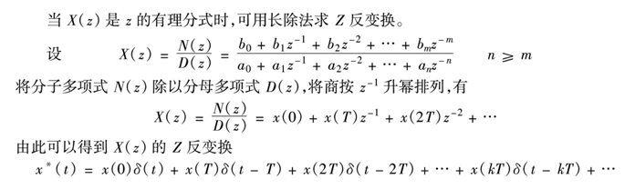
       * 例题
         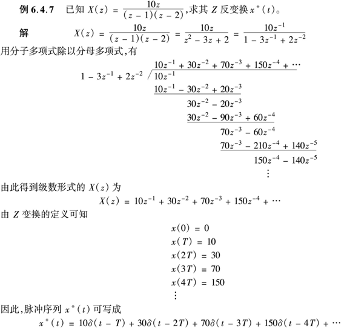
     * 部分分式法
       * 公式
         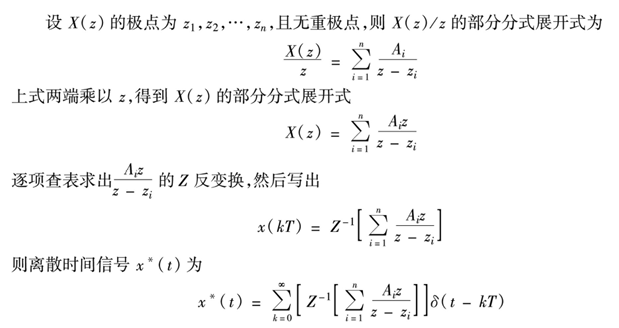
       * 例题
         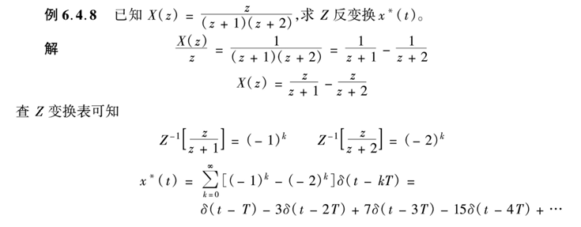
     * 留数计算法
       * 公式
         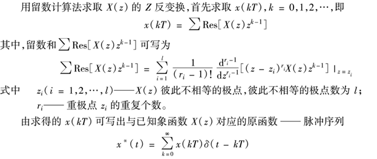
       * 例题
         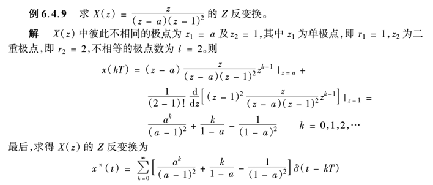

### 线性离散系统的3种数学模型

1. 差分方程（时域）——线性常系数差分方程

   * 描述，定义

     * n阶后向差分方程

       $y(k) + a_1y(k-1) + a_2y(k-2) + \dots + a_{n-1}y(k-n+1) + a_ny(k-n) = 
       $$b_0r(k) + b_1r(k-1) + \dots + b_{m-1}r(k-m+1) + b_mr(k-m)$
       $$
       y(k) = -\sum_{i=1}^{n} a_iy(k-i) + \sum_{j=0}^{m} b_jr(k-j), \quad n \ge m
       $$

       $kT$时刻的输出$y(k)$不仅与$kT$时刻的输入$r(k)$相关，还与$kT$时刻以前的输入$r(k-1),r(k-2),\dots$ 和输出$y(k-1),y(k-2),\dots$ 有关。

     * n阶前向差分方程

       $y(k+n) + a_1y(k+n-1) + a_2y(k+n-2) + \dots + a_ny(k) = b_0r(k+m) + b_1r(k+m-1) + \dots + b_mr(k)$

       $$
       y(k+n) = -\sum_{i=1}^{n} a_iy(k+n-i) + \sum_{j=0}^{m} b_jr(k+m-j)
       $$

       前向/后向差分方程无本质区别。若不考虑初始条件，仅就输入与输出关系而言，二者等价。

       > 前向：指用现在和过去的值来表示将来的值，如$y(k+n)$
       >
       > 后向：指用过去来表示现在的值，如$y(k-n)$

   * 时间序列的z变换
     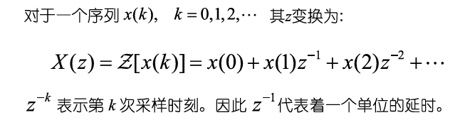

   * 差分方程的求解

     * 迭代法
       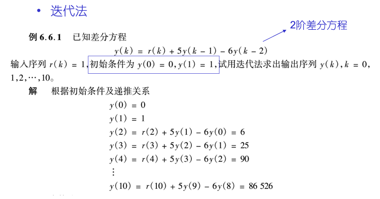
     * z变换法
       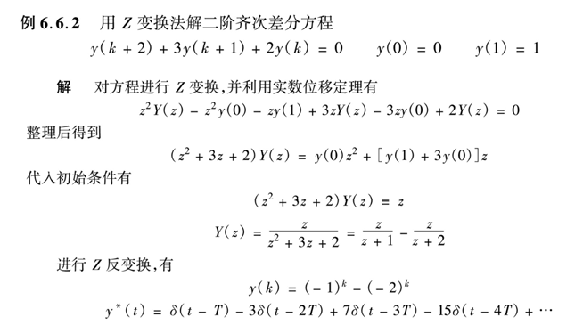

   * 脉冲传递函数==（z传递函数）==
     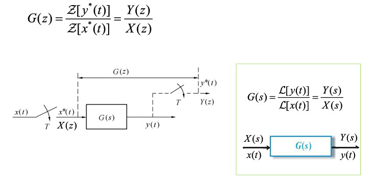

     * 脉冲传递函数的物理意义
       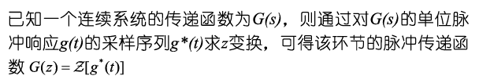

     * 脉冲传递函数的性质
       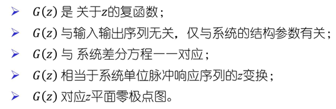

     * 脉冲传递函数的局限性
       原则上不反映非零初始条件下系统响应的全部信息，一般只适合描述但输入单输出的离散系统；只适用于描述线性定常离散系统。

     * 脉冲传递函数的求解

       * 例题

         * S——t——Z

           

       * 串联环节的脉冲传递函数

         * 串联环节间**无同步采样开关**
           $G(z)=Z[G_1(s)G_2(s)]=G_1G_2(z)$
           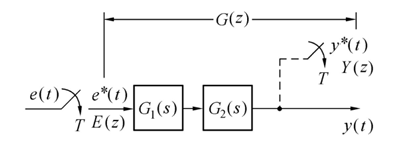

         * 串联环节间**有同步采样开关**
           $G(z)=\frac{Y(z)}{E(z)}=Z[G_1(s)]Z[G_2(s)]=G_1(z)G_2(z)$
           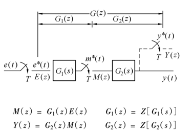

           > 关于同步采样开关的理解：
           > 同步采样开关的存在与否，其核心影响在于**是否在系统内部“打断”了连续信号的流动，从而改变了信息传递的完整性**。这个影响的根本原理源于Z变换的本质：Z变换是用于描述离散采样点序列的工具，而非连续过程。
           >
           > - **为什么影响传递函数**：当**没有**中间采样开关时，`G1`的连续输出完整地、动态地驱动`G2`，它们构成一个不可分割的整体连续系统`G1(s)G2(s)`，我们只能对这个整体的最终输出进行采样和Z变换，即`Z[G1(s)G2(s)]`。而当**有**中间采样开关时，`G1`的输出被采样成一个离散的脉冲序列，丢失了采样点之间的所有连续信息，`G2`接收到的只是一个离散的激励信号。
           > - **为什么离散信号是独立的**：正是因为这种“信息丢失”，使得`G2`的动态完全独立于`G1`在采样间隙的行为，它只关心在采样时刻到来的脉冲值。这就在物理上将系统解耦成了两个独立的离散环节。因此，我们可以先对每个环节单独进行Z变换（`G1(z)`和`G2(z)`），然后在z域中将它们简单相乘。这与Z变换的性质——时域卷积对应于z域乘积——是完全一致的，因为两个通过离散信号连接的系统，其总响应正是两个系统脉冲响应序列的卷积。

         * 例题
           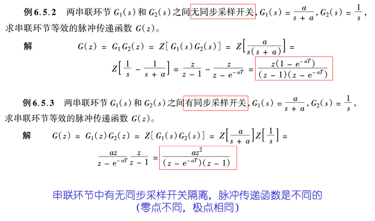

       * 零阶保持其与环节串联
         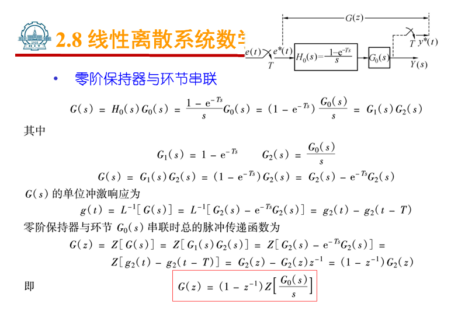

         例题
         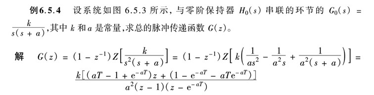
         增加ZOH不改变系统的阶数，不改变开环极点，只改变开环零点。

     * 闭环脉冲传递函数

       如果偏差信号不是以离散信号的形式输入到前向通道的第一个环节，则一般写不出闭环脉冲传递函数，只能写出输出的Z变换表达式。

       > 就是方框图的相加点后是不是立马跟一个同步采样开关，有就可以写出来，没有则写不出来。

       * 求的出
         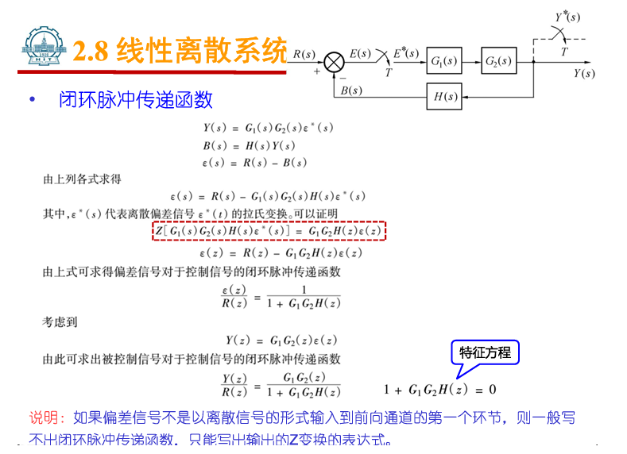

         求不出
         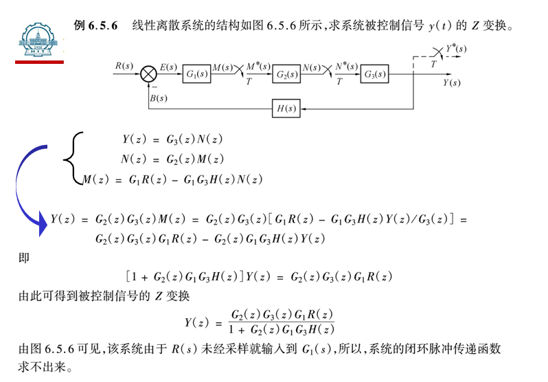

     * 干扰项
       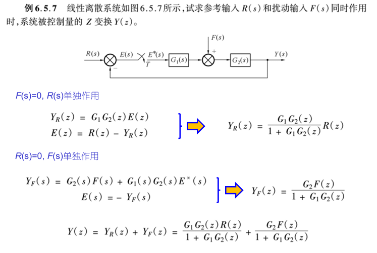

     * 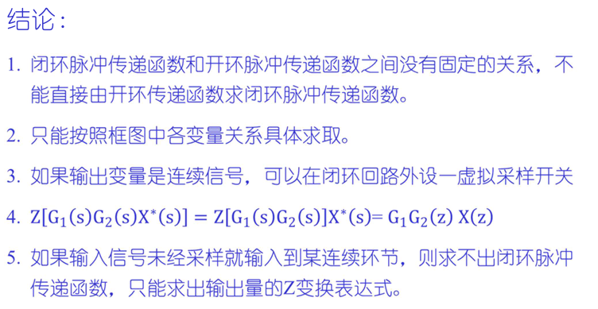

2. 离散空间状态表达

   * 定义

     * 设采样方式为周期采样，采样时刻为$kT(k=0,1,2,\dots)$
       $$
       x(k+1)=Cx(k)+Hu(k)\\
       y(k)=Cx(k)+Du(k)
       $$

   * 化差分方程为离散状态方程
     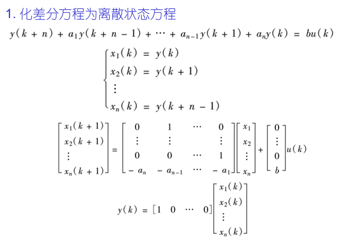

   * 化脉冲传递函数为离散状态方程
     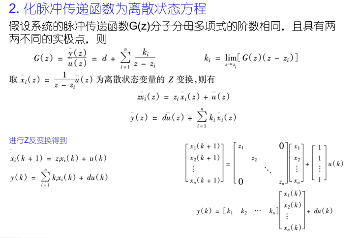

     > 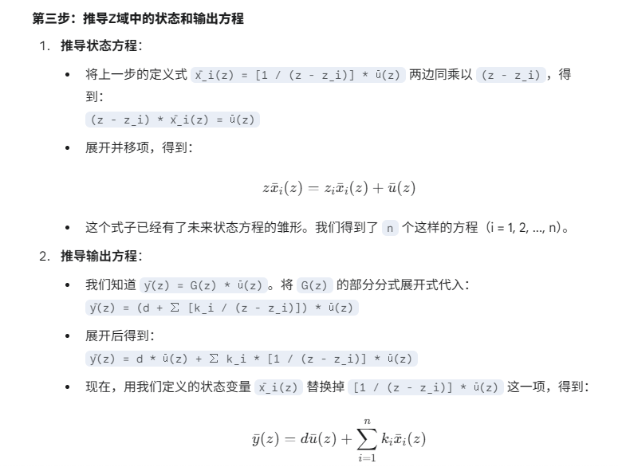

3. 控制系统数学模型汇总
   

## 传递函数时域分析

### 基于脉冲传递函数的离散系统时域分析

1. 脉冲传递函数（z传递函数）
   

2. 离散系统的极点与瞬态响应的关系

   * 定义
     设系统的闭环脉冲传递函数为
     $$\Phi(z) = \frac{N(z)}{D(z)} = \frac{k \prod_{i=1}^{m} (z-z_i)}{\prod_{i=1}^{n} (z-p_i)}, \quad n > m$$
     其中 $z_i$ 为系统的闭环零点；$p_i$ 为系统的闭环极点。

   * 阶跃响应

     * 响应通式：$y(kT)=A+\sum^n_{i=1}B_ip^k_i$

       > 瞬态分量$\sum^n_{i=1}B_ip^k_i$

     * 推导：

     * 极点状态分析

       * 实极点
         
         

       * 复数共轭极点

         * 响应通式
           

           > 证明方法：把a+bi和a-bi代入，将数都化成相角形式，合并即可。

         * 响应
           
           

### 基于状态空间的时域分析（LTI线性时不变）

1. 状态方程的分析——前言

   * 状态方程
     $\dot{x}(t)=Ax(t)+Bu(t),t\geq 0 ,x_0=x(0),x\in R^n,u\in R^m$
   * 系统的运动分析/时域分析：**本质上是求解系统状态方程**，以解析形式或数值形式，建立系统状态随着输入和初始状态的演化规律，特别是对系统结构和参数的依赖关系。
   * 解的存在性和唯一性：
     输入向量$u(t)$的各个元素在时间定义区间上平方可积
     $\int^{t_a}_{t_0}[u_i(t)]^2dt < \infty,i=1,\dots,m$

2. 基于状态空间的时域分析

   * 线性系统满足叠加定理
     $\dot{x}(t)=Ax(t)+Bu(t)$
     系统响应=零输入响应+零状态响应
     
     
     
   * 零输入响应$u(t)=0$
     $\dot{x}=Ax$
   
     * LTI解：==$x(t)=e^{At}x_0$==
   
       > **作为定义**：这是一种“定义式”的思路。我们不是从某个已知的“矩阵指数函数”出发去“得到”它的泰勒展开；相反，我们是**利用标量指数函数的泰勒级数形式来 \*定义\* 矩阵指数函数**。
       >
       > 这个无穷级数的收敛性可通过简单的放缩证得，最终收敛为一个有限的$e^{||A||t}$
   
     * 矩阵指数函数的性质
       
   
       > 上述性质的求解依赖于矩阵指数函数的定义式，重点看（4）
   
       
   
       > 上述是“A为n*n阶对角阵”的特殊情况，此时A的对角元素就是特征值，更一般的情况为：
       > 
   
     * 矩阵指数函数的计算
   
       * 定义法
         
       * 特征根法——无重根
         
       
       > 方法二的证明用$P^{-1}AP=对角矩阵$的性质即可
       
       * 特征根法——有重根
       
         
       
         > 广义特征向量的笔记见纸质笔记。
       
         * 补充
           
       
       * 预解矩阵法/拉氏变换法
         
       
       * 例子（见PPT）
     
   * 零状态响应
     
   
     * 证明
       
     * 注意到，零状态响应是一个卷积的结构，可以看作是$e^{At}B*u(t)$，即脉冲响应和输入的卷积，与传递函数模型是一致的。
     
   * 系统状态运动规律的基本表达
     **全响应=零输入+零状态**
     
   
   * 基于特征结构的状态响应表达
   
     * 对于特征值两两相异的n维连续空间LTI系统
       $e^{At} = \sum_{i=1}^{n} v_i \bar{v}_i e^{\lambda_i t}$
       $e^{At} = \sum_{i=1}^{n} \bar{w_i }w_i e^{\lambda_i t}$
     * 
     
   * 结论
   
     
            
   
3. LTI系统的状态转移矩阵$\Phi(t,t_0)$

   * 定义
     

     > 将初始状态转移到终值状态。 

   * 特性
     

   * LTI系统的状态响应和输出响应
     

   * 离散系统的时域分析
     

     > 推导：将（K+1）T代入，换算出KT时刻式子的关系。重点是注意$u(\tau)=u(KT)=u(k)(在KT与(K+1)T之间保持不变)$，零阶保持器。
     > 
     
   * LTI离散系统状态方程的解
   
     * 迭代法（反复代入，依次计算）
     * z变换法
       
   
   * 离散LTI系统**零输入响应**稳定性
   
     $x(k+1)=Gx(k)$
     当且仅当G的所有特征根模均小于1
   
   * 离散系统状态转移矩阵
   
     * 时变系统
       
   
     * 时不变系统
       
   
     * 状态转移矩阵求法
   
       * z变换法
         $\Phi(k)=G^k=Z^{-1}[(zI-G)^{-1}z]$
   
       * 化矩阵G为标准型
   
         * G的特征根为单根
           
         * G的特征根有重根
           
   
       * 化为G的有限项
         
   
         * 凯莱-哈密尔顿定理
           
           
           > ==所有的$A^i(i=n,n+1,\dots)$均可表示为{$I,A,A^2,\dots,A^{n-1}$}==
           > ==但{$I,A,A^2,\dots,A^{n-1}$}不一定线性无关==
           
         * 凯莱-哈密尔顿定理的应用例子与**长除法**
         
           * 
         
           > 长除法对后续理解有关键作用。
           >
           > 长除法：原式除于特征方程，由于A为该特征方程的矩阵跟，对应的x为其特征方程的代数根，即特征值，有$\Delta(x)=0$
         
           * 
           
         * 应用凯莱-哈密尔顿定理计算$e^{At}$
           
           
         

## 离散系统稳定性定义及劳斯判据

1. 离散系统极点位置与系统瞬态响应的关系

   

   * s域到z域的映射
     
     
     
     
   * 离散系统稳定性
     * 充要条件
       
     * 劳斯稳定判据
       
       
     * 例子
       
       
       

## 离散系统误差计算

1. 稳态误差求解方法

   > 和连续系统其实极为类似

   * 一般方法
     

     * ==系统型别：$GH(z)=\frac{1}{(z-1)^v}GH_0(z)$==
       ==系统增益：$\lim_{z \to1}GH_0(z)=K$==

       ==使用终值定理的公式也需要进行平移==

   * 静态误差系数法
     
     
     

     > 大体上与连续系统类似，但要注意T，由于z变化产生的系数。

2. 动态误差计算

   总的来说，从z域映射到s域，然后泰勒展开，求其各项系数，即可得到$e_{ss}^*(kT)$
   

   > 离散系统动态误差系数不可用长除法求解，只能求导。

   * 例子
     

3. 概念辨析
   

   **为什么泰勒展开？**
   

## 基于状态空间表达式的稳定性分析

### Lyapunov意义下的稳定性基本概念

1. 平衡状态
   
   对稳定性的分析要具体到各个平衡状态点中，下面即为各种稳定性。

   * Lyapunov意义下的稳定性
     
     简单来说，如果系统状态从一个平衡点附近（而非恰好在平衡点上）开始，它后续的运动轨迹将一直被限制在该平衡点周围的一个小范围内，永远不会偏离太远。

     > 

   * 渐近稳定性
     

     > 经典控制理论中的稳定性定义与此处渐进稳定性对应。

     * 一致渐近稳定
       

   * 大范围（全局）渐进稳定性
     **当初始条件扩散至整个状态空间，**
     

     * **对于一个线性系统 x˙=Ax，如果它有一个渐近稳定的平衡点（这个点必然是原点），那么这个平衡点就是全局渐近稳定的**
       

       证明：（线性系统满足叠加远离）
       
       
       > 如果线性系统有渐近稳定性的平衡状态，则只可能是0，而且没有其他平衡点存在。
       >
       > 上述证明表示了线性系统的平衡点之间性质相同。
   
2. 不稳定性
   

3. 总结
   

### Lyapunov第一法

> 利用状态方程的解的特性来判断系统稳定性的方法，适用于线性定常、线性时变以及非线性函数可线性化的情况。

1. 定理
   * 
   * 证明
     

### Lyapunov第二法（直接法）

1. 李雅普诺夫函数

   * 定义
     

     > 优点与不足：此方法解决了一些用其他稳定判据能以解决的非线性的稳定性问题，遗憾的是对一般非线性系统仍未找到构造李雅普诺夫函数的通用方法。

   * ==经验结论：对于线性系统，通常用二次型函数$x^TPx$作为李雅普诺夫函数。==

   * 标量函数定号性
     

     * 结论
       
   
2. Lyapunov第二法主要定理

   * **定理1**
     
     * 例题：如何选取$V(x)$：一般选取$V(x)=ax_1^2+bx_2^2$，验算$\dot{V}$是否负定，若满足，则符合条件
       
   * 定理2（定理1推广）
     
     * 例子——$V(x)选择的影响$
       
       
   * 不稳定判别定理
     
   * 总结
     

### 线性定常系统的Lyapunov稳定性分析

1. LTI连续系统渐近稳定性的判别
   * 定理（由第二法推导而来）
     
     * 
   * 推导
     
     
   * 总结
     
2. 线性定常离散系统渐近稳定性的判据
   * 
   * 

## 控制系统的性能指标

### Nyquist图补习

1. Nyquist图画法

   > 范围：0——0+——∞

   * 若不存在积分环节，则0和0+无区别。

   * 若存在积分/微分环节，0的点可以认为是0+和0-中间的等分，即，先分别画出0+和0-的点，然后顺时针画圆（注意相位要追平，而不是图中位置的简单连线），取中间平分处则为0。相位的确定结合极限来理解。

     > 也可以从根轨迹来理解

   * 若存在非最小相位环节，需要注意其在0+和无穷时相位和最小相位环节相差180°。具体计算细节可通过极限推导。本质都如下：
     

   * ==Nyquist画法的本质，就是回归到上面的相位和幅角的表达式，用极限等思想去判别！==

   * ==相角的计算都要回归到其在坐标系中的实际点位。==比如$jw-1$这样 的点，在坐标系上处于第二象限，也就是90°到180°，因此其相角在计算时是$180°-\arctan w$。

   * 在确定特殊点后，如果不确定其具体路径，应该可以取一些特殊点来定位一下，比如$w=1$之类的，以确定曲线是从上半平面绕还是下半平面。

2. Nyquist稳定性判据

   * 对于（-1，0）左侧的负实轴，从上到下为为正穿越$N^+$、从下到上为负穿越$N^-$，其中如果起点或者终点为（-1，0）左侧负实轴，那么这次穿越以1/2计数，正负性可根据本身方向做一个延申来确认，同样是从上到下为正，从下到上为负。

### 对数稳定判据

1. Nyquist图和Bode图的对应关系

   * Nyquist图上的单位圆与Bode图上的0dB线
     * 单位圆外对应于幅频特性0dB线以上的部分
     * 单位圆内对应于幅频特性0dB线以下的部分
   * Nyquist图上的负实轴与Bode图上的相频特性的-180°对应
   * ==Nyquist图上（-1，j0）点左侧的负实轴对应于：幅频特性0dB线以上部分+相频特性-180°线==
     

2. 对数频率稳定判据
   
   

   * ==半次穿越==
     

     * 半次穿越本质是0-到0+的虚线穿越，然后对半分的结果。因此要考察是否真正穿越，下面有道题就是反例。
     
   * ==存在积分环节时，要补虚线==
     
   
   * ==**存在微分环节，同样要补画虚线，**==但要注意，==-180°线和180°线都对应Nyquist图中的负实轴！==
     本质上，Bode图相位就是Nyquist曲线上的点的相位。因此，当我们的角度高于180°时，比如例子中的270°，实际上和相位中-90°是相同的。从270°下降从上到下穿过180°，对应Nyquist图中从下到上负穿越，与-180°的判断准则完全相同。
     因此，==当超过180°时，正负穿越的判定准则相同。==

     
   
   * 存在非最小相位环节。
     
     
   * “真正的穿越”
   
     * 0点是0°，顺时针画无限大圆到-180°，可接下来，相角增大，对应于Nyquist曲线就是从负实轴交点又往下走了，没有穿越负实轴，则N=0.
       
     * 一直是-180°，不算穿越
       
     * 0时相角为0°，从0画无限大圆到-180°处，然后0+之后相角继续往下减，对应于Nyquist曲线，则是从下到上穿越了-180°，因此N-=1。
       

### 稳定裕度

1. 相角裕度

   * 定义
     
     

     > 角度都是与正实轴的夹角，但是从正实轴顺时针转过的角度为负角度。
     >
     > 对于相角裕度，其为负实轴与OA的夹角，逆时针为正。

   * 根据相角裕度增加滞后环节到临界稳定
     

     >  $e^{-\tau s}$的模为1，相角为$-\tau w$。

   * Bode图视角看相角裕度
     
     重点是找到剪切频率，然后再相应地找到相位曲线与-180°曲线的差值。

2. 幅值裕度

   * 定义
     
     

   * 根据幅值裕度增加直流增益直到临界稳定
     

   * Bode图视角

     找到穿越频率，然后对比即可
     

3. 总结

   * 相角裕度和幅值裕度表示闭环系统与临界稳定状态远离的成都，常被用作控制系统设计的指标。
   * 相角裕度和幅值裕度数值大小、正负跟闭环系统是否稳定没有必然关系。
   * 对于一些复杂系统，可以求出多个相角裕度$\gamma$和幅值裕度$K_g$，这时，以最小的值作为相角裕度和幅值裕度。

4. 计算方式

   * 相角裕度——求剪切频率
     * 方法统一，令$|G(jw)|=1$，求出相应的w即可
       
     
   * 幅值裕度——求穿越频率
     * 利用$\angle G(jw_g)=-180°$
       
     * 展开$G(jw)$，令其虚部为0
       
     * 使用Bode图求近似值
       
     
   * 计算技巧

     * 求解剪切频率时，列出bode图的分段函数，方便计算时利用对数的加减法形状化简方程。
       

     * 求解反正切方程时，常用到反正切的和差公式。
       

       > 对于反正切差公式，其条件有$xy>-1$这在传递函数的场景中是较为容易实现的，毕竟频率是正数。

       例题如下：
       
       

     * Nyquist图需要画渐进性的情况

       具体操作步骤是，分离出实部和虚部，分别求他们的渐近线。只有存在积分环节的才需要画这个渐进线，前面的系统没有画，是因为他们的渐进性本身和虚轴贴的很近！需要画渐进性的是少数情况。对于是否要画渐进线，有更简单的判别方式：
       
       

       
       
       

## 附言

1. **二维矩阵求逆公式**

   对于一个给定的二维矩阵 $A$：

   $$
   A = \begin{pmatrix} a & b \\ c & d \end{pmatrix}
   $$

   如果其行列式 $ad-bc \neq 0$，那么它的逆矩阵 $A^{-1}$ 为：

   $$
   A^{-1} = \frac{1}{ad-bc} \begin{pmatrix} d & -b \\ -c & a \end{pmatrix}
   $$

2. Z变换
   

2. 拉普拉斯变换性质
   

3. 矩阵运算中逐元素运算和基于代数结构的运算区分方法

   * ==核心：是否依赖矩阵乘法==

   * 逐元素：积分、微分、拉普拉斯变换、Z变换等

   * 代数结构有关：$e^{At}$、$sin(A)$

     > 本质上，通过泰勒展开，这些式子都会存在矩阵乘法，因此都是非逐元素的

4. 约旦标准型
   
   上述式子也符合凯莱-哈密尔顿定理。

   以下为计算例子：注意，Q的排列有考究，如果排错无法得到约旦标准型。
   
   
   判断有多少个广义特征向量的方法：==$几何重数-代数重数$==

   * 如上题，直接代入寻找其中的自由向量。普通特征向量的个数为几何重数。
   * $几何重数=n-rank(A-\lambda I)$
     秩的求法：**通过初等行变换，将原矩阵化为“行阶梯形矩阵”，然后数出非零行的数量**。
     **列向量的角度**: 矩阵的秩等于其**列向量**中线性无关向量的最大数量（列秩）。

   约旦标准型的幂
   
   
5. 特征方程$\Delta(s)=det(sI-A)$中，s的含义是复数，因为A的特征值可能是复数。A的特征值即为特征方程的解。
